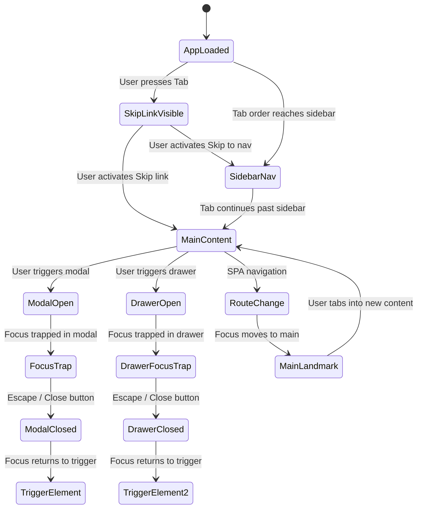
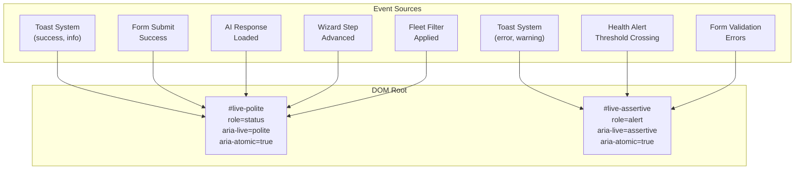
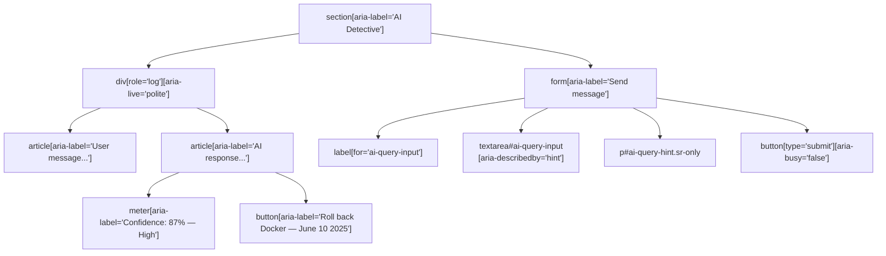
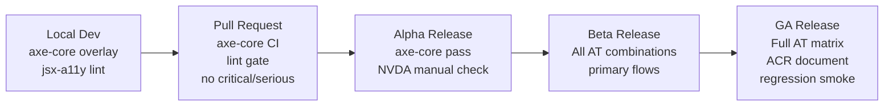

# 53. Accessibility Requirements

> Defines the conformance target, stable A11Y-### requirements, ARIA patterns for domain composites, keyboard and screen-reader support within the Tauri webview, color-contrast rules for data visualization, and testing gates for all DeviceLifeline editions. Part of the DeviceLifeline documentation suite — see [Documentation Index](README.md).

**Status:** Draft v1 · **Authoring role:** Accessibility Specialist · **Last updated:** 2026-06-07
**Related:** [49. Design System Specification](49-design-system-specification.md), [50. UI/UX Specification](50-ui-ux-specification.md), [52. Component Library Specification](52-component-library-specification.md), [43. Testing Strategy](43-testing-strategy.md), [07. Non-Functional Requirements](07-non-functional-requirements.md)

---

## 1. Purpose & Scope

This document defines every accessibility requirement for DeviceLifeline — a Tauri desktop application with a React + TypeScript + Tailwind CSS UI rendered inside the Windows system webview (WebView2, Chromium-based). It is normative: all product engineering, design, and QA work must satisfy these requirements before a feature is considered shippable.

**Conformance target: WCAG 2.2 Level AA** for all interactive and informational UI surfaces, without exception. Level AAA criteria are noted where they are achievable with low implementation cost; they are advisory, not mandatory.

Scope:

- All screens and flows available in the Free, Pro, Developer, Technician, and Business editions (see [57. Business Edition Specification](57-business-edition-specification.md) and [56. Technician Edition Specification](56-technician-edition-specification.md))
- All domain composite components: TimelineChart, HealthGauge, ConfidenceMeter, AIChatPanel, RestoreWizard, FleetTable
- All primitive components defined in [52. Component Library Specification](52-component-library-specification.md)
- Toast, Alert, and live-region messaging infrastructure
- Keyboard navigation, visible focus indicators, and logical focus management
- Color and contrast — including the data-visualization palette from [49. Design System Specification §4.3](49-design-system-specification.md)
- Reduced-motion support and OS-level accessibility setting respect
- Text scaling / browser zoom behavior inside the Tauri webview
- Screen-reader support: Windows Narrator, NVDA, JAWS (primary); VoiceOver (macOS, future)
- Testing automation, linting, and release gate integration

Out of scope: Server-side admin interfaces (if any); marketing website; Stripe/Paystack payment iframes (governed by those vendors' own conformance programs).

---

## 2. Assumptions

- **A1:** WebView2 on Windows 10 v2004+ and Windows 11 exposes a full Chromium accessibility tree to Windows AT (assistive technology) clients via IAccessible2, UI Automation (UIA), and ARIA. All WAI-ARIA 1.2 roles and attributes are supported in WebView2.
- **A2:** The Tauri shell window itself receives a `WS_EX_NOACTIVATE`-free window style so that screen readers can focus into the webview without an extra activation step. Tauri's default window configuration satisfies this.
- **A3:** The AT bridge between the Chromium renderer inside WebView2 and UIA/MSAA is maintained by the Chromium accessibility subsystem; no custom UIA provider is needed in the Rust host.
- **A4:** Tailwind CSS v4 utility classes are used for all styling. `focus-visible:` variants are available and are the canonical way to implement visible focus indicators.
- **A5:** Users may operate the app at any OS text-size scaling from 100% to 200%. The Tauri webview inherits the Windows DPI scale factor. CSS layout must not clip or overflow at 200% text zoom (WCAG 1.4.4 Resize text).
- **A6:** The `prefers-reduced-motion` media query is honoured by the OS and forwarded into the WebView2 CSS environment. Tailwind `motion-reduce:` variants are the implementation mechanism.
- **A7:** Recharts (or equivalent SVG-based charting library) is used for TimelineChart, HealthGauge, and performance charts. SVG-rendered charts must supplement color with text labels, patterns, or direct annotations.
- **A8:** NVDA 2023.x + Firefox is the secondary test pair; NVDA + Chrome is tertiary. JAWS 2024 + Chrome is tested for enterprise edition (Business/Technician) acceptance.
- **A9:** macOS VoiceOver and Linux AT support are future-phase requirements, documented here as advisory notes under each requirement.
- **A10:** All font assets (Inter, JetBrains Mono) are bundled; no user-facing font rendering depends on network availability.

---

## 3. Conformance Target and Standards

### 3.1 Primary Standard

| Standard | Level | Applicability |
|----------|-------|---------------|
| WCAG 2.2 Level AA | Mandatory | All interactive and informational UI surfaces |
| WCAG 2.2 Level AAA (selected) | Advisory | Where noted per requirement |
| WAI-ARIA 1.2 | Mandatory | All custom interactive widgets |
| ARIA in HTML (W3C) | Mandatory | Authoring practice for all React components |
| EN 301 549 v3.2.1 | Advisory | EU market readiness (maps to WCAG 2.1 AA + additional clauses) |

**A11Y-001** — The product SHALL achieve WCAG 2.2 Level AA conformance for all screens accessible to end users across all editions at release.

**A11Y-002** — Conformance SHALL be documented per major release in a Voluntary Product Accessibility Template (VPAT) or equivalent Accessibility Conformance Report (ACR). This artifact is maintained in `/docs/accessibility/acr-vN.md` and updated before each public release.

### 3.2 Scope of Conformance Claim

The conformance claim covers the Tauri application shell and all content rendered in the WebView2. It explicitly excludes:

- Third-party iframes (Stripe Checkout, Paystack) — these are governed by their vendors' own WCAG claims.
- OS-native dialogs launched via Tauri's `tauri::api::dialog` (open/save file pickers). These inherit OS-level accessibility.
- PostHog analytics SDK UI (invisible to users).

---

## 4. Keyboard Navigation and Full Operability

Every function available to a mouse user SHALL be available to a keyboard-only user.

### 4.1 Global Keyboard Conventions

**A11Y-003** — All interactive elements (buttons, links, inputs, custom widgets) SHALL be reachable and operable via the keyboard Tab key and standard keyboard interactions, without requiring a mouse or pointer device.

**A11Y-004** — The application SHALL implement a logical, predictable tab order that follows the visual reading order (left-to-right, top-to-bottom in LTR). The Tauri window title bar is excluded from the tab ring; tab order begins at the first focusable element within the webview.

**A11Y-005** — Tab order SHALL follow the DOM order. CSS-only visual reordering (e.g., `flex-row-reverse`, CSS Grid `order`) that diverges from DOM order is prohibited unless the DOM order itself reflects the logical sequence.

**A11Y-006** — All keyboard shortcuts provided to mouse users (e.g., drag-and-drop for restore item ordering) SHALL have a keyboard-accessible equivalent. Where a shortcut is documented in the UI, it SHALL also appear in a keyboard shortcut reference dialog accessible via `?` or `Help > Keyboard Shortcuts`.

**A11Y-007** — Focus SHALL never be sent to an invisible or `display:none` element. Focus SHALL never become trapped outside a designated focus trap (modal, drawer) unless the user is inside that trap intentionally.

**A11Y-008** — Keyboard operability SHALL NOT rely on timing; timed actions (e.g., auto-dismissing toasts) SHALL be pause-able or extendable to at least three times the default duration (WCAG 2.2 SC 2.2.1). The default toast duration of 4 000 ms SHALL be extended to 12 000 ms for users who have enabled "Extended notification time" in Settings > Accessibility.

### 4.2 Key Bindings for Interactive Widgets

The following table defines mandatory keyboard interaction patterns per WAI-ARIA 1.2 Authoring Practices.

| Widget | Activation | Navigation | Dismiss / Close |
|--------|-----------|------------|-----------------|
| Button | `Enter`, `Space` | `Tab` / `Shift+Tab` | N/A |
| Link | `Enter` | `Tab` / `Shift+Tab` | N/A |
| Checkbox | `Space` | `Tab` / `Shift+Tab` | N/A |
| Radio group | `Space` (select focused) | Arrow keys within group | N/A |
| Select / Listbox | `Enter` or `Space` to open; `Enter` to confirm | Arrow keys; type-ahead | `Escape` |
| Menu / Dropdown | `Enter` or `Space` to open | Arrow keys; `Home`/`End` | `Escape`; focus returns to trigger |
| Tabs | `Enter` or `Space` (manual) OR arrow key (auto, if `aria-orientation` set) | Left/Right (horizontal) or Up/Down (vertical) Arrow | N/A |
| Modal / Dialog | Focus moves to first focusable element on open | `Tab` cycles within trap; `Shift+Tab` reverse | `Escape` (if closeable); Close button `Enter`/`Space` |
| Drawer | Same as Modal | Same as Modal | `Escape`; Close button |
| Tooltip | Appears on `:focus-visible` | N/A | `Escape`; blur |
| Table (sortable) | `Enter`/`Space` on sort header | Arrow keys for cell navigation (if grid role) | N/A |
| Context menu | `Shift+F10` or application/menu key | Arrow keys; type-ahead | `Escape`; Tab |
| Combobox (SearchInput) | Typing opens suggestions | Arrow keys; `Enter` selects | `Escape` clears suggestions |
| TimelineChart | Focus on chart root; arrow keys move between event markers | `Home`/`End` for first/last event | N/A |
| RestoreWizard steps | `Enter` / `Space` on step indicator or Next button | `Tab` through step content | Wizard Cancel button |

**A11Y-009** — Every widget in the table above SHALL implement the keyboard pattern exactly as specified. Deviations require documented justification and an alternative keyboard pathway.

### 4.3 Skip Navigation

**A11Y-010** — A "Skip to main content" link SHALL be the first focusable element in the webview DOM. It is visually hidden until it receives keyboard focus (`:focus-visible` makes it visible, positioned at top-left of the window). On activation it moves focus to the `<main>` landmark.

**A11Y-011** — A second skip link, "Skip to navigation", SHALL be provided when the primary navigation sidebar is present, allowing keyboard users to reach the sidebar without tabbing through all main content.

Illustrative DOM structure:

```html
<!-- Skip links — always first in DOM -->
<a href="#main-content" class="sr-only focus:not-sr-only focus:fixed focus:top-2 focus:left-2 ...">
  Skip to main content
</a>
<a href="#sidebar-nav" class="sr-only focus:not-sr-only focus:fixed focus:top-2 focus:left-32 ...">
  Skip to navigation
</a>

<!-- Sidebar -->
<nav id="sidebar-nav" aria-label="Primary navigation">...</nav>

<!-- Main content -->
<main id="main-content" tabindex="-1">...</main>
```

### 4.4 Focus Management for Dynamic Views

**A11Y-012** — When the application performs a page-level navigation (route change within the SPA), focus SHALL be programmatically moved to the `<main>` element (or to the page `<h1>` if appropriate). The `<main>` element SHALL carry `tabindex="-1"` to be focusable programmatically without entering the tab sequence.

**A11Y-013** — When a Modal opens, focus SHALL be moved to the first interactive element inside the modal (or to the modal's `<h2>` title if no interactive element precedes the body content). When the modal closes, focus SHALL return to the exact element that triggered the modal.

**A11Y-014** — When a Drawer opens, focus SHALL move to the drawer's close button or first actionable element. When the drawer closes, focus returns to the trigger.

**A11Y-015** — When a Toast notification appears, it SHALL NOT steal focus. Toasts are announced via ARIA live regions (see Section 10).

**A11Y-016** — When inline content loads asynchronously (e.g., AI Detective response appearing after a query), focus SHALL remain on the input element that triggered the load. The newly rendered content SHALL be announced via `aria-live="polite"` on the response container.

**A11Y-017** — When an item is deleted from a list (e.g., removing an app from the restore queue), focus SHALL move to the next item in the list, or to the previous item if the deleted item was the last, or to the list container heading if the list is now empty.

---

## 5. Visible Focus Indicators

**A11Y-018** — Every focusable element SHALL display a clearly visible focus indicator that meets or exceeds WCAG 2.2 SC 2.4.11 (Focus Appearance, AA). The focus ring SHALL have:
- Minimum area: the perimeter of the element's bounding box offset by 2px, fully enclosed in a 2px-wide solid ring.
- Minimum contrast ratio: 3:1 between the focus ring color and the adjacent background.
- The ring SHALL NOT be solely reliant on color change; a solid ring border is required.

**A11Y-019** — The focus ring color token SHALL be `--dl-color-focus-ring` (`#4a9fd6` / `--dl-blue-400`). This token resolves identically in both light and dark theme. Implementation via Tailwind `focus-visible:ring-2 focus-visible:ring-[--dl-color-focus-ring] focus-visible:outline-none focus-visible:ring-offset-2`.

**A11Y-020** — Focus indicators SHALL NOT be suppressed by `outline: none` or `outline: 0` on any element unless the element implements an equivalent visible replacement using `focus-visible:ring-*` utilities. The base Tailwind preflight `outline: none` on buttons and inputs SHALL be overridden within the DeviceLifeline theme.

**A11Y-021** — On dark backgrounds (sidebar, overlays, dark-theme surfaces), the 2px ring SHALL be supplemented with a 2px white ring-offset (`ring-offset-2` with `ring-offset-color: var(--dl-color-bg-surface)`) to ensure the focus ring remains visible against any surface.

**A11Y-022** — Focus indicators inside complex composites (TimelineChart, FleetTable) SHALL meet the same contrast and area requirements. Custom SVG-rendered focusable elements SHALL use a 2px SVG `stroke` in `--dl-color-focus-ring` as the focus affordance.

---

## 6. Screen-Reader Support

### 6.1 Tauri / WebView2 Accessibility Tree Considerations

**A11Y-023** — WebView2 on Windows exposes the Chromium accessibility tree to UI Automation (UIA) and MSAA/IAccessible2. The application SHALL NOT disable or bypass this tree. Specifically: the Tauri window `decorations` setting SHALL NOT use `transparent` + custom hit-testing in a way that removes the accessibility root from the UIA tree.

**A11Y-024** — The application SHALL be tested with Windows Narrator (built-in, no install), NVDA (free, most common), and JAWS (enterprise standard) against the test matrix defined in Section 13. All three SHALL be able to read and interact with every screen.

**A11Y-025** — Platform-specific behavior to account for:
  - **Narrator + WebView2:** Narrator uses UIA; Chromium's UIA bridge is generally complete for standard HTML but may lag on ARIA 1.2 additions. Test new ARIA patterns against Narrator explicitly.
  - **NVDA + WebView2:** NVDA uses MSAA/IAccessible2 by default; switch NVDA to "Use UI Automation when available" setting enabled for best results. Document this in the support KB (see [54. Support Operations Plan](54-support-operations-plan.md)).
  - **JAWS + WebView2:** JAWS 2024+ treats Chromium-based applications with enhanced UIA support. Virtual cursor (PC cursor) mode is expected. Test `INSERT+F7` element list for meaningful link/heading extraction.

**A11Y-026** — The webview document SHALL have a meaningful `<title>` that is updated on navigation. Format: `"{Current Screen} — DeviceLifeline"`. Screen readers announce the page title on focus entry and on navigation.

**A11Y-027** — The document language SHALL be declared: `<html lang="en">`. If a localized variant is shipped, `lang` SHALL match the UI language.

**A11Y-028** — ARIA landmark regions SHALL be present and correctly used on every screen:

| Landmark role | element | Usage |
|---------------|---------|-------|
| `banner` | `<header>` | Application title bar area (if rendered in webview) |
| `navigation` | `<nav aria-label="Primary navigation">` | Sidebar navigation |
| `main` | `<main>` | Per-screen primary content area |
| `complementary` | `<aside>` | Context panels (e.g., correlation detail drawer content) |
| `contentinfo` | `<footer>` | Status bar at bottom of window (if applicable) |
| `form` | `<form>` or `role="form"` with `aria-label` | Forms with multiple inputs (settings, restore config) |
| `search` | `role="search"` | Search input areas (software inventory filter) |
| `region` | `<section aria-label="...">` | Major named sections within `<main>` |

**A11Y-029** — Heading hierarchy SHALL be logical and non-skipping. Each screen has exactly one `<h1>` (the page title). Section headings are `<h2>`. Sub-sections are `<h3>`. Card/widget titles that serve as section anchors for screen-reader navigation are `<h3>` or `<h4>` depending on nesting level. No heading level SHALL be skipped.

**A11Y-030** — All images and icons that convey meaning SHALL have `alt` text or an ARIA label. Decorative images/icons SHALL use `aria-hidden="true"` and `alt=""`. Icon-only buttons (e.g., close, refresh, export) SHALL have `aria-label` describing the action.

**A11Y-031** — All status/health indicators that use color alone (HealthGauge, ConfidenceMeter, Badge variants) SHALL provide a text equivalent that is either:
  - Visible in the component (preferred), or
  - Available as a visually hidden `<span class="sr-only">` adjacent to the colored element.

### 6.2 Screen-Reader Interaction Patterns for Key Flows

**A11Y-032** — **AI Detective (AIChatPanel):** The conversational interface SHALL be implemented as a message log region with `role="log"` and `aria-live="polite"`. Each new AI response appended to the log SHALL be announced by the screen reader without disrupting the user's current focus position. The query input (`<textarea>`) SHALL have `aria-label="Ask AI Detective"`. The submit button SHALL read "Send query" when idle and "Sending…" when loading.

**A11Y-033** — **RestoreWizard:** The multi-step wizard SHALL use a `<nav aria-label="Restore progress" role="navigation">` steplist. Each step indicator SHALL convey its state: `aria-current="step"` for the current step, `aria-label="Step N of M: {step name} — {complete|incomplete}"` for each indicator. The wizard title `<h2>` SHALL update to reflect the current step name on step change.

**A11Y-034** — **FleetTable (Business Edition):** The fleet device table SHALL use semantic `<table>` markup with a `<caption>` describing the table content (e.g., "Managed devices — 47 total"). Column headers `<th scope="col">`. Sort state via `aria-sort`. Bulk-select checkbox in header: `aria-label="Select all devices"` with `aria-checked="mixed"` when partially selected. Each row checkbox: `aria-label="Select {device name}"`.

**A11Y-035** — **Modals and Drawers:** `role="dialog"` with `aria-modal="true"` SHALL be present on all modal and drawer containers. The modal title SHALL be a `<h2>` element referenced by `aria-labelledby`. If a description paragraph is present, `aria-describedby` SHALL reference it.

**A11Y-036** — **Toast Notifications:** Rendered in a `role="status"` region for success/info and `role="alert"` region for error/warning (see Section 10 for the full live-region spec). The toast container SHALL use `aria-live="polite"` for non-critical and `aria-live="assertive"` for critical alerts.

**A11Y-037** — **Tabs:** `role="tablist"`, `role="tab"`, `role="tabpanel"` per WAI-ARIA tablist pattern. The active tab has `aria-selected="true"`. Each tabpanel has `aria-labelledby="{tab-id}"`. Tab panel content is not in the tab sequence until the panel is active (`tabpanel` has `tabindex="0"` or focuses its first child).

---

## 7. Color and Contrast Requirements

### 7.1 Text Contrast

**A11Y-038** — Normal text (below 18pt / 24px regular or 14pt / ~18.67px bold) SHALL have a minimum contrast ratio of 4.5:1 against its background (WCAG 2.2 SC 1.4.3).

**A11Y-039** — Large text (18pt+ / 24px+ regular, or 14pt+ / ~18.67px+ bold) SHALL have a minimum contrast ratio of 3:1 against its background.

**A11Y-040** — Text disabled by the `--dl-color-text-disabled` token (`--dl-gray-300` on light / `--dl-gray-600` on dark) is exempt from contrast requirements per WCAG exception, but SHALL meet a minimum 2:1 ratio to remain softly readable. Any disabled text falling below 2:1 SHALL be supplemented with additional visual cues (strikethrough, reduced opacity of containing block) to indicate the disabled state.

The following table verifies the semantic text tokens from [49. Design System §4.2](49-design-system-specification.md) against their expected backgrounds:

| Token pair | Light ratio (approx) | Dark ratio (approx) | AA Pass? |
|------------|---------------------|---------------------|---------|
| `--dl-color-text-primary` on `--dl-color-bg-surface` | 14.5:1 (`#111827` on `#fff`) | 14.8:1 (`#f3f4f6` on `#111827`) | Pass |
| `--dl-color-text-secondary` on `--dl-color-bg-surface` | 7.0:1 (`#4b5563` on `#fff`) | 5.9:1 (`#9ca3af` on `#111827`) | Pass |
| `--dl-color-text-muted` on `--dl-color-bg-surface` | 4.6:1 (`#6b7280` on `#fff`) | 4.6:1 (`#6b7280` on `#111827`) | Pass |
| `--dl-color-text-link` on `--dl-color-bg-surface` | 4.6:1 (`#1a7fc4` on `#fff`) | 7.2:1 (`#82bfe8` on `#111827`) | Pass |
| `--dl-color-text-on-sidebar` on `--dl-color-bg-sidebar` | 10.1:1 | 10.1:1 | Pass |
| `--dl-color-status-warning` on surface | 4.8:1 (light) | 8.2:1 (dark) | Pass |
| `--dl-color-status-critical` on surface | 5.1:1 (light) | 4.9:1 (dark) | Pass |

**A11Y-041** — If any token pair identified in the [49. Design System Specification](49-design-system-specification.md) fails the ratio thresholds when verified with a tool such as Leonardo (Adobe) or the browser DevTools contrast checker, the token value SHALL be adjusted before release. The Design System document SHALL reflect the corrected value.

### 7.2 Non-Text Contrast (UI Components)

**A11Y-042** — Interactive component boundaries (button borders, input borders, checkbox outlines) SHALL have at least 3:1 contrast against the adjacent background (WCAG 2.2 SC 1.4.11).

**A11Y-043** — The focus ring color `--dl-color-focus-ring` (`#4a9fd6`) on the default surface background (`#ffffff` light / `#111827` dark) SHALL achieve:
  - Light: `#4a9fd6` on `#ffffff` → 3.0:1 (borderline — supplemented by ring-offset as specified in A11Y-021 to widen the visible target).
  - Dark: `#4a9fd6` on `#111827` → 3.1:1 (passes).
  Verification is required at token adoption. If light-mode ratio falls below 3:1, `--dl-color-focus-ring` SHALL be darkened to `--dl-blue-500` (`#1a7fc4`) for light-mode contexts (achieving 4.5:1).

**A11Y-044** — Graphical objects that convey information (icons, chart bars, gauge arcs, timeline event markers) SHALL have at least 3:1 contrast against adjacent colors (WCAG 2.2 SC 1.4.11).

### 7.3 Data-Visualization Contrast and Non-Color Differentiation

Charts and data visualizations MUST NOT rely on color as the sole means of conveying information (WCAG 2.2 SC 1.4.1).

**A11Y-045** — The Performance Timeline and Health Intelligence charts SHALL supplement color with at least one additional visual channel for each data series or event type. Accepted additional channels:

| Additional channel | Applicability |
|-------------------|---------------|
| Direct text labels (value labels on data points) | All chart types |
| Pattern/texture fills (hatching, dots) for area fills | Area charts, bar charts |
| Distinct marker shapes (circle, triangle, square, diamond) | Line/scatter charts |
| Icon overlays on event markers (install icon, crash icon) | Timeline event markers |
| Data table adjacent to or togglable from chart | All charts (keyboard/AT fallback) |

**A11Y-046** — The categorical series palette from [49. Design System §4.3](49-design-system-specification.md) has been selected with deuteranopia (red-green color blindness) simulation in mind. However, engineering SHALL additionally verify the 8-series palette against protanopia and tritanopia simulations using Coblis or equivalent before v1 release. If any two series are indistinguishable under any common CVD simulation, the affected token(s) SHALL be adjusted.

**A11Y-047** — The Health Score sequential ramp (0–100 mapped from red → orange → yellow → lime → green) SHALL NOT be used as the sole indicator of health status. The numeric score SHALL always be present as text adjacent to or within the HealthGauge. Textual labels ("Critical", "Poor", "Fair", "Good", "Excellent") SHALL be rendered as `<title>` elements within the SVG gauge or as adjacent visually-visible text.

**A11Y-048** — Timeline event type colors (`--dl-event-install`, `--dl-event-crash`, etc.) SHALL each have a corresponding icon shape and/or text label in the chart legend and in each event marker's accessible name. A chart legend SHALL list each event type with its symbol and name, not color alone.

**A11Y-049** — Every chart component (TimelineChart, HealthGauge, ConfidenceMeter) SHALL provide an accessible data table as a fallback. This table SHALL be:
  - Rendered in the DOM as a `<table>` element, either always visible or togglable via a "Show data table" button adjacent to the chart.
  - Correctly marked up with scope, headers, and caption.
  - Announced by screen readers when focus moves to the chart area.

Illustrative pattern for TimelineChart accessible fallback:

```html
<figure aria-label="Performance Timeline">
  <div aria-hidden="true">
    <!-- SVG/canvas chart rendered here; hidden from AT -->
  </div>
  <figcaption>
    <button aria-expanded="false" aria-controls="timeline-data-table">
      Show data table
    </button>
    <table id="timeline-data-table" hidden>
      <caption>Performance Timeline events — June 2025 to June 2026</caption>
      <thead>
        <tr>
          <th scope="col">Date</th>
          <th scope="col">Event type</th>
          <th scope="col">Description</th>
          <th scope="col">Performance impact</th>
        </tr>
      </thead>
      <tbody><!-- rows --></tbody>
    </table>
  </figcaption>
</figure>
```

**A11Y-050** — ConfidenceMeter (AI Detective confidence score display) SHALL include a text readout of the percentage value as an `aria-label` on the meter element, e.g., `aria-label="Confidence: 87%"`. The visual meter track color change (green/yellow/red by confidence band) SHALL be supplemented by the textual confidence label ("High", "Moderate", "Low").

---

## 8. Reduced Motion

**A11Y-051** — When the operating system `prefers-reduced-motion: reduce` media query is active, ALL animations and transitions SHALL be either:
  - Eliminated (duration set to `0ms`), or
  - Replaced with an instant state change (e.g., modal appears without fade/scale).

The Tailwind utility `motion-reduce:transition-none` and `motion-reduce:animate-none` SHALL be applied to every animated element. A global CSS rule is the implementation baseline:

```css
@media (prefers-reduced-motion: reduce) {
  *, *::before, *::after {
    animation-duration: 0.01ms !important;
    animation-iteration-count: 1 !important;
    transition-duration: 0.01ms !important;
    scroll-behavior: auto !important;
  }
}
```

**A11Y-052** — The app SHALL also expose a manual "Reduce motion" toggle in Settings > Accessibility that mirrors the OS preference independently. This is for users who prefer less motion in DeviceLifeline specifically without changing their global OS preference.

**A11Y-053** — Animations that carry essential meaning (e.g., a progress bar advancing during a restore operation) SHALL remain visible under reduced motion, but may be replaced with a static progress indicator (bar at final position + percentage text) rather than a smooth sweep.

**A11Y-054** — The Performance Timeline's animated event popover flyout and the HealthGauge arc animation SHALL each have a `motion-reduce:` variant that removes the sweep/bounce and presents the final state immediately.

---

## 9. Text Scaling and Zoom

**A11Y-055** — The application UI SHALL be fully operable at 200% browser text zoom (WCAG 2.2 SC 1.4.4) without loss of content or functionality. Text SHALL reflow; horizontal scrollbars in the main content area SHALL be avoided (one exception: data tables with many columns may have contained horizontal scroll within the table).

**A11Y-056** — Layout SHALL use relative units (`rem`, `em`, `%`, `fr`) wherever practical. Fixed-pixel heights on containers that hold text SHALL be avoided. Where fixed pixel heights are required (e.g., the sidebar navigation item height), they SHALL be converted to `rem` or have a `min-height` that scales with text size.

**A11Y-057** — The minimum base font size in the UI is `--dl-text-sm` (12px / 0.857rem). At 200% zoom this becomes effective 24px. Cards, panels, and table cells must accommodate this without clipping.

**A11Y-058** — The Tauri window allows the user to resize it to any width down to the minimum defined in the UI/UX spec (see [50. UI/UX Specification](50-ui-ux-specification.md)). At the minimum window width AND 200% text zoom, the application SHALL remain usable without horizontal overflow at the `<body>` level.

**A11Y-059** — Text SHALL NOT be rendered inside `<canvas>` elements without an accessible text alternative. All canvas-based rendering (if used for chart performance) SHALL include an ARIA label describing the chart content and a DOM-based data table fallback as specified in A11Y-049.

**A11Y-060** — Line length for body text and AI-generated response text in the AIChatPanel SHALL not exceed 80 characters (approximately 45em at base font size) to aid readability. AI response paragraphs SHALL observe standard paragraph spacing.

---

## 10. ARIA Patterns for Domain Composite Components

### 10.1 AIChatPanel (AI Detective Conversational Interface)

**A11Y-061** — The AIChatPanel SHALL use the following ARIA structure:

```html
<section aria-label="AI Detective">
  <div role="log" aria-live="polite" aria-label="Conversation history" aria-relevant="additions">
    <!-- Messages rendered here; new messages announced politely -->
    <article aria-label="User message at 14:23">
      <p>Why is my PC slow?</p>
    </article>
    <article aria-label="AI Detective response at 14:23">
      <p>Based on your Performance Timeline...</p>
      <!-- Confidence meter -->
      <meter min="0" max="100" value="87"
             aria-label="Response confidence: 87% — High"
             aria-valuenow="87" aria-valuemin="0" aria-valuemax="100">
        87%
      </meter>
    </article>
  </div>

  <form aria-label="Send message to AI Detective">
    <label for="ai-query-input">Ask AI Detective</label>
    <textarea id="ai-query-input"
              placeholder="Describe your issue or ask a question…"
              aria-describedby="ai-query-hint"
              rows="3"></textarea>
    <p id="ai-query-hint" class="sr-only">
      Type your question and press Enter or click Send to get AI-powered diagnostics.
    </p>
    <button type="submit" aria-busy="false">Send query</button>
  </form>
</section>
```

**A11Y-062** — When the AI is generating a response, the submit button SHALL set `aria-busy="true"` and its text content SHALL change to "Sending…". The conversation log entry for the in-progress response SHALL include a loading indicator with `role="status"` and `aria-label="AI Detective is generating a response"`.

**A11Y-063** — AI-generated Correlation Hypothesis cards within the AIChatPanel SHALL be structured as `<article>` elements with a `<h3>` heading naming the hypothesis. Confidence scores SHALL use `<meter>` as shown above. Suggested action buttons (e.g., "Roll back Docker") SHALL have descriptive `aria-label` values that include context, e.g., `aria-label="Roll back Docker — installed June 10, 2025"`.

### 10.2 TimelineChart

**A11Y-064** — TimelineChart SHALL be implemented as a compound widget with `role="application"` on the outer container (to indicate a custom keyboard interface to AT) and `aria-label="Performance Timeline"`. The `role="application"` SHALL be used only on the chart canvas area; navigation outside the chart reverts to document mode.

**A11Y-065** — Individual event markers within the timeline SHALL be focusable SVG elements with `role="button"` (if interactive) or `role="img"` (if decorative), and `aria-label` in the form: `"{Event type}: {Name}, {Date}, {Impact description}"`. Example: `aria-label="Software install: Docker Desktop 4.25.0, June 10 2025, startup time increased 35%"`.

**A11Y-066** — The Timeline SHALL support keyboard traversal: `Left Arrow` and `Right Arrow` move focus between adjacent events in chronological order. `Home` moves to earliest event in the current view. `End` moves to the most recent. `Enter` or `Space` on a focused event marker opens the Correlation Detail Drawer.

**A11Y-067** — The Timeline's zoom and pan controls (time range selector, scroll) SHALL have keyboard equivalents: `+`/`-` or `Ctrl+Plus`/`Ctrl+Minus` for zoom; Scroll via arrow keys when chart is focused. The current time range SHALL be announced to AT when changed, e.g., via a `aria-live="polite"` region: "Timeline showing June 1 to June 30, 2025".

### 10.3 HealthGauge

**A11Y-068** — HealthGauge SHALL use `<meter>` semantics where the health score maps directly to a meter value, supplemented by ARIA:

```html
<figure aria-label="CPU Health">
  <svg aria-hidden="true" role="img">
    <!-- arc rendered here -->
  </svg>
  <meter
    min="0" max="100" value="72"
    low="50" high="85" optimum="100"
    aria-label="CPU Health Score: 72 out of 100 — Good"
  >
    72%
  </meter>
  <figcaption>
    <span class="sr-only">CPU Health: </span>72
    <span aria-hidden="true"> / 100</span>
    <span class="sr-only"> out of 100 — Good</span>
    <span aria-hidden="true" class="...">Good</span>
  </figcaption>
</figure>
```

**A11Y-069** — When HealthGauge values update in real time (live health monitoring), the `<meter>` value SHALL be updated in the DOM. The live update SHALL NOT use `aria-live` on the gauge itself (this would be overly verbose). Instead, a summary status panel shall use `aria-live="polite"` to announce significant threshold crossings (e.g., score dropping below 50 triggers an announcement: "CPU health dropped to 48 — Poor").

### 10.4 ConfidenceMeter

**A11Y-070** — ConfidenceMeter is a specialized gauge used for AI Detective confidence scores. ARIA pattern:

```html
<div role="meter" aria-valuenow="87" aria-valuemin="0" aria-valuemax="100"
     aria-label="Confidence: 87% — High"
     aria-valuetext="87 percent confidence — High">
  <span aria-hidden="true">87%</span>
  <span class="sr-only">Confidence: 87 percent — High confidence</span>
</div>
```

The `aria-valuetext` attribute provides the semantic band label ("High", "Moderate", "Low") in addition to the numeric value.

### 10.5 RestoreWizard

**A11Y-071** — RestoreWizard uses a `<nav aria-label="Restore progress" role="navigation">` for the step indicator. The step indicator list uses `<ol>` (ordered list). Each step `<li>` contains a button/link that is `aria-current="step"` when active, `aria-disabled="true"` for future steps not yet reachable:

```html
<nav aria-label="Restore wizard progress">
  <ol role="list">
    <li>
      <button aria-current="step" aria-label="Step 1 of 5: Select snapshot — current step">
        1. Select Snapshot
      </button>
    </li>
    <li>
      <button aria-label="Step 2 of 5: Review applications — not yet reached"
              aria-disabled="true">
        2. Review Applications
      </button>
    </li>
    <!-- … -->
  </ol>
</nav>

<section aria-label="Step 1: Select Snapshot" aria-live="polite">
  <h2>Select a Snapshot to Restore</h2>
  <!-- step content -->
</section>
```

**A11Y-072** — When the wizard advances to the next step, a `aria-live="polite"` region SHALL announce the new step: "Step 2 of 5: Review Applications". Focus SHALL move to the step section `<h2>`.

**A11Y-073** — During active restore operations (progress step), a `role="progressbar"` element SHALL convey installation progress:

```html
<div role="progressbar"
     aria-valuenow="45"
     aria-valuemin="0"
     aria-valuemax="100"
     aria-label="Restoring applications: 45% complete — Installing Visual Studio Code"
     aria-valuetext="45 percent — Installing Visual Studio Code">
</div>
```

The `aria-valuetext` SHALL include the name of the currently-installing application for verbosity without screen reader polling.

### 10.6 FleetTable (Business / Technician Editions)

**A11Y-074** — FleetTable SHALL use full semantic table markup. Virtual scrolling (react-virtual) SHALL maintain `aria-rowcount="{total row count}"` on `<table>` and `aria-rowindex="{1-based index}"` on each rendered `<tr>`. This ensures AT can announce "row 47 of 312" accurately even when only a window of rows is in the DOM.

**A11Y-075** — Column filter dropdowns above the FleetTable SHALL use the combobox ARIA pattern (see A11Y widget table). Applied filters SHALL be announced via `role="status"` live region: "Filter applied: Status = Critical. 12 devices shown."

**A11Y-076** — Bulk-action toolbar (appears when rows are selected) SHALL receive focus immediately when it becomes visible after a row selection, so keyboard users are aware of available bulk actions. The toolbar region SHALL have `role="toolbar"` and `aria-label="Bulk actions for selected devices"`.

### 10.7 Modals and Drawers

**A11Y-077** — All Modal and Drawer components SHALL implement focus trapping via a library such as `focus-trap-react`. The trap SHALL include all focusable descendants and SHALL cycle from last to first and first to last at the boundaries.

**A11Y-078** — When a Modal is open, `aria-hidden="true"` SHALL be applied to all sibling DOM trees outside the modal (i.e., the main content, the sidebar) to prevent AT from navigating behind the modal. This is critical for WebView2 / Narrator, which may otherwise explore the full document tree.

**A11Y-079** — Confirmation dialogs (destructive actions: "Delete all snapshots", "Cancel subscription") SHALL include both `aria-labelledby` (pointing to the dialog title) and `aria-describedby` (pointing to the consequence description). The default focused element in a destructive confirmation SHALL be the "Cancel" button, not the destructive action.

---

## 11. Accessible Error, Status, and Alert Messaging

### 11.1 ARIA Live Regions Architecture

The application SHALL maintain a single, consistent live-region infrastructure:

**A11Y-080** — A global `role="status"` region with `aria-live="polite"` SHALL exist in the DOM root for non-urgent announcements (success toasts, info messages, background operation completions).

**A11Y-081** — A global `role="alert"` region with `aria-live="assertive"` SHALL exist in the DOM root for urgent announcements (errors, critical health alerts, installation failures). Assertive regions interrupt the screen reader's current utterance; they SHALL be used sparingly.

**A11Y-082** — Live regions SHALL be present in the DOM before content is injected into them. Empty live regions SHALL be rendered in the DOM from app init, even when not displaying a message. Dynamically injected live regions are NOT reliably announced by NVDA/JAWS.

Illustrative DOM placement:

```html
<body>
  <!-- Skip links -->
  <!-- App root -->
  <div id="app-root">
    <!-- All UI here -->
  </div>

  <!-- Live regions — always in DOM, always empty by default -->
  <div id="live-polite" role="status" aria-live="polite" aria-atomic="true"
       class="sr-only"></div>
  <div id="live-assertive" role="alert" aria-live="assertive" aria-atomic="true"
       class="sr-only"></div>
</body>
```

**A11Y-083** — The Toast system SHALL write its messages into the appropriate live region (`live-polite` for success/info; `live-assertive` for error/warning) in addition to rendering the visual toast. The message written to the live region SHALL be the full toast text without HTML markup.

**A11Y-084** — `aria-atomic="true"` SHALL be set on both live regions so that AT reads the entire region content on update, not just the changed fragment.

### 11.2 Form Validation Errors

**A11Y-085** — Inline field validation errors SHALL be announced to AT via `role="alert"` on the error message element (or `aria-live="polite"` if the validation is not triggered by form submit). The input field SHALL reference its error message via `aria-describedby="{error-id}"`.

**A11Y-086** — When a form is submitted and validation fails, focus SHALL move to the first invalid field. A summary error message at the top of the form (e.g., "3 errors found — please review the highlighted fields") SHALL use `role="alert"` and SHALL be rendered in the DOM before focus shifts to the first invalid field.

**A11Y-087** — Required fields SHALL be indicated by both:
  - A visible required indicator (asterisk `*` with a legend "* Required" at the form start), and
  - `aria-required="true"` on the input element.
  
  The `required` HTML attribute is preferred over `aria-required` to also trigger browser-native validation; they are equivalent in AT announcement.

### 11.3 System-Level Status Alerts (Health Intelligence)

**A11Y-088** — Hardware failure alerts from the Health Intelligence system (e.g., "SSD S.M.A.R.T. warning") SHALL be delivered as `role="alert"` entries (assertive live region) when they are first surfaced, so keyboard and screen-reader users are immediately notified without needing to navigate to the dashboard.

**A11Y-089** — Ongoing health warnings that are displayed persistently on the dashboard SHALL NOT continue using `aria-live` on each refresh. They SHALL be present in the DOM as static content with appropriate heading/section structure, readable via normal AT navigation.

---

## 12. OS-Level Accessibility Settings

**A11Y-090** — The application SHALL honor `prefers-color-scheme`. When set to `dark`, the dark theme SHALL be applied automatically without requiring a manual toggle. The in-app theme toggle provides an explicit override. (Implemented via `prefers-color-scheme` media query on CSS custom properties; see [49. Design System §4.2](49-design-system-specification.md).)

**A11Y-091** — The application SHALL honor `prefers-reduced-motion` (see Section 8).

**A11Y-092** — The application SHALL honor Windows High Contrast Mode (WHCM). When WHCM is active, the Chromium/WebView2 renderer maps CSS custom properties to system colors. The application SHALL:
  - NOT override `forced-colors: active` styles with `!important` color declarations.
  - Supplement the forced-color scheme with `forced-colors` CSS media query overrides where borders or non-text indicators need reinforcement.
  - Test with Windows 11 High Contrast Aquatic, Desert, Dusk, and Night Sky themes.

**A11Y-093** — The application SHALL honor `prefers-contrast: more` where it is available in WebView2. On surfaces where this media query is active, borders and dividers SHALL be reinforced with a higher-contrast value.

**A11Y-094** — The application SHALL respect the Windows system `TextScaleFactor` (set in Settings > Accessibility > Text Size). WebView2 inherits the DPI scale but not the TextScaleFactor directly; the application SHALL expose its own text size scalar (100%–175%) in Settings > Accessibility that mirrors this OS setting for users who need it within the app.

**A11Y-095** — The application SHALL not suppress or override Windows keyboard shortcut behaviors that AT users depend on, including `Win+Plus` (Magnifier zoom) and `Win+Ctrl+Enter` (Narrator toggle). These operate at the OS level and pass through to any application.

---

## 13. Testing Approach

### 13.1 Automated Testing

**A11Y-096** — axe-core (via `@axe-core/react`) SHALL be integrated into the development environment and the CI pipeline:
  - Dev: `axe-core` violation overlay active in local development builds (non-production only).
  - CI: `@axe-core/playwright` or `jest-axe` runs against every Storybook story and every E2E test scenario as part of the test suite defined in [43. Testing Strategy](43-testing-strategy.md).
  - Threshold: Zero `critical` or `serious` axe violations at merge to `main`. `moderate` violations are tracked as issues with 2-sprint SLA.

**A11Y-097** — The axe ruleset SHALL use `WCAG2AA` plus `WCAG22AA` tags. Custom rules SHALL be added for DeviceLifeline-specific patterns (e.g., verifying that `--dl-event-*` SVG elements have accessible names).

**A11Y-098** — Color contrast SHALL be verified programmatically using `axe-core`'s color-contrast rule AND manually via browser DevTools contrast checker and the Figma Contrast plugin before each token is finalized.

### 13.2 Linting

**A11Y-099** — `eslint-plugin-jsx-a11y` SHALL be installed and configured with the `recommended` ruleset. The rules SHALL be enforced at lint-time (CI lint step blocks merge on violations). The ruleset is extended with the following additional rules set to `error`:

| Rule | Rationale |
|------|-----------|
| `jsx-a11y/no-aria-hidden-on-focusable` | Prevents hiding focusable elements from AT |
| `jsx-a11y/prefer-tag-over-role` | Enforces semantic HTML over redundant ARIA role |
| `jsx-a11y/no-redundant-roles` | Keeps ARIA clean; no `role="button"` on `<button>` |
| `jsx-a11y/interactive-supports-focus` | Ensures custom interactive elements are focusable |
| `jsx-a11y/click-events-have-key-events` | Ensures click handlers have keyboard equivalents |
| `jsx-a11y/label-has-associated-control` | Enforces label-to-input associations |

**A11Y-100** — TypeScript component interfaces SHALL include accessibility-critical props as required where applicable (e.g., `aria-label` required on icon-only `Button`, `id` required on `Input` and `Select`). This is enforced in the component interface definitions in [52. Component Library Specification](52-component-library-specification.md).

### 13.3 Manual Screen-Reader Testing

**A11Y-101** — Manual screen-reader testing SHALL be performed on the following AT combinations before each minor and patch release:

| AT | Browser inside WebView2 / Pairing | Scope |
|----|----------------------------------|-------|
| Windows Narrator | WebView2 (Chromium) | All screens, all flows |
| NVDA (latest stable) | Chrome-like WebView2 | All screens, all flows |
| JAWS 2024+ | Chrome-like WebView2 | Business/Technician flows + any flow gating release |

**A11Y-102** — The manual test script SHALL cover:
  1. Complete keyboard-only walkthrough of each primary user flow (onboarding, Device DNA Snapshot, Performance Timeline review, AI Detective query, Restore Wizard, Health dashboard).
  2. Screen reader announcement verification for: page title on navigation, landmark navigation (`F6` / `H` key heading scan), form error announcement, Toast notifications, Modal open/close, live region updates.
  3. Data visualization accessibility: TimelineChart accessible table, HealthGauge score announcement, ConfidenceMeter reading.
  4. Focus trap verification in Modal and Drawer.
  5. High Contrast Mode rendering check (visual only, no AT needed).

**A11Y-103** — Blocking accessibility issues found during manual testing SHALL be filed as `severity: accessibility-critical` GitHub issues. They SHALL block the release unless formally accepted as a known deviation with a documented remediation plan and timeline.

### 13.4 Release Gates (Integration with Testing Strategy)

As specified in [43. Testing Strategy](43-testing-strategy.md), accessibility forms a mandatory gate in the release pipeline:

**A11Y-104** — The CI pipeline SHALL fail any PR that introduces new axe-core `critical` or `serious` violations. This is enforced as a required status check.

**A11Y-105** — Alpha releases SHALL require: zero axe critical/serious violations. Beta releases SHALL additionally require: passing NVDA manual test script for all primary flows. GA (General Availability) releases SHALL require: passing all AT combinations in the manual test matrix AND an updated ACR document.

**A11Y-106** — Accessibility regression testing SHALL be included in the smoke test suite run after every production deployment (canary and stable channels). Any regression triggers a P1 incident per the process in [43. Testing Strategy](43-testing-strategy.md).

---

## 14. Accessibility Across Editions

### 14.1 Free and Pro Editions

The requirements in Sections 3–13 apply in full to the Free and Pro editions. These represent the baseline product experience.

**A11Y-107** — Feature-gated UI (Pro-locked features visible to Free users) SHALL convey the locked state accessibly. The `Badge variant="locked"` component SHALL include `aria-label="Pro feature — upgrade required"` and the gating button/card SHALL have an accessible description explaining the upgrade requirement, not just a visual lock icon.

### 14.2 Developer Edition

**A11Y-108** — The Developer Edition workspace template and environment restore flows use the same RestoreWizard component; all ARIA patterns from Section 10.5 apply. Additional Developer-specific panels (SDK picker, package manager configuration) SHALL meet the same keyboard and AT requirements.

### 14.3 Technician Edition

**A11Y-109** — The Technician Edition introduces multi-device context switching (selecting a customer's device from a list). The device-selection panel SHALL use `role="listbox"` or `role="combobox"` with proper `aria-selected` state. Switching device context SHALL announce the newly selected device name via the polite live region: "Now viewing: {Device Name} — {Customer Name}".

**A11Y-110** — Technician reports (generated PDF/HTML exports) are out of scope for interactive ARIA requirements but SHALL meet WCAG 1.3.1 (Info and Relationships) for the HTML export format: proper heading structure, table markup, and alt text for any embedded chart images.

### 14.4 Business Edition (Admin Console)

**A11Y-111** — The Business Edition admin console introduces the FleetTable and bulk-action workflows. All requirements from Section 10.6 apply. Additionally, fleet health dashboards (aggregate charts across devices) SHALL comply with the same data-visualization accessibility requirements defined in Section 7.3.

**A11Y-112** — Role-based access control UI (assigning admin vs. viewer roles to team members) SHALL use accessible form controls (radio groups or Select elements) with descriptive labels that explain the scope of each role. Confirmation dialogs for permission changes SHALL follow A11Y-079.

**A11Y-113** — Bulk-operation status (e.g., "Deploying software profile to 47 devices") SHALL be communicated via a `role="progressbar"` and polite live region updates at meaningful milestones (start, 50% complete, complete/failure) rather than continuous streaming updates.

---

## Diagrams

### Focus Management Flow



### Live Region Architecture



### ARIA Pattern: AIChatPanel



### Accessibility Testing Pipeline



---

## Risks & Mitigations

| Risk | Likelihood | Impact | Mitigation |
|------|-----------|--------|-----------|
| WebView2 UIA bridge lag: newly introduced WAI-ARIA 1.2 roles/attributes not yet reliably surfaced via UIA on all Windows versions | Medium | High | Test all custom ARIA patterns on Windows 10 + NVDA and Windows 11 + Narrator before each release; pin WebView2 runtime minimum version in Tauri config |
| Data visualizations (SVG/Canvas charts) present complex AT challenges; data table fallbacks may be incomplete | High | High | Require accessible data table for every chart as a release gate; test HealthGauge and TimelineChart against NVDA in every release |
| Focus management bugs introduced by React state-driven rendering (focus lost on re-render) | High | Medium | Enforce `focus-trap-react` for all modal/drawer; add axe-core rule for lost-focus scenarios; include focus-management assertions in E2E tests |
| Color contrast failures introduced by future token changes | Medium | High | Lock tokens in [49. Design System](49-design-system-specification.md) behind a contrast-verification gate in CI (automated contrast check script runs on token file changes) |
| Reduced-motion global CSS override breaking essential animated feedback (progress bars) | Medium | Medium | Audit every animated element against the reduced-motion rule before applying global override; use `motion-reduce:` utility selectively, not only the global reset |
| Third-party chart library (Recharts or equivalent) shipping inaccessible SVG output | Medium | High | Evaluate library accessibility before adoption; supplement output with custom ARIA overlays; consider fallback to a more accessible library if deficiencies are unfixable |
| High Contrast Mode compatibility: custom CSS variables not mapping correctly to system colors | Medium | Medium | Test all four Windows 11 HC themes before every major release; add `forced-colors` CSS block in design system theme file |
| AT testing coverage gap in CI (automated tools miss NVDA-specific ARIA interpretation quirks) | High | Medium | Supplement axe-core CI with dedicated manual test runs by an AT-experienced QA engineer each sprint (post-MVP, as AT QA is contracted) |
| Business Edition admin users operating at enterprise scale with accessibility requirements mandated by procurement (Section 508, EN 301 549) | Medium | High | Target WCAG 2.2 AA as the baseline (satisfies Section 508 refresh and EN 301 549); produce an ACR before enterprise sales engagements |
| macOS VoiceOver and Linux AT support not tested at launch (Windows-first) | High | Low (MVP) | Document explicitly as out of scope for V1; add macOS VoiceOver to the post-MVP test matrix (Future Considerations) |

---

## Future Considerations

1. **macOS VoiceOver support:** When the macOS port is developed (see [28. Future macOS Architecture Plan](28-macos-architecture-plan.md)), the full manual test matrix SHALL be extended to include VoiceOver + Safari WebKit webview pairing. Note that macOS uses WKWebView, not WebView2; ARIA behavior differences must be re-validated.

2. **Linux AT support:** Orca screen reader on Linux with the GTK WebKitGTK webview is a future test target once Linux is officially supported (see [29. Future Linux Architecture Plan](29-linux-architecture-plan.md)).

3. **WCAG 3.0 readiness:** WCAG 3.0 (in development) introduces APCA (Advanced Perceptual Contrast Algorithm) for contrast evaluation. The design token system should be re-evaluated against APCA thresholds when WCAG 3.0 reaches Candidate Recommendation status. The DeviceLifeline token values were selected with perceptual uniformity (OKLCH) in mind, which aligns with APCA principles.

4. **Accessibility settings profile:** A future enhancement is an in-app Accessibility Settings panel where users can configure: text scale factor, reduced-motion preference, extended notification time, high-contrast override. This surfaces the settings from A11Y-052, A11Y-008, and A11Y-094 in one discoverable location. Post-MVP.

5. **Automated AT testing in CI:** Tools such as `@guidepup/playwright` enable scripted screen-reader interaction in CI (NVDA + Playwright on Windows GitHub Actions runners). This would replace or augment manual testing for regression detection. Evaluate for inclusion in the v1.1 testing infrastructure.

6. **Internationalization (i18n) + accessibility:** When non-English locales are added, all ARIA labels and `aria-valuetext` strings must be localized. The `lang` attribute must be updated per locale. Bidirectional text (RTL) support will require re-validation of tab order and visual focus indicator positioning.

7. **Mobile app (future):** The mobile strategy (see [59. Future Mobile App Strategy](59-future-mobile-app-strategy.md)) will need a separate accessibility requirements document targeting WCAG 2.2 AA for touch interfaces and mobile AT (iOS VoiceOver, Android TalkBack).

8. **Voluntary Product Accessibility Template (VPAT) / ACR publication:** For enterprise market readiness, the ACR should be published on the DeviceLifeline website and submitted to the IT Vendor Accessibility Evaluation Portal (ITIC) and similar enterprise procurement databases.

---

## Acceptance Criteria

- [ ] **A11Y-AC-01** — A WCAG 2.2 Level AA audit (automated + manual) of the production build returns zero `critical` or `serious` violations across all screens in all editions.
- [ ] **A11Y-AC-02** — All A11Y-### requirements numbered A11Y-001 through A11Y-113 have been implemented, tested, and closed with evidence (axe-core report, manual test log, or code review approval).
- [ ] **A11Y-AC-03** — Windows Narrator can complete every primary user flow (onboarding, snapshot creation, timeline review, AI query, restore wizard, health dashboard) without AT errors or undiscoverable content.
- [ ] **A11Y-AC-04** — NVDA + WebView2 can complete every primary user flow. All toast, alert, and live-region messages are announced correctly.
- [ ] **A11Y-AC-05** — JAWS 2024 can complete all Business Edition and Technician Edition flows, including FleetTable navigation and bulk operations.
- [ ] **A11Y-AC-06** — At 200% browser text zoom, no content is clipped or lost; no horizontal scrollbar appears on the `<body>`.
- [ ] **A11Y-AC-07** — With `prefers-reduced-motion: reduce` active, no animations play that were not explicitly designed as reduced-motion variants. Progress indicators remain visible.
- [ ] **A11Y-AC-08** — With Windows 11 High Contrast Mode (Aquatic theme) active, all interactive elements and text remain legible; no essential content is obscured.
- [ ] **A11Y-AC-09** — The TimelineChart, HealthGauge, and Performance charts each render an accessible data table that can be navigated and read by NVDA without chart color information being necessary to understand the data.
- [ ] **A11Y-AC-10** — Color contrast ratios for all semantic text token pairs are verified at or above 4.5:1 (normal text) and 3:1 (large text/UI components) using both axe-core and manual browser DevTools audit.
- [ ] **A11Y-AC-11** — `eslint-plugin-jsx-a11y` reports zero errors in the linting CI step on all component files.
- [ ] **A11Y-AC-12** — The "Skip to main content" link is the first focusable element and visibly appears on Tab; activating it moves focus to `<main>`.
- [ ] **A11Y-AC-13** — Focus is never lost (stranded on a removed DOM element or sent to `document.body` unintentionally) during any tested user flow.
- [ ] **A11Y-AC-14** — An Accessibility Conformance Report (ACR) based on WCAG 2.2 AA is completed and stored at `/docs/accessibility/acr-v1.md` before the GA release.
- [ ] **A11Y-AC-15** — The accessibility regression smoke test passes after each production deployment, with no new axe-core violations introduced relative to the previous release baseline.
