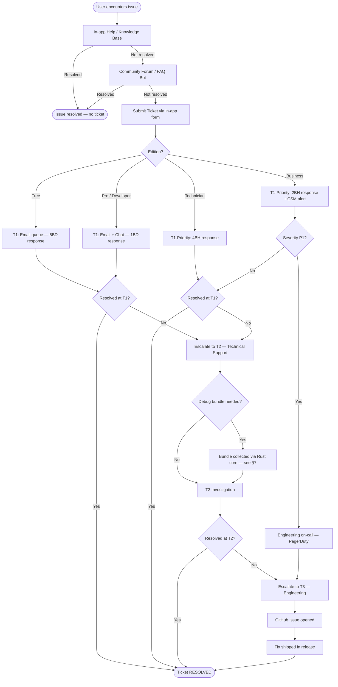
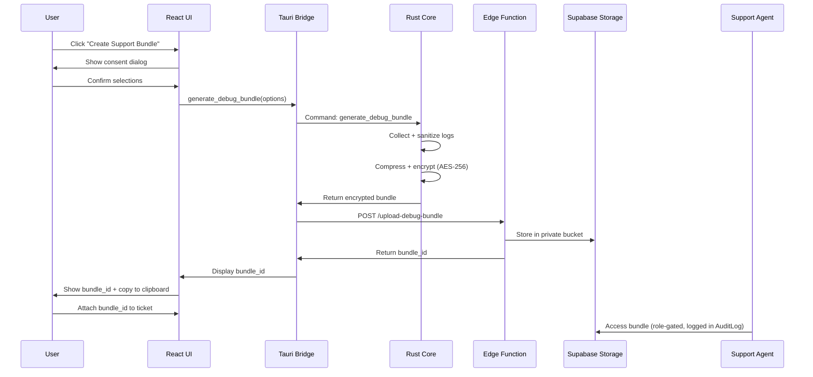

# 54. Support Operations Plan

> Defines support tiers, channels, SLA targets by edition, escalation paths, the debug-bundle workflow, and self-service deflection strategy for DeviceLifeline. Part of the DeviceLifeline documentation suite — see [Documentation Index](README.md).

**Status:** Draft v1 · **Authoring role:** Customer Success/Support Lead · **Last updated:** 2026-06-07
**Related:** [36. Logging Strategy](36-logging-strategy.md), [37. Observability Strategy](37-observability-strategy.md), [14. Subscription Plans](14-subscription-plans.md), [55. Customer Success Plan](55-customer-success-plan.md), [16. Risk Analysis](16-risk-analysis.md)

---

## 1. Purpose & Scope

This document specifies the complete support operations model for DeviceLifeline, covering:

- Support channels and tier structure
- Service Level Agreement (SLA) targets per edition (Free, Pro, Developer, Technician, Business)
- Ticketing system configuration and escalation paths
- The structured debug-bundle collection and triage workflow
- Self-service and deflection mechanisms
- Priority support for Technician and Business editions

**Out of scope:** Customer success lifecycle management (see [55. Customer Success Plan](55-customer-success-plan.md)); product observability infrastructure (see [37. Observability Strategy](37-observability-strategy.md)).

---

## 2. Assumptions

| ID | Assumption |
|----|------------|
| A-SUP-01 | Support operations launch with a small team (2–4 agents) at MVP; headcount scales with ARR milestones. |
| A-SUP-02 | Ticketing is handled via a third-party helpdesk platform (e.g., Linear for internal triage + Intercom or Zendesk for customer-facing). Exact vendor is TBD; this doc specifies requirements, not vendor. |
| A-SUP-03 | Debug bundles are generated on-device by the Rust core and uploaded to Supabase Storage; support agents access them via an internal admin view, never exposing raw device data to unauthorized parties. |
| A-SUP-04 | Free-tier users receive community and knowledge-base support only at launch; email support is introduced for Free after user base exceeds 10,000 MAU. |
| A-SUP-05 | SLA clocks begin when a ticket is confirmed received (auto-acknowledgement email sent). |
| A-SUP-06 | Technician and Business SLAs are governed by terms in their respective Subscription contracts; this document specifies defaults. |
| A-SUP-07 | All support interactions are logged and associated with the relevant Account and User records in Supabase for audit purposes. |

---

## 3. Support Channels

### 3.1 Channel Matrix

| Channel | Description | Editions Available |
|---------|-------------|-------------------|
| **In-app Help** | Contextual help panel, tooltips, guided walkthroughs embedded in the React UI. Zero-friction first stop. | All |
| **Knowledge Base** | Public, searchable docs site (hosted separately; e.g., Mintlify or GitBook). Covers how-to guides, troubleshooting trees, FAQ. | All |
| **Community Forum** | Moderated community (e.g., Discord server + Discourse forum). Peer support, announcements, feature requests. | All |
| **Email Support** | Ticket submitted via in-app form or support@devicelifeline.com. Routed into helpdesk. | Pro, Developer, Technician, Business; Free (post-10k MAU) |
| **Live Chat** | Real-time chat via helpdesk widget (within app and marketing site). Business-hours coverage at launch. | Pro, Developer, Technician, Business |
| **Priority Chat / Slack Connect** | Dedicated shared Slack channel or priority queue for Technician/Business accounts. | Technician, Business |
| **Video / Screen-share Session** | Scheduled screen-share session for complex issues. | Business (included); Technician (on request) |

### 3.2 In-App Help System

The React UI embeds a help panel accessible from a persistent `?` icon in the navigation bar. Features:

- **Contextual article injection:** The current route determines which knowledge-base articles surface first.
- **Search bar:** Full-text search over the knowledge base without leaving the app.
- **"Create a Ticket" shortcut:** Pre-populates the ticket form with the current screen, app version, OS version, and a privacy-gated option to attach a debug bundle.
- **Guided tours:** Step-by-step onboarding tours for first-time activation of key features (Device DNA scan, first Restore, AI Detective query).
- **Status page link:** Embedded Supabase / service status indicator.

---

## 4. Support Tier Structure

### 4.1 Tier Definitions

```
Tier 0 — Self-Service
  Knowledge Base · Community · In-app Help · AI-assisted FAQ bot

Tier 1 — Frontline Support
  Email & Live Chat · Basic troubleshooting · Known-issue matching
  → Escalate to Tier 2 if unresolved in 2 business days

Tier 2 — Technical Support
  Advanced debugging · Debug bundle analysis · Rust Core / Supabase issues
  → Escalate to Tier 3 if requires code fix

Tier 3 — Engineering Escalation
  Engineering team involvement · Bug confirmed → GitHub Issue opened
  → Resolution tracked through release cycle
```

### 4.2 Issue Categories

| Category | Typical Examples | Default Tier |
|----------|-----------------|--------------|
| Account & Billing | Subscription status, payment failure, seat management | T1 |
| Installation & Setup | App install errors, first-run failures, OS compatibility | T1 |
| Device DNA / Snapshots | Scan errors, missing data, sync failures | T1 → T2 |
| Performance Timeline | Missing events, incorrect correlations | T2 |
| AI Detective | Inaccurate diagnoses, hallucinated findings | T2 |
| Restore / Install Engine | Failed restores, WinGet errors, install task failures | T2 |
| Health Intelligence | Incorrect health scores, missed alerts | T2 |
| Crash Intelligence | Crash events not captured, incorrect BSOD analysis | T2 |
| Data Privacy / Deletion | GDPR/CCPA data subject requests | T2 → Legal |
| Security Incidents | Suspected data breach, unauthorized access | T3 → Security Incident Response |
| Technician Edition | Multi-device management, report generation, white-label | T2 (priority) |
| Business Edition / Fleet | Fleet policy, compliance, admin console | T2 (priority) |

---

## 5. SLA Targets by Edition

All times are **business hours** (09:00–18:00 in the account's primary time zone) unless marked 24/7.

| Edition | First Response | Resolution Target | Availability | Priority Queue |
|---------|---------------|-------------------|--------------|----------------|
| **Free** | 5 business days (email, post-10k MAU) | Best-effort | Community 24/7 | No |
| **Pro** | 1 business day | 5 business days | Email + Chat | No |
| **Developer** | 1 business day | 5 business days | Email + Chat | No |
| **Technician** | 4 business hours | 2 business days | Email + Priority Chat | Yes |
| **Business** | 2 business hours | 1 business day (P1: 4 hrs) | Email + Priority Chat + Video | Yes (dedicated queue) |

**Severity levels (Business):**

| Severity | Definition | Response SLA |
|----------|-----------|--------------|
| P1 — Critical | Production fleet impacted; data loss risk; security incident | 2 hours (24/7) |
| P2 — High | Core feature unavailable for >50% of fleet; > 10 devices impacted | 4 business hours |
| P3 — Medium | Feature degraded; workaround exists | 1 business day |
| P4 — Low | Minor issue; cosmetic; documentation request | 5 business days |

---

## 6. Ticketing System & Escalation Paths

### 6.1 Ticket Lifecycle

Every support ticket follows this lifecycle:

```
CREATED → TRIAGED → IN_PROGRESS → PENDING_CUSTOMER → RESOLVED → CLOSED
                ↓                          ↑
           ESCALATED ──────────────────────┘
```

**State definitions:**

- **CREATED:** Auto-acknowledged; SLA clock starts.
- **TRIAGED:** Tier-1 agent assigned; category and severity tagged.
- **IN_PROGRESS:** Agent actively working; first response sent.
- **ESCALATED:** Moved to Tier 2/3; parent ticket ID linked.
- **PENDING_CUSTOMER:** Awaiting information from customer; SLA clock paused.
- **RESOLVED:** Fix or workaround confirmed; resolution note written.
- **CLOSED:** Customer confirmed or 5 days elapsed without response after RESOLVED.

### 6.2 Escalation Triggers

| Trigger | Action |
|---------|--------|
| Issue unresolved after 80% of SLA elapsed | Auto-notify support lead; proactive customer update |
| Issue matches known bug in issue tracker | Link to bug; set resolution ETA from engineering |
| Debug bundle analysis reveals Rust core panic | Escalate to Tier 3; open GitHub issue with bundle reference |
| Customer reports data loss or security concern | Immediate escalation to security incident response team |
| Technician/Business P1 ticket created | PagerDuty / on-call alert to engineering lead |

### 6.3 Required Ticket Fields

| Field | Required | Auto-Populated |
|-------|----------|----------------|
| User ID / Account ID | Yes | Yes (from session) |
| Edition / Plan | Yes | Yes (from Subscription) |
| App Version | Yes | Yes (from in-app form) |
| OS Version & Build | Yes | Yes (from in-app form) |
| Issue Category | Yes | No (agent-tagged) |
| Severity | Yes | No (agent-tagged) |
| Debug Bundle ID | Optional | Optional (user-consented) |
| Affected Device IDs | Optional | Optional |

---

## 7. Debug Bundle Workflow

The debug bundle is the primary artifact used by Tier 2+ support for technical triage. It is generated by the Rust core and must never expose personally identifiable information beyond what the user has explicitly consented to share.

See [36. Logging Strategy](36-logging-strategy.md) for the full logging architecture and log-level definitions.

### 7.1 Bundle Contents

| Component | Included | Notes |
|-----------|----------|-------|
| Application logs (last 48 hrs) | Yes | Sanitized: no file content, no credential values |
| Rust core diagnostic output | Yes | Panic traces, collector errors |
| SQLite schema version + migration state | Yes | No row data |
| Device DNA snapshot metadata | Optional | User-consented; no personal files |
| Performance Timeline event counts (no content) | Yes | Counts only |
| Health sample summary (last 7 days) | Optional | Aggregated; no raw data |
| Crash event summary | Optional | Error codes + timestamps only |
| OS version, CPU/RAM/disk spec | Yes | Hardware profile only |
| Network config (anonymized) | Optional | No SSIDs, no IPs |
| Supabase sync state | Yes | Timestamps, error codes |

### 7.2 Generation Flow

```
User clicks "Create Support Bundle" in app
  → React UI shows consent dialog listing included components
  → User toggles optional components on/off
  → User clicks Confirm
  → Tauri bridge invokes Rust core command: generate_debug_bundle
  → Rust core:
      1. Collects logs from on-device log store (SQLite / file)
      2. Sanitizes: strips PII patterns (email, name, path fragments)
      3. Compresses to .zip with SHA-256 checksum
      4. Encrypts with Supabase Storage upload key (AES-256)
  → Tauri bridge calls Supabase Edge Function: upload_debug_bundle
  → Edge Function stores bundle in Supabase Storage (private bucket)
  → Returns bundle_id to client
  → User copies bundle_id into support ticket (or in-app form auto-attaches)
```

### 7.3 Support Agent Access

- Support agents access bundles via an internal admin dashboard (Supabase + custom React admin panel).
- Access is gated by `support_agent` role with Row-Level Security on the bundles table.
- Bundle access is logged in AuditLog with `agent_id`, `bundle_id`, `accessed_at`.
- Bundles auto-expire from Storage after 90 days.
- Agents may NOT download bundles to local machines; they are accessed in-browser only.

---

## 8. Self-Service & Deflection

### 8.1 Deflection Hierarchy

```
1. In-app contextual help (zero-click)
2. Knowledge base search (self-serve)
3. Community forum (peer support)
4. AI-assisted FAQ bot (LLM over knowledge base articles — Tier-0 automation)
5. Ticket submission (human support)
```

**Deflection target:** 60% of Free/Pro issues resolved at Tier 0 without human agent involvement.

### 8.2 AI-Assisted FAQ Bot

At the ticket creation step, the in-app form runs a semantic search over the knowledge base using a lightweight Supabase Edge Function → OpenAI Embeddings query. Results surface the top 3 matching articles. If the user marks an article as resolving their issue, no ticket is created.

- Model: OpenAI `text-embedding-3-small` for article embeddings stored in Supabase `pgvector`.
- Articles embedded at publish time; re-indexed nightly.
- Deflection rate tracked in PostHog as `support_deflection_event`.

### 8.3 Knowledge Base Structure

```
Getting Started/
  Installation & First Run
  Activating Your Plan
  First Device DNA Scan
Features/
  Performance Timeline
  AI Detective
  Health Intelligence
  Crash Intelligence
  Recovery Center
Restore & Setup/
  One-Click Restore
  WinGet Troubleshooting
  Restore Job Status
Account & Billing/
  Plans & Upgrades
  Seat Management (Business)
  Cancellation & Refunds
Technician Edition/
  Multi-Device Management
  Generating Customer Reports
  White-Label Configuration
Business Edition/
  Fleet Setup
  Policy Management
  Admin Console
Troubleshooting/
  Common Error Codes
  Debug Bundle Guide
  Contact Support
```

---

## 9. Priority Support — Technician & Business Editions

### 9.1 Technician Edition

- Dedicated `technician-support@devicelifeline.com` queue or in-app priority tag.
- Response within 4 business hours.
- Support agents trained on Technician Edition workflows: customer report generation, multi-device management, white-label branding.
- Access to a "Technician Support Portal" with batch ticket submission for shop workflows.
- Quarterly support review call with assigned CS rep (see [55. Customer Success Plan](55-customer-success-plan.md)).

### 9.2 Business Edition

- Dedicated Slack Connect channel per Account (provisioned at onboarding).
- Named Customer Success Manager (CSM) as primary escalation path.
- P1 response 24/7 via PagerDuty integration; engineer on-call receives alert.
- Monthly support health review included in CSM cadence.
- All support tickets for a Business Account are aggregated in CSM dashboard.
- Video / screen-share sessions: up to 2 hours/month included; additional time billed at hourly rate (TBD).

---

## 10. Diagrams

### 10.1 Support Flow



### 10.2 Debug Bundle Data Flow



---

## Risks & Mitigations

| Risk | Likelihood | Impact | Mitigation |
|------|-----------|--------|------------|
| RISK-SUP-01: Support volume spikes at launch exceed team capacity | High | High | Pre-build knowledge base before launch; AI deflection bot; community forum seeded with common answers |
| RISK-SUP-02: Debug bundles contain inadvertent PII | Medium | High | Rust core sanitization pass; regex-based PII scrubbing for emails, paths, usernames; consent-gated optional sections |
| RISK-SUP-03: SLA breach for Business/Technician due to small team | Medium | High | PagerDuty on-call rotation; escalation automation; clear hand-off protocol between CS and engineering |
| RISK-SUP-04: Support agent gains unauthorized data access | Low | Critical | RLS on bundle storage; access logging in AuditLog; in-browser access only; 90-day auto-expiry |
| RISK-SUP-05: AI FAQ bot returns incorrect deflection (wrong article) | Medium | Medium | Human fallback always present; bot flags low-confidence results; feedback loop improves embeddings |
| RISK-SUP-06: Helpdesk vendor lock-in | Low | Medium | Abstract ticket IDs into internal tracking; ensure data export capability at vendor selection |

---

## Future Considerations

- **AI-powered ticket routing:** Automatically classify and route tickets to the correct tier and agent specialty using LLM classification on ticket text.
- **Automated diagnosis from debug bundle:** Edge Function analyzes bundle contents and surfaces probable cause before agent review.
- **Self-serve subscription management:** Full Stripe Customer Portal integration so users can upgrade, downgrade, and cancel without contacting support.
- **Multi-language knowledge base:** Localization of top 20 articles into top 5 user languages post-MVP.
- **In-app chat with AI agent:** Post-MVP AI agent capable of walking users through troubleshooting steps interactively (see [58. Future AI Agent Strategy](58-future-ai-agent-strategy.md)).
- **SLA dashboard for Business admins:** Real-time ticket status and SLA health visible in the admin console.

---

## Acceptance Criteria

- [ ] AC-SUP-01: In-app help panel is accessible from every screen in the React UI via the `?` icon.
- [ ] AC-SUP-02: Knowledge base is live and searchable before public launch, covering all MVP features.
- [ ] AC-SUP-03: Debug bundle generation dialog displays all included/optional components and requires explicit user consent before collection.
- [ ] AC-SUP-04: Debug bundle upload to Supabase Storage completes within 60 seconds for bundles under 50 MB.
- [ ] AC-SUP-05: Support agent access to debug bundles is gated by `support_agent` role and every access is written to AuditLog.
- [ ] AC-SUP-06: Bundles auto-deleted from Supabase Storage after 90 days (verified by scheduled cleanup function).
- [ ] AC-SUP-07: SLA targets defined in §5 are reflected in helpdesk automation rules and are measurable via helpdesk reports.
- [ ] AC-SUP-08: P1 Business tickets trigger PagerDuty alert within 5 minutes of ticket creation.
- [ ] AC-SUP-09: AI FAQ deflection bot surfaces at least 3 articles before ticket submission for any ticket category that has >5 knowledge-base articles.
- [ ] AC-SUP-10: Tier escalation from T1→T2 and T2→T3 is traceable in ticket history with timestamps and agent names.
