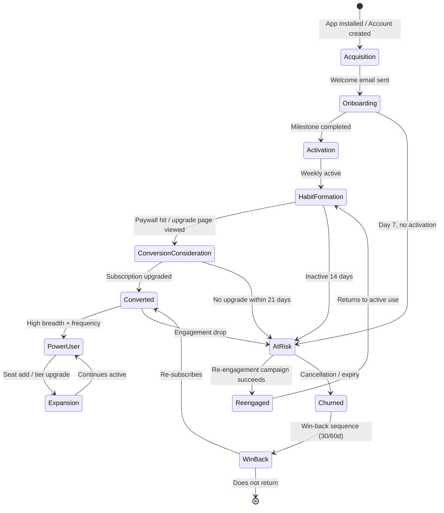
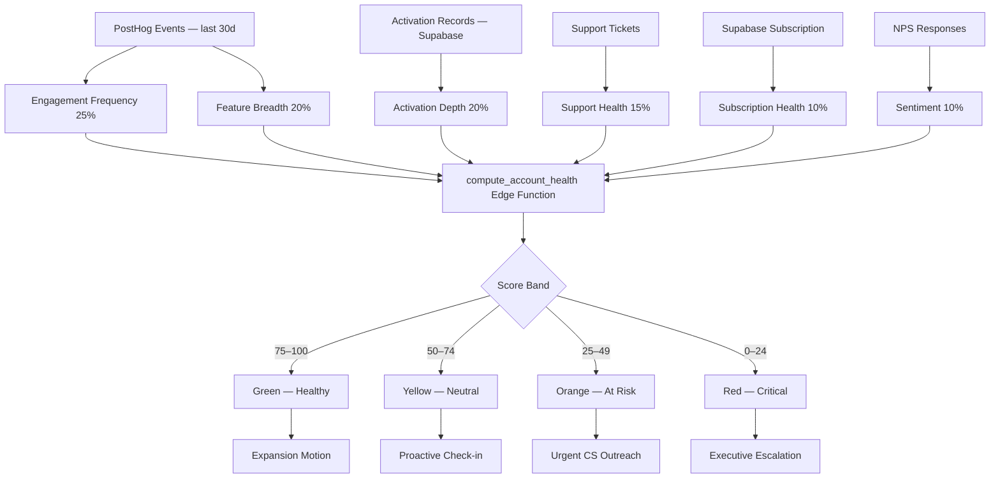

# 55. Customer Success Plan

> Defines activation milestones, lifecycle journeys, account health scoring, churn prevention, expansion motions, and success metrics for DeviceLifeline. Part of the DeviceLifeline documentation suite — see [Documentation Index](README.md).

**Status:** Draft v1 · **Authoring role:** Customer Success/Support Lead · **Last updated:** 2026-06-07
**Related:** [14. Subscription Plans](14-subscription-plans.md), [54. Support Operations Plan](54-support-operations-plan.md), [13. Monetization Strategy](13-monetization-strategy.md), [04. User Personas](04-user-personas.md), [35. Event Tracking Specification](35-event-tracking-specification.md)

---

## 1. Purpose & Scope

This document defines the Customer Success strategy for DeviceLifeline across all editions. It covers:

- Activation and onboarding milestone definitions
- Lifecycle journeys for consumer self-serve vs. B2B (Technician / Business)
- Account health scoring model
- Churn prevention and expansion revenue motions
- Education and enablement programs
- NPS and quantitative success metrics
- CS-specific operations for Technician and Business editions

**Out of scope:** Support ticket SLAs (see [54. Support Operations Plan](54-support-operations-plan.md)); subscription pricing (see [14. Subscription Plans](14-subscription-plans.md)).

---

## 2. Assumptions

| ID | Assumption |
|----|------------|
| A-CS-01 | Customer Success is owned by 1 CS lead at launch; scales to team of 3–5 post-Series A. |
| A-CS-02 | In-app behavioral events tracked via PostHog (see [35. Event Tracking Specification](35-event-tracking-specification.md)) are the primary data source for health scoring and lifecycle triggers. |
| A-CS-03 | Automated lifecycle emails are sent via a transactional email platform (e.g., Resend or SendGrid); template content is managed by CS. |
| A-CS-04 | NPS surveys are delivered in-app (React UI modal) and via email; responses stored in Supabase. |
| A-CS-05 | Consumer (Free/Pro/Developer) journeys are primarily self-serve with light-touch automation; Technician/Business journeys include human CSM touchpoints. |
| A-CS-06 | Account health scores are computed nightly via a Supabase Edge Function that reads PostHog event data and Supabase subscription records. |
| A-CS-07 | "Activation" is achieved when a user completes the defined activation milestone set for their edition within 14 days of signup. |

---

## 3. Activation & Onboarding Milestones

### 3.1 Activation Definition by Edition

| Edition | Activation Milestone | Target Window |
|---------|---------------------|---------------|
| **Free** | Completes first Device DNA scan + views dashboard | 48 hours |
| **Pro** | Device DNA scan + views Performance Timeline + one AI Detective query | 7 days |
| **Developer** | Device DNA scan + creates one EnvironmentTemplate or RestorePlan | 14 days |
| **Technician** | Connects first client device + generates first customer report | 14 days |
| **Business** | Admin creates Account + adds 3+ devices to FleetGroup + assigns first Policy | 21 days |

### 3.2 Onboarding Step Definitions (Pro Example)

```
Step 1: Install & Launch (Day 0)
  → App installed, first run completes, Rust core initializes
  → User creates account via Supabase Auth

Step 2: First Device DNA Scan (Day 0–1)
  → User initiates scan from dashboard
  → DeviceDNASnapshot created; SQLite populated
  → In-app tour overlays explain snapshot sections

Step 3: Explore Performance Timeline (Day 1–3)
  → User opens Timeline module
  → At least one TimelineEvent viewed in detail
  → AI correlation tooltip displayed

Step 4: First AI Detective Query (Day 3–7)
  → User types natural-language question
  → DiagnosisSession created; DiagnosisFinding returned
  → User rates finding (thumbs up/down)

Step 5: Activation Confirmed (Day ≤7)
  → All above steps complete
  → PostHog event: user_activated emitted
  → Welcome series transitions to engagement series
```

### 3.3 Onboarding Email Sequence (Consumer)

| Day | Trigger | Email Subject |
|-----|---------|---------------|
| 0 | Account created | "Welcome to DeviceLifeline — start here" |
| 1 | Not scanned yet | "Your computer is waiting to be understood" |
| 3 | Scanned but not Timeline | "See what changed on your PC this month" |
| 5 | Not queried AI yet | "Ask your AI Detective anything" |
| 7 | Not activated | "Need help getting started? Here's a 2-min guide" |
| 14 | Activated | "You're all set — here's what to explore next" |

---

## 4. Lifecycle Journeys

### 4.1 Consumer Self-Serve Journey (Free → Pro → Developer)

```
Acquisition → Activation → Habit Formation → Conversion → Retention → Expansion
```

**Lifecycle stages and triggers:**

| Stage | Definition | Key Events | CS Action |
|-------|-----------|-----------|-----------|
| **Acquisition** | Account created; plan = Free | `account_created` | Welcome email; onboarding tour |
| **Activation** | Completed activation milestone | `user_activated` | Congratulations email; next-step CTA |
| **Habit Formation** | Weekly active; returning to core features | `dna_scan_weekly`, `timeline_viewed` | Feature discovery nudges |
| **Conversion Consideration** | Hits Free plan limits; views upgrade page | `upgrade_page_viewed`, `paywall_hit` | Upgrade prompt; trial offer |
| **Converted** | Upgrades to Pro or Developer | `subscription_upgraded` | Thank-you email; Pro feature tour |
| **Power User** | High feature breadth; AI queries weekly | `ai_query_weekly`, `restore_completed` | Beta program invite; referral ask |
| **At Risk** | No activity >21 days | `user_inactive_21d` | Re-engagement email; support offer |
| **Churned** | Subscription cancelled or expired | `subscription_cancelled` | Exit survey; win-back sequence (30/60d) |

### 4.2 B2B Journey — Technician Edition

Technician accounts are typically repair shop owners or MSP technicians. They evaluate DeviceLifeline for workflow efficiency and client differentiation.

| Stage | Milestone | CS Touchpoint |
|-------|-----------|---------------|
| Trial / Evaluation | Shop owner installs; connects first device | Automated: trial guide email + demo video |
| Activation | First client report generated | Human: CSM welcome call (15 min) |
| Expansion | >5 devices connected | Human: CSM check-in; show batch report features |
| Renewal Risk | Activity drop >14 days | Human: proactive outreach from CSM |
| Renewal | Annual renewal due | Human: CSM renewal call + usage review |
| Advocacy | NPS ≥9; active >6 months | Referral program offer; case study ask |

### 4.3 B2B Journey — Business Edition

Business accounts are IT leads, ops managers, or CTOs managing device fleets.

| Stage | Milestone | CS Touchpoint |
|-------|-----------|---------------|
| Sales Handoff | Contract signed; Account provisioned | Human: onboarding kickoff call (CSM + IT lead) |
| Technical Onboarding | Devices enrolled; FleetGroups created; Policies set | Human: onboarding workshop (up to 2 hrs); Slack Connect channel opened |
| Go-Live | >80% of contracted devices active | Human: go-live confirmation + success plan set |
| Steady-State | Monthly active fleet; compliance reports used | Human: monthly CSM cadence call |
| Expansion | Team grows; new FleetGroups; add seats | Human: expansion proposal from CSM |
| Renewal | Renewal date approaching (90d out) | Human: business review + ROI summary |
| Executive Sponsor | C-level engagement | Human: QBR (Quarterly Business Review) |

---

## 5. Account Health Scoring

### 5.1 Health Score Model

Account health is computed nightly as a composite score (0–100). The score is visible to CSMs in an internal dashboard and, in aggregate, to Business admins.

**Score components:**

| Dimension | Weight | Signal |
|-----------|--------|--------|
| **Activation Depth** | 20% | % of edition activation milestones completed |
| **Engagement Frequency** | 25% | DAU/WAU ratio over last 30 days |
| **Feature Breadth** | 20% | # of distinct modules used in last 30 days |
| **Support Health** | 15% | Inverse of open P1/P2 tickets; days since last escalation |
| **Subscription Health** | 10% | Payment current; no failed charges in last 60 days |
| **NPS/Sentiment** | 10% | Last NPS response (Promoter=100, Passive=50, Detractor=0) |

**Score bands:**

| Band | Score | Interpretation | CS Action |
|------|-------|---------------|-----------|
| Green — Healthy | 75–100 | Engaged, paying, no issues | Expansion motion; referral ask |
| Yellow — Neutral | 50–74 | Some disengagement or minor issues | Proactive check-in; feature discovery |
| Orange — At Risk | 25–49 | Low engagement or open issues | Urgent CS outreach; escalation review |
| Red — Critical | 0–24 | Inactive or high churn signal | Executive escalation; save motion |

### 5.2 Health Score Computation

Health score is computed by a Supabase Edge Function (`compute_account_health`) on a nightly cron:

```
Input: PostHog user events (last 30d) + Supabase subscription record + support ticket counts
Output: health_score (0–100) + band + delta vs. prior period
Stored in: Supabase table account_health_scores (account_id, score, band, computed_at, components JSON)
```

---

## 6. Churn Prevention

### 6.1 Churn Signals

| Signal | Trigger Condition | Priority |
|--------|------------------|----------|
| `user_inactive_14d` | No app open event in 14 days | Medium |
| `feature_usage_drop_50pct` | Feature use drops 50%+ week-over-week | Medium |
| `support_escalation_unresolved` | T2/T3 ticket open >5 days | High |
| `payment_failed` | Stripe/Paystack payment failure | High |
| `nps_detractor` | NPS score submitted ≤6 | High |
| `health_score_critical` | Health score drops to Red band | High |
| `cancel_intent_page_viewed` | User visits cancellation page | Very High |

### 6.2 Churn Prevention Playbooks

**Automated playbooks (all editions):**

| Trigger | Automated Action |
|---------|-----------------|
| `user_inactive_14d` | Re-engagement email: "What's new on your PC?" with timeline screenshot |
| `payment_failed` | Payment failure email (Day 1, Day 3, Day 7); grace period of 7 days before downgrade |
| `cancel_intent_page_viewed` | In-app exit survey modal; 1-month discount offer for Pro annual |

**Human-touch playbooks (Technician / Business):**

| Trigger | CSM Action |
|---------|-----------|
| `health_score_critical` | CSM outreach within 1 business day; root-cause investigation |
| `nps_detractor` | CSM follow-up call within 48 hours; issue escalation if needed |
| `support_escalation_unresolved_5d` | CSM coordinates with engineering lead; daily status update to account |
| Renewal approaching (60d out) | CSM initiates renewal conversation; ROI summary prepared |

### 6.3 Win-Back Sequences

For churned subscribers (subscription cancelled):

| Day Post-Cancellation | Action |
|----------------------|--------|
| 1 | Exit survey email; collect reason |
| 7 | "We want you back" email — what's changed; known issue resolution if applicable |
| 30 | Win-back offer: 30% off first month back |
| 60 | Final win-back: different messaging based on exit survey category |

---

## 7. Expansion Motions

### 7.1 Upgrade Triggers (Consumer)

| Trigger | Expansion Motion |
|---------|-----------------|
| Free user hits 3 AI Detective queries (paywall) | Upgrade prompt with Pro feature comparison |
| Pro user exports first RestorePlan | Upsell Developer for EnvironmentTemplates |
| Pro user mentions multiple devices in AI query | Upsell Technician if shop context detected |

### 7.2 Seat Expansion (Business)

- Fleet exceeds 80% of contracted device seats → CSM receives alert; sends expansion proposal.
- New FleetGroup created with devices beyond seat limit → Admin prompted to add seats in admin console.
- HR system integration event (new employee onboarded) → triggers seat-add suggestion (post-MVP).

### 7.3 Cross-Sell (Future)

- Pro → Developer: developer environment templates, workstation backup.
- Individual → Business: when Pro user's company context detected.
- Technician → Business: when shop grows to manage >20 devices.

---

## 8. Education & Enablement

### 8.1 Consumer Education

| Format | Description | Cadence |
|--------|-------------|---------|
| In-app tours | Interactive feature walkthroughs in React UI | On first use of each module |
| Video tutorials | 2–5 min screen-recorded feature walkthroughs | Published at feature launch |
| Knowledge base | Written how-to articles | Maintained ongoing |
| Release notes digest | Monthly "What's new" email | Monthly |
| Community Q&A | Weekly community digest of top questions | Weekly |

### 8.2 Technician Enablement

| Format | Description |
|--------|-------------|
| Technician Onboarding Guide | PDF + web guide for setting up shop workflows |
| Webinar | Monthly "Technician Tips" live session (30 min) |
| White-label setup guide | Step-by-step branded report configuration |
| Case study library | How other shops use DeviceLifeline |

### 8.3 Business Enablement

| Format | Description |
|--------|-------------|
| Admin Console training | Live 2-hr onboarding session for IT admin |
| Fleet Management Playbook | PDF guide: FleetGroups, Policies, compliance |
| API / Integration Guide | For IT teams integrating with existing tooling (post-MVP SSO, MDM) |
| QBR template | Quarterly Business Review slide deck template |

---

## 9. NPS & Success Metrics

### 9.1 NPS Program

- **Survey delivery:** In-app modal (React UI) after 30 days of activity, then every 90 days.
- **Delivery method:** Also sent via email for users who don't open the app within 7 days of trigger.
- **Question:** Standard NPS: "How likely are you to recommend DeviceLifeline to a friend or colleague?" (0–10)
- **Follow-up:** One open text field: "What's the main reason for your score?"
- **Storage:** Supabase `nps_responses` table linked to `user_id` and `account_id`.
- **Target NPS:** ≥40 at 12 months post-launch.

### 9.2 Key Success Metrics

| Metric | Definition | Target (12 months) |
|--------|-----------|-------------------|
| **Activation Rate** | % of signups completing activation milestone within 14 days | ≥55% |
| **D30 Retention** | % of activated users still active at Day 30 | ≥45% |
| **M3 Retention** | % of activated users still active at Month 3 | ≥35% |
| **Trial → Paid Conversion** | % of Free users upgrading within 90 days | ≥8% |
| **Monthly Revenue Churn** | MRR lost from cancellations / beginning MRR | ≤3% |
| **NPS** | Net Promoter Score | ≥40 |
| **CSAT** | Customer Satisfaction Score (post-ticket) | ≥4.2 / 5.0 |
| **Time to Activation** | Median hours from signup to activation milestone | ≤48 hrs (Free), ≤7 days (Pro) |
| **Business Expansion Rate** | % of Business accounts adding seats within 12 months | ≥30% |
| **Support Deflection Rate** | % of issues resolved at Tier 0 (no ticket) | ≥60% |

---

## 10. CS Operations for Technician & Business

### 10.1 CSM Assignment Model

| Edition | CSM Coverage | Ratio |
|---------|-------------|-------|
| Free / Pro / Developer | Pooled (no named CSM) | Automated only |
| Technician | Shared CSM pool | 1 CSM : ≤100 accounts |
| Business | Named CSM | 1 CSM : ≤20 accounts |

### 10.2 CSM Tooling

- **CRM:** Internal Supabase-backed admin dashboard showing account health, usage, ticket history, NPS.
- **Communication:** Slack Connect (Business), email templates via transactional email platform.
- **Task management:** Linear or Notion for CSM playbook tracking.
- **Meeting notes:** Linked to Account record in CRM.

### 10.3 Quarterly Business Review (Business Edition)

QBR deliverables per account:

1. Fleet health summary (device counts, health score distribution, alert history)
2. Feature adoption report (which modules are used; which are unused)
3. Support health (ticket volume, P1/P2 frequency, resolution times)
4. ROI summary (time saved vs. manual device management estimate)
5. Roadmap preview (upcoming features relevant to the account)
6. Success goals for next quarter (agreed, documented)

---

## Diagrams

### Lifecycle Journey Overview



### Account Health Score Model



---

## Risks & Mitigations

| Risk | Likelihood | Impact | Mitigation |
|------|-----------|--------|------------|
| RISK-CS-01: Low activation rate (<40%) at launch | Medium | High | Shorten onboarding steps; add in-app guided tour; reduce time to first scan |
| RISK-CS-02: Health score model inaccurate due to sparse PostHog data | Medium | Medium | Default new accounts to Neutral band; require 14-day data minimum before scoring |
| RISK-CS-03: CSM bandwidth insufficient for Business accounts | Medium | High | Hard cap of 20 accounts/CSM; hiring triggers defined at 15 accounts/CSM |
| RISK-CS-04: NPS survey fatigue reduces response rates | Medium | Low | Max 1 survey per 90-day window; suppress for active support cases |
| RISK-CS-05: Win-back sequences perceived as spam | Low | Medium | Strict suppression list; max 2 win-back emails; unsubscribe respected immediately |
| RISK-CS-06: Business churn due to delayed onboarding | Low | High | Onboarding kickoff within 5 days of contract signing; CSM owns activation checklist |

---

## Future Considerations

- **Product-led growth loops:** Free users who share device health reports generate referral credit (post-MVP).
- **In-app NPS and survey expansion:** CSAT immediately post-feature use for granular feedback.
- **CS platform integration:** Salesforce or HubSpot integration for enterprise sales + CS alignment (post-Series A).
- **Automated QBR generation:** Edge Function composes QBR draft from account data; CSM reviews and presents.
- **Community-led success:** Power user advocates ("DeviceLifeline Champions") given beta access and recognition in community.
- **Localized CS:** Regional CSMs for EMEA and APAC as international expansion proceeds.

---

## Acceptance Criteria

- [ ] AC-CS-01: Activation milestones for all 5 editions are defined, instrumented in PostHog, and verifiable in Supabase.
- [ ] AC-CS-02: Onboarding email sequence triggers correctly within 1 hour of account creation event.
- [ ] AC-CS-03: Account health score is computed nightly and visible in CSM dashboard for all accounts with ≥14 days of data.
- [ ] AC-CS-04: Churn signal `health_score_critical` triggers CSM task creation within 1 business day.
- [ ] AC-CS-05: In-app NPS survey appears for eligible users (active ≥30 days, last survey >90 days ago) with correct suppression logic.
- [ ] AC-CS-06: Business accounts receive Slack Connect channel within 2 business days of contract signing.
- [ ] AC-CS-07: QBR template document exists and is used for all Business accounts at or before 90-day mark.
- [ ] AC-CS-08: Win-back email sequence fires within 24 hours of `subscription_cancelled` event and respects unsubscribe.
- [ ] AC-CS-09: D30 retention is measurable from PostHog cohort analysis by end of Month 2 post-launch.
- [ ] AC-CS-10: Support deflection rate ≥60% is measurable via PostHog `support_deflection_event` vs. ticket volume.
