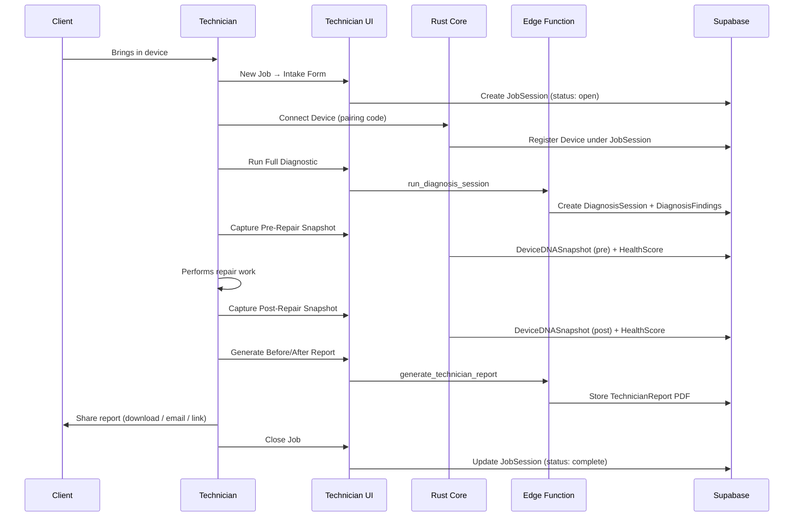
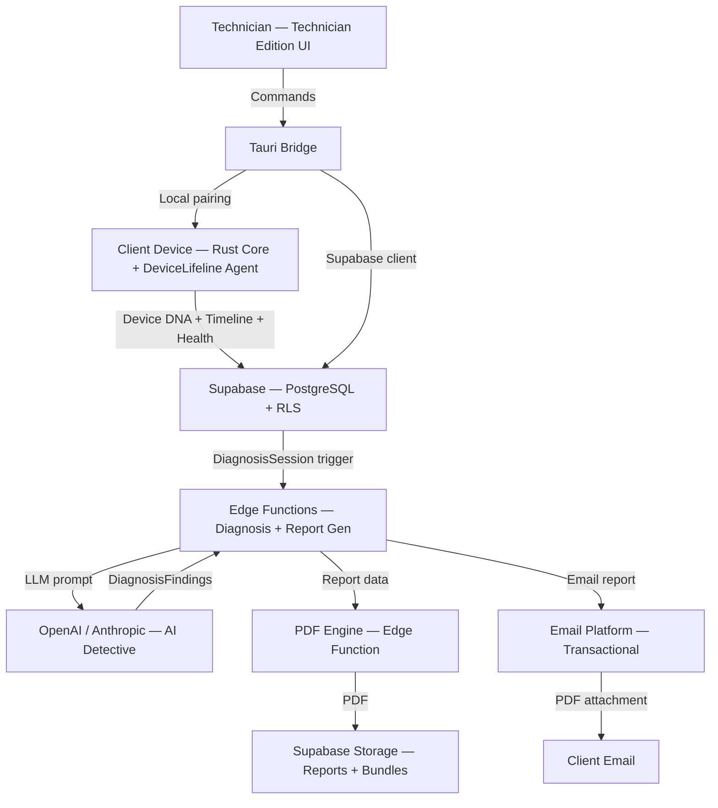

# 56. Technician Edition Specification

> Full specification for the Technician Edition of DeviceLifeline — a professional diagnostic toolkit for repair shops and MSPs. Part of the DeviceLifeline documentation suite — see [Documentation Index](README.md).

**Status:** Draft v1 · **Authoring role:** Customer Success/Support Lead + Principal Architect · **Last updated:** 2026-06-07
**Related:** [22. AI Diagnostics Design](22-ai-diagnostics-design.md), [24. Device DNA Design](24-device-dna-design.md), [23. Performance Timeline Design](23-performance-timeline-design.md), [25. Restore Engine Design](25-restore-engine-design.md), [14. Subscription Plans](14-subscription-plans.md), [32. Database Design](32-database-design.md), [57. Business Edition Specification](57-business-edition-specification.md)

---

## 1. Purpose & Scope

This document provides the complete functional and technical specification for the **Technician Edition** of DeviceLifeline — an add-on tier targeting computer repair technicians, repair shops, and Managed Service Providers (MSPs).

The Technician Edition extends the core platform with:

- Multi-device (multi-client) management under a single technician Account
- Customer report generation (branded / white-label)
- Full access to device history and Performance Timeline for client devices
- Repair recommendations derived from DiagnosisFindings
- Before/after health comparisons
- Shop workflow automation

**Out of scope:** Fleet-level policy management (see [57. Business Edition Specification](57-business-edition-specification.md)); future AI agentic execution (see [58. Future AI Agent Strategy](58-future-ai-agent-strategy.md)).

**MVP boundary:** Technician Edition is **post-MVP**. It is planned as a distinct release phase after the core Pro experience is validated.

---

## 2. Assumptions

| ID | Assumption |
|----|------------|
| A-TE-01 | A Technician account is a single-user Account (one technician LicenseSeat) at launch; multi-technician shop support (multiple seats under one Account) is available as an add-on. |
| A-TE-02 | Client devices are connected to the technician's DeviceLifeline account temporarily for the duration of a repair job; they do not permanently share data with the technician. |
| A-TE-03 | "Client device" = a Device record linked to a technician's Account for a bounded JobSession (defined in §4). The client's own DeviceLifeline account (if any) is separate. |
| A-TE-04 | Device DNA Snapshots and Performance Timeline data are collected by the Rust core running on the client's device during the repair session. |
| A-TE-05 | Customer reports are generated as PDF documents by a Supabase Edge Function; white-label branding (logo, colors, shop name) is configured per Account. |
| A-TE-06 | All client device data is stored under the technician's Account in Supabase with strict RLS; data is deleted at job close or after configurable retention period. |
| A-TE-07 | Technician Edition pricing is per LicenseSeat per month (billed monthly or annually). See [14. Subscription Plans](14-subscription-plans.md). |
| A-TE-08 | The Technician Edition UI is a separate module/route within the same Tauri app, not a separate application. |

---

## 3. Core Use Cases

### 3.1 Primary Personas

| Persona | Profile | Key Need |
|---------|---------|----------|
| **Solo Repair Technician** | Individual running a laptop/PC repair business | Efficient diagnosis; professional reports to justify repair recommendations |
| **Repair Shop Manager** | Manages 2–5 technicians; front-of-shop intake | Standardized intake process; client-facing reports; historical visibility |
| **MSP Technician** | IT support provider for small businesses | Remote/on-site diagnostics; multi-client management; health assessments |

### 3.2 Core Use Case Catalog

| ID | Use Case | Description |
|----|----------|-------------|
| UC-TE-01 | Start repair job | Technician registers a client device under their Account for a new JobSession |
| UC-TE-02 | Run diagnostic assessment | AI Detective performs full diagnosis on client device; findings surfaced to technician |
| UC-TE-03 | View device history | Technician inspects Performance Timeline and past DeviceDNASnapshots |
| UC-TE-04 | Generate customer report | Produce a branded PDF report for the client summarizing findings and recommendations |
| UC-TE-05 | Before/after comparison | Run DNA snapshot before repair; run again after; diff displayed |
| UC-TE-06 | Health assessment | Generate overall device health score + component-level breakdown |
| UC-TE-07 | Repair recommendation | AI-generated suggested repair steps based on DiagnosisFindings |
| UC-TE-08 | Close job | Mark repair complete; optionally export/archive job data |
| UC-TE-09 | Configure white-label | Set shop name, logo, colors for customer reports |
| UC-TE-10 | View job history | Review past jobs and reports for a returning client device |

---

## 4. Data Model Extensions

The Technician Edition adds the following records to the core schema. For base schema, see [32. Database Design](32-database-design.md) and [33. Entity Relationship Design](33-entity-relationship-design.md).

### 4.1 JobSession

Represents a single repair engagement for one client device.

```
JobSession {
  id: UUID (PK)
  technician_account_id: UUID (FK → Account)
  device_id: UUID (FK → Device)
  client_name: TEXT (nullable — customer's name, stored encrypted)
  client_contact: TEXT (nullable — encrypted)
  intake_notes: TEXT
  status: ENUM(open, in_progress, complete, archived)
  opened_at: TIMESTAMPTZ
  closed_at: TIMESTAMPTZ (nullable)
  pre_snapshot_id: UUID (FK → DeviceDNASnapshot, nullable)
  post_snapshot_id: UUID (FK → DeviceDNASnapshot, nullable)
  report_id: UUID (FK → TechnicianReport, nullable)
  created_at: TIMESTAMPTZ
  updated_at: TIMESTAMPTZ
}
```

### 4.2 TechnicianReport

A generated customer-facing report document.

```
TechnicianReport {
  id: UUID (PK)
  job_session_id: UUID (FK → JobSession)
  account_id: UUID (FK → Account)
  report_type: ENUM(health_assessment, diagnostic, before_after, full)
  storage_path: TEXT (Supabase Storage path)
  generated_at: TIMESTAMPTZ
  branding_config_id: UUID (FK → BrandingConfig)
  findings_snapshot: JSONB (snapshot of DiagnosisFindings at time of generation)
  health_score_snapshot: JSONB
  share_token: TEXT (nullable — for share-via-link)
  share_expires_at: TIMESTAMPTZ (nullable)
}
```

### 4.3 BrandingConfig

Per-Account white-label configuration.

```
BrandingConfig {
  id: UUID (PK)
  account_id: UUID (FK → Account)
  shop_name: TEXT
  logo_storage_path: TEXT (nullable)
  primary_color: TEXT (hex)
  secondary_color: TEXT (hex)
  contact_email: TEXT
  contact_phone: TEXT (nullable)
  website_url: TEXT (nullable)
  footer_text: TEXT (nullable)
  created_at: TIMESTAMPTZ
  updated_at: TIMESTAMPTZ
}
```

---

## 5. Technician UI Module

The Technician Edition adds a "Technician" section to the React UI nav, accessible only when `subscription.plan = 'technician'`.

### 5.1 Screen Map

```
Technician/
├── Job Dashboard             # Active + recent jobs
├── New Job                   # Start a new JobSession
│   ├── Connect Device        # Device pairing via local network or USB
│   └── Intake Form           # Client details, device description, complaint
├── Job View [job_id]/
│   ├── Overview              # Job status, device summary
│   ├── Diagnostics           # AI Detective session for this job
│   ├── Performance Timeline  # Client device timeline
│   ├── Device DNA            # Current + historical snapshots
│   ├── Health Assessment     # Health score breakdown
│   ├── Before/After          # DNA snapshot diff (pre vs. post repair)
│   ├── Recommendations       # Repair steps from DiagnosisFindings
│   └── Report                # Generate / preview / send report
├── Job History               # Closed jobs, past reports
└── Settings/
    ├── Branding              # White-label configuration
    ├── Report Templates      # Customize report sections
    └── Subscription          # Seat management
```

### 5.2 Job Dashboard

The job dashboard shows:

- **Active jobs:** Cards with device name, client name (masked to first name + last initial), duration open, current health score, status badge.
- **Awaiting action:** Jobs where a recommendation has been made but not actioned.
- **Recently closed:** Last 10 completed jobs with report link.
- **Quick stats:** Total jobs this month, average turnaround time, average health score improvement.

---

## 6. Multi-Device Management

Technicians manage multiple client devices, each within an isolated JobSession context.

### 6.1 Device Connection

```
Option A — Local Network:
  1. Technician installs DeviceLifeline agent on client machine (or it is already installed)
  2. Technician opens "Connect Device" in Technician UI
  3. Client machine displays a 6-digit pairing code
  4. Technician enters code
  5. Tauri bridge establishes encrypted local channel (mDNS + TLS)
  6. Device record created under technician's Account for job duration

Option B — USB / Direct:
  1. Technician boots client device
  2. USB-attached deployment script installs DeviceLifeline agent + job token
  3. Agent registers with Supabase using job token
  4. Device linked to technician's JobSession automatically
```

**Security note:** Device pairing tokens are single-use, 15-minute TTL, generated by Supabase Edge Function. The client device's data is never merged with the client's personal Account unless the client explicitly authenticates.

### 6.2 Device List View

The Job Dashboard shows all connected devices in a sortable/filterable table:

| Column | Description |
|--------|-------------|
| Device Name | Hostname + model |
| Client | First name + last initial |
| Status | Open / In Progress / Complete |
| Health Score | Current HealthScore (0–100) |
| Time Open | Duration of current JobSession |
| Last Activity | Last data sync timestamp |
| Actions | View | Generate Report | Close Job |

---

## 7. Diagnostic Assessment Workflow

Built on top of AI Diagnostics design (see [22. AI Diagnostics Design](22-ai-diagnostics-design.md)).

### 7.1 Technician-Specific Diagnosis Flow

```
Technician clicks "Run Full Diagnostic" on Job View
  → React UI creates DiagnosisSession with context: technician_mode=true
  → Tauri bridge invokes Rust core: run_full_diagnostic(device_id, job_session_id)
  → Rust core collects:
      - Latest DeviceDNASnapshot
      - Last 90 days of TimelineEvents
      - Last 30 days of HealthSamples
      - Last 30 days of CrashEvents
  → Rust core pre-processes + anonymizes payload
  → Tauri calls Supabase Edge Function: run_diagnosis_session
  → Edge Function sends payload to OpenAI / Anthropic API
  → Returns DiagnosisSession with DiagnosisFindings[]

DiagnosisFinding structure (per finding):
  {
    id: UUID
    session_id: UUID
    category: ENUM(performance, health, crash, software, hardware, configuration)
    severity: ENUM(critical, high, medium, low, info)
    title: TEXT
    description: TEXT (plain English)
    evidence: JSONB (supporting TimelineEvents, HealthSamples, CrashEvents)
    confidence_score: FLOAT (0–1)
    recommended_actions: TEXT[]
    repair_estimate_minutes: INT (nullable)
  }
```

### 7.2 Repair Recommendations

From each `DiagnosisFinding`, the Recommendations tab shows:

- **Finding title + severity badge**
- **Plain-English explanation** (suitable for including in client report)
- **Technical detail** (expandable for technician view only)
- **Recommended actions** ordered by priority
- **Estimated repair time** (where AI can infer it)
- **Confidence score** displayed as indicator bar

The technician can:

- Check off recommended actions as completed
- Add manual notes per finding
- Mark a finding as "not applicable" (excluded from report)

---

## 8. Device History & Performance Timeline

The Technician Edition grants full read access to the client device's Performance Timeline and DeviceDNASnapshot history within the scope of the JobSession.

### 8.1 Timeline Access

- Timeline view uses the same React component as the Pro/Consumer edition (see [23. Performance Timeline Design](23-performance-timeline-design.md) and [50. UI/UX Specification](50-ui-ux-specification.md)).
- **Default view:** Last 90 days of TimelineEvents.
- **Technician annotation:** Technician can add a `tech_note` overlay to any TimelineEvent (stored in JobSession context, not in the device's primary record).
- **Correlation highlights:** AI-identified correlations surfaced with confidence indicators.

### 8.2 DNA Snapshot Access

- The technician can browse all historical DeviceDNASnapshots for the device (within the job's linked device history).
- Side-by-side comparison: select any two snapshots; diff shows added/removed software, changed configurations, new startup items.
- See [24. Device DNA Design](24-device-dna-design.md) for snapshot structure.

---

## 9. Before/After Health Comparison

A key workflow for technicians is proving the value of their repair work to clients.

### 9.1 Workflow

```
1. Job opened → technician triggers "Capture Pre-Repair Snapshot"
   → Rust core runs Device DNA scan; saves as DeviceDNASnapshot(pre)
   → HealthSamples collected; HealthScore computed; saved as pre_health_score

2. Technician performs repair work

3. Technician triggers "Capture Post-Repair Snapshot"
   → Rust core runs Device DNA scan; saves as DeviceDNASnapshot(post)
   → HealthSamples collected; HealthScore computed; saved as post_health_score

4. Before/After tab displays:
   - Health score delta: pre vs. post (e.g., 42 → 71, +29 points)
   - Software changes: installed, removed, updated
   - Startup items: added, removed
   - Services: started, stopped, removed
   - Performance metrics: startup time change, RAM usage change
   - Hardware health changes (if applicable)
```

### 9.2 Before/After Display Format

```
┌─────────────────────────────────────────────────────┐
│  BEFORE (2026-06-05 09:15)   │  AFTER (2026-06-05 14:30) │
│  Health Score: 42 ●●○○○○○○○○│  Health Score: 71 ●●●●●●●○○○│
├─────────────────────────────────────────────────────┤
│  Software Changes: 3 removed, 1 updated            │
│  Startup Items: 4 removed (reduced by 4)           │
│  Services: 2 disabled                              │
│  Startup Time: 45s → 28s (-38%)                    │
│  RAM at Idle: 6.2 GB → 4.1 GB (-34%)              │
└─────────────────────────────────────────────────────┘
```

---

## 10. Customer Report Generation

### 10.1 Report Types

| Report Type | Contents | Typical Use |
|-------------|----------|-------------|
| **Health Assessment** | Device health score, component breakdown, risk indicators | Initial intake; annual health check |
| **Diagnostic Report** | DiagnosisFindings summary, root-cause analysis, recommendations | After diagnosis session |
| **Before/After Report** | Pre vs. post snapshots, health score change, changes made | Proof of repair value |
| **Full Report** | All of the above combined | Premium comprehensive report |

### 10.2 Report Generation Flow

```
Technician clicks "Generate Report" → selects report type
  → React UI calls Supabase Edge Function: generate_technician_report
  → Edge Function:
      1. Loads JobSession, DiagnosisFindings, before/after snapshots
      2. Applies BrandingConfig (logo, colors, shop info)
      3. Renders report template (Handlebars/Mustache HTML template)
      4. Invokes headless Chromium PDF generation (via Supabase function)
         OR generates structured HTML + CSS → PDF via pdf-lib
      5. Stores PDF in Supabase Storage (private bucket, path: reports/{account_id}/{job_id}/{report_id}.pdf)
      6. Returns TechnicianReport record with storage_path

Report delivery options:
  - Download PDF (immediate)
  - Generate share link (time-limited token, configurable 1–30 day expiry)
  - Email to client (via transactional email platform; technician provides client email)
```

### 10.3 Report Sections

```
[COVER PAGE]
  - Shop logo + branding
  - Report type title
  - Device: [Hostname] — [Make/Model]
  - Date: [generated_at]
  - Prepared by: [Shop Name]

[EXECUTIVE SUMMARY]
  - 2–3 sentence plain-English summary of device condition
  - Overall health score (visual gauge)
  - Key finding count by severity (critical/high/medium/low)

[FINDINGS]
  - Per finding: title, description, severity badge
  - Recommended actions (plain English)
  - (Technical details hidden from client-facing sections unless opted in)

[BEFORE/AFTER] (if applicable)
  - Health score comparison
  - Changes summary table

[HEALTH BREAKDOWN]
  - CPU, RAM, Storage, Battery, Network component scores

[TECHNICIAN NOTES]
  - Free-text notes added during job (technician-authored)

[FOOTER]
  - Shop name, contact, website
  - Report generated by DeviceLifeline (configurable attribution)
```

### 10.4 White-Label Configuration

Technicians configure branding in the Settings → Branding screen:

| Setting | Type | Required |
|---------|------|----------|
| Shop Name | Text | Yes |
| Logo | Image upload (PNG/SVG, max 2 MB) | No |
| Primary Color | Hex color picker | Yes |
| Secondary Color | Hex color picker | No |
| Contact Email | Email | Yes |
| Contact Phone | Text | No |
| Website URL | URL | No |
| Footer Text | Text (max 200 chars) | No |
| "Powered by DeviceLifeline" attribution | Toggle (on by default) | No (can be hidden) |

---

## 11. Shop Workflow Integration

### 11.1 Typical Repair Shop Day Flow



### 11.2 Job Status Workflow

```mermaid
stateDiagram-v2
    [*] --> Open: Job created
    Open --> InProgress: Diagnostic run or snapshot taken
    InProgress --> AwaitingClient: Report generated; pending client approval
    InProgress --> Complete: Technician closes job
    AwaitingClient --> Complete: Client notified / report delivered
    AwaitingClient --> InProgress: Technician makes further changes
    Complete --> Archived: Auto-archive after 90 days or manual archive
    Archived --> [*]
```



---

## 12. Functional Requirements

| ID | Requirement | Priority |
|----|-------------|----------|
| FR-TE-01 | A Technician account must be able to manage ≥50 JobSessions simultaneously | Must Have |
| FR-TE-02 | Device connection via pairing code must complete within 60 seconds on a local network | Must Have |
| FR-TE-03 | Full diagnostic assessment must complete and return findings within 120 seconds | Must Have |
| FR-TE-04 | Before/after snapshot pair must be linked to the same JobSession | Must Have |
| FR-TE-05 | Customer report PDF must generate within 30 seconds | Must Have |
| FR-TE-06 | Report must apply BrandingConfig (logo, colors, shop name) without technician intervention after initial setup | Must Have |
| FR-TE-07 | Share link for report must support configurable expiry (1–30 days) | Must Have |
| FR-TE-08 | Client device data must be isolated from other JobSessions via RLS | Must Have |
| FR-TE-09 | Technician must be able to add notes to any DiagnosisFinding | Should Have |
| FR-TE-10 | Job history must be searchable by client name, device model, date range | Should Have |
| FR-TE-11 | Report must be sendable to client via email directly from the Technician UI | Should Have |
| FR-TE-12 | Multi-seat shop accounts (2–5 technicians) must isolate JobSessions per technician by default | Should Have |
| FR-TE-13 | Technician must be able to export job archive as ZIP (report PDF + JSON data) | Could Have |

---

## Diagrams

### Technician Edition System Context



---

## Risks & Mitigations

| Risk | Likelihood | Impact | Mitigation |
|------|-----------|--------|------------|
| RISK-TE-01: Client device data leaks to wrong technician account | Low | Critical | RLS enforced on all technician-scope tables; pairing token scoped to single JobSession; automated testing of RLS policies |
| RISK-TE-02: PDF generation fails for complex device profiles | Medium | Medium | Fallback to simplified HTML report; error surfaced to technician with manual export option |
| RISK-TE-03: Device pairing on hostile networks is unreliable | Medium | Medium | Fallback to USB-based token deployment; clear error messages with troubleshooting steps |
| RISK-TE-04: AI findings are inaccurate for unusual hardware configs | Medium | High | Confidence scores always shown; technician can reject/modify findings; not presented as definitive to client |
| RISK-TE-05: Client data retained beyond job close | Low | High | Auto-purge configurable (default: 90 days post-close); technician can purge immediately; GDPR compliance |
| RISK-TE-06: White-label branding creates false impressions of product ownership | Low | Medium | Footer attribution to DeviceLifeline retained by default; contractual terms require accurate representation |

---

## Future Considerations

- **Multi-technician seat management:** Shop Manager role with visibility across all technicians' jobs.
- **CRM integration:** Link JobSession data to repair shop CRM (e.g., RepairShopr, RepairDesk) via API.
- **Remote diagnostics:** Run diagnostic session on a client device over the internet (not just local network) — requires secure remote agent capability.
- **Recurring client tracking:** Named client profiles linking multiple JobSessions for the same customer over time.
- **Marketplace listing:** DeviceLifeline-approved technician directory for consumers seeking repair help.
- **AI-suggested pricing:** Based on DiagnosisFindings, suggest typical repair cost range to help technicians quote.

---

## Acceptance Criteria

- [ ] AC-TE-01: Technician Edition UI module is only accessible to accounts with `plan = 'technician'`; all other plans see an upgrade prompt.
- [ ] AC-TE-02: Device pairing via 6-digit code completes within 60 seconds on a local network in automated integration test.
- [ ] AC-TE-03: Full diagnostic session returns DiagnosisFindings within 120 seconds in load test with realistic device payload.
- [ ] AC-TE-04: RLS test confirms technician A cannot read JobSessions or TechnicianReports belonging to technician B.
- [ ] AC-TE-05: Before/after snapshot comparison correctly diffs installed software, startup items, and services between pre and post snapshots.
- [ ] AC-TE-06: PDF report generated with correct BrandingConfig (logo, colors, shop name) for a test account within 30 seconds.
- [ ] AC-TE-07: Report share link expires at configured time and returns 404/403 after expiry.
- [ ] AC-TE-08: JobSession data is purged from Supabase Storage within 24 hours of the configured retention period expiry.
- [ ] AC-TE-09: Technician can add, edit, and delete notes on DiagnosisFindings without affecting the underlying DiagnosisSession record.
- [ ] AC-TE-10: Job history search returns correct results when filtering by date range and device model across ≥100 closed jobs.
