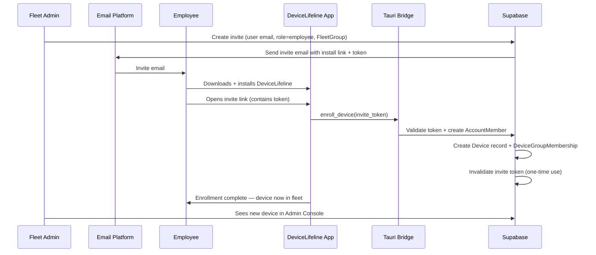
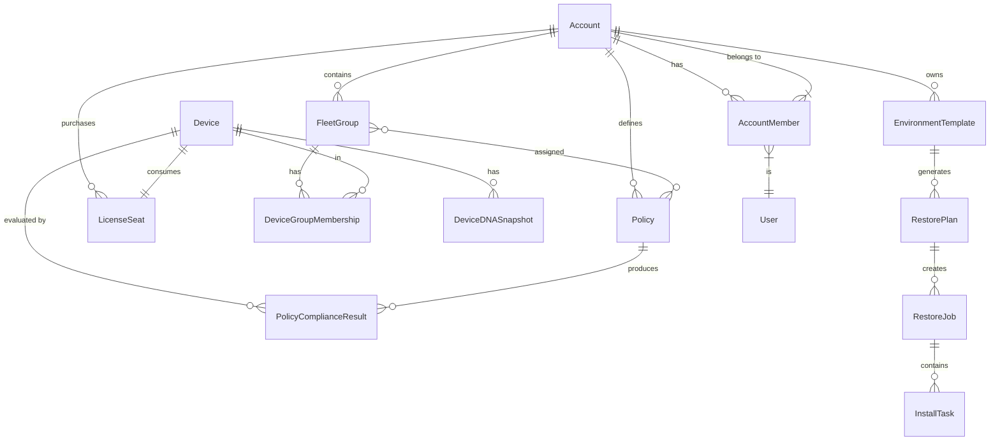
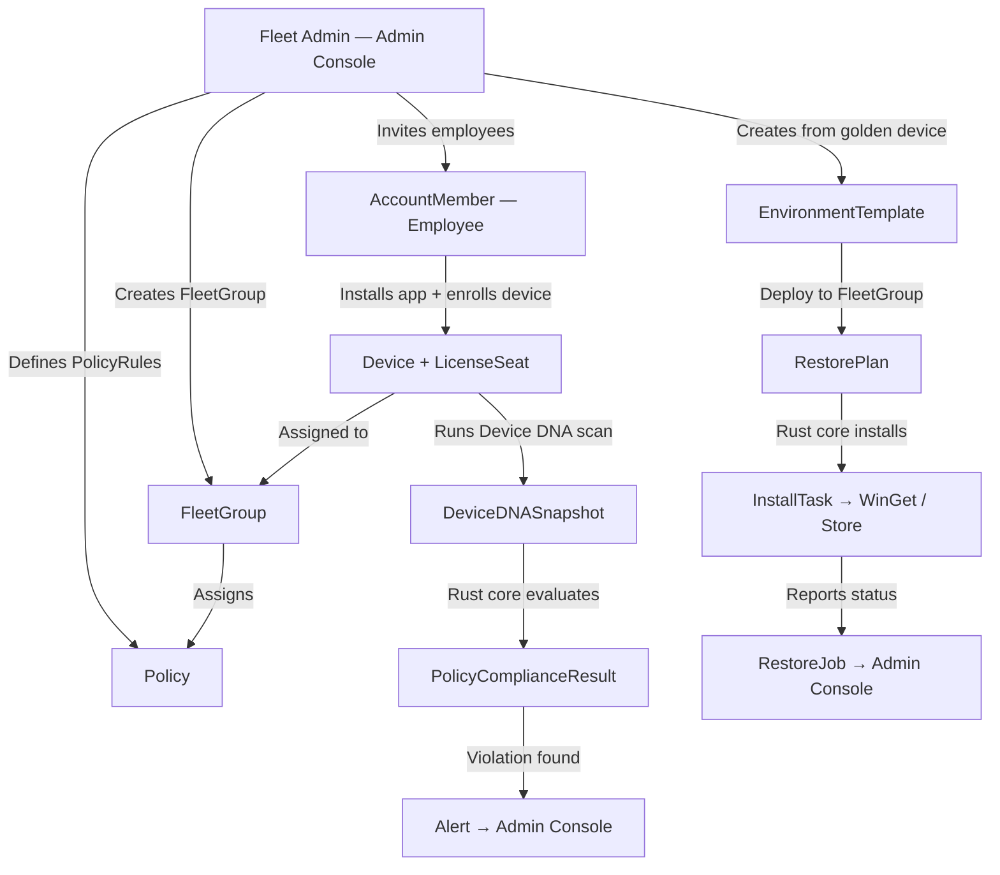

# 57. Business Edition Specification

> Full specification for the Business Edition of DeviceLifeline — fleet management for organizations: Accounts, FleetGroups, Policies, compliance, and the admin console. Part of the DeviceLifeline documentation suite — see [Documentation Index](README.md).

**Status:** Draft v1 · **Authoring role:** Customer Success/Support Lead + Principal Architect · **Last updated:** 2026-06-07
**Related:** [14. Subscription Plans](14-subscription-plans.md), [32. Database Design](32-database-design.md), [33. Entity Relationship Design](33-entity-relationship-design.md), [17. Security Requirements](17-security-requirements.md), [34. API Specification](34-api-specification.md), [56. Technician Edition Specification](56-technician-edition-specification.md), [30. System Architecture](30-system-architecture.md)

---

## 1. Purpose & Scope

This document provides the complete functional and technical specification for the **Business Edition** of DeviceLifeline — the fleet management tier targeting IT teams, small businesses, and enterprise device management. It covers:

- Account / Organization model and role-based access control (RBAC)
- FleetGroup structure and Policy assignment
- Employee onboarding and device enrollment
- Software compliance monitoring
- Environment standardization via EnvironmentTemplates
- Deployment templates and RestorePlan distribution
- Asset visibility and per-device licensing
- Admin Console specification
- Future SSO and MDM integration notes

**Out of scope:** Individual device diagnostics (see [22. AI Diagnostics Design](22-ai-diagnostics-design.md)); Technician-specific workflows (see [56. Technician Edition Specification](56-technician-edition-specification.md)).

**MVP boundary:** Business Edition is **post-MVP**. It is planned as a distinct release phase after Pro and Technician editions are validated.

---

## 2. Assumptions

| ID | Assumption |
|----|------------|
| A-BE-01 | A Business Account represents an organization; multiple Users (employees and admins) share the Account. |
| A-BE-02 | Per-device licensing: pricing is based on the number of active LicenseSeats (one per enrolled Device). See [14. Subscription Plans](14-subscription-plans.md). |
| A-BE-03 | The Admin Console is a separate route within the React UI, accessible only to users with `admin` or `fleet_manager` roles within the Account. |
| A-BE-04 | Supabase Row-Level Security enforces all Account data isolation; no cross-Account data access is possible at the query level. |
| A-BE-05 | SSO (SAML/OIDC) and MDM integration (e.g., Intune, Jamf) are explicitly **future/post-Business-Edition-v1** capabilities; this document notes where they will hook in. |
| A-BE-06 | Policy enforcement is advisory at v1 (violations reported, not automatically remediated); auto-remediation is a future capability tied to AI agent strategy (see [58. Future AI Agent Strategy](58-future-ai-agent-strategy.md)). |
| A-BE-07 | Employee users install DeviceLifeline on their devices; enrollment into the Business Account is done via an invite token or admin-pushed installer. |
| A-BE-08 | All fleet data is scoped to the Business Account in Supabase; employees do not see each other's devices unless they have fleet visibility permissions. |

---

## 3. Account & Organization Model

### 3.1 Account Structure

```
Account (Business)
├── account_id: UUID
├── name: TEXT (organization name)
├── plan: 'business'
├── owner_user_id: UUID (Account Owner)
├── subscription_id: UUID (→ Subscription)
├── seat_limit: INT (max enrolled Devices)
├── active_seat_count: INT (computed)
├── created_at: TIMESTAMPTZ
└── settings: JSONB (retention, notification prefs, etc.)
```

### 3.2 Users & Roles Within an Account

| Role | Description | Capabilities |
|------|-------------|-------------|
| **Account Owner** | Billing contact; org owner | All capabilities; transfer ownership; cancel subscription |
| **Fleet Admin** | IT lead; full fleet management | Create/manage FleetGroups, Policies, EnvironmentTemplates; view all devices; manage roles |
| **Fleet Manager** | Team lead; limited admin | Manage their assigned FleetGroups and Policies; view devices in their groups |
| **Employee** | Regular user; owns their device | View their own device only; no fleet visibility |
| **Viewer** | Read-only stakeholder | View fleet dashboard; no write operations |

### 3.3 User-Account Association

```
AccountMember {
  id: UUID (PK)
  account_id: UUID (FK → Account)
  user_id: UUID (FK → User)
  role: ENUM(owner, fleet_admin, fleet_manager, employee, viewer)
  invited_at: TIMESTAMPTZ
  joined_at: TIMESTAMPTZ (nullable)
  invite_token: TEXT (nullable; one-time use)
  invite_expires_at: TIMESTAMPTZ (nullable)
  created_at: TIMESTAMPTZ
}
```

---

## 4. FleetGroup

FleetGroups are logical groupings of devices within an Account, enabling targeted Policy assignment and reporting.

### 4.1 FleetGroup Record

```
FleetGroup {
  id: UUID (PK)
  account_id: UUID (FK → Account)
  name: TEXT (e.g., "Engineering", "Sales", "Remote Workers")
  description: TEXT
  created_by: UUID (FK → User)
  policy_ids: UUID[] (FK → Policy[]; array of assigned policies)
  created_at: TIMESTAMPTZ
  updated_at: TIMESTAMPTZ
}
```

### 4.2 Device-to-FleetGroup Assignment

A Device may belong to exactly one FleetGroup at a time within an Account. A Device not yet assigned is in the default `Unassigned` group.

```
DeviceGroupMembership {
  id: UUID (PK)
  device_id: UUID (FK → Device)
  fleet_group_id: UUID (FK → FleetGroup)
  account_id: UUID (FK → Account)
  assigned_by: UUID (FK → User)
  assigned_at: TIMESTAMPTZ
}
```

### 4.3 Example FleetGroup Structure

```
Account: Acme Corp
├── FleetGroup: Engineering (25 devices)
│   ├── Policy: Dev Tools Compliance
│   ├── Policy: No Crypto Mining Software
│   └── EnvironmentTemplate: Engineering Baseline
├── FleetGroup: Sales (15 devices)
│   ├── Policy: CRM Software Required
│   └── Policy: Approved Browser List
├── FleetGroup: Executives (5 devices)
│   └── Policy: Security Hardening
└── FleetGroup: Unassigned (3 devices)
    └── (no policies applied)
```

---

## 5. Policy

Policies define rules that enrolled devices are expected to comply with. Compliance is checked by the Rust core on each Device DNA scan and reported to the fleet dashboard.

### 5.1 Policy Record

```
Policy {
  id: UUID (PK)
  account_id: UUID (FK → Account)
  name: TEXT
  description: TEXT
  rules: JSONB (array of PolicyRule)
  enforcement_mode: ENUM(advisory, report_only)  -- v1: report_only only
  created_by: UUID (FK → User)
  created_at: TIMESTAMPTZ
  updated_at: TIMESTAMPTZ
}
```

### 5.2 PolicyRule Schema

```json
{
  "rule_id": "PR-001",
  "type": "software_required | software_prohibited | software_version_min | os_version_min | service_required | service_prohibited | startup_prohibited",
  "target": "application name or identifier",
  "condition": {
    "operator": "installed | not_installed | version_gte | version_lte",
    "value": "version string or null"
  },
  "severity": "critical | high | medium | low",
  "description": "Plain-English description shown in compliance report"
}
```

### 5.3 Policy Rule Types

| Rule Type | Example Use | Evaluated Against |
|-----------|-------------|-------------------|
| `software_required` | "Microsoft Defender must be installed" | SoftwareInventoryItem |
| `software_prohibited` | "BitTorrent must not be installed" | SoftwareInventoryItem |
| `software_version_min` | "Chrome must be ≥ 120.0" | SoftwareInventoryItem.version |
| `os_version_min` | "Windows 11 22H2 or later required" | DeviceDNASnapshot.os_version |
| `service_required` | "Windows Defender service must be running" | DeviceDNASnapshot.services |
| `service_prohibited` | "TeamViewer service must not run" | DeviceDNASnapshot.services |
| `startup_prohibited` | "Crypto miner must not be in startup" | DeviceDNASnapshot.startup_items |

### 5.4 Compliance Evaluation

Compliance is evaluated by the Rust core on each Device DNA scan cycle. Results are synced to Supabase.

```
PolicyComplianceResult {
  id: UUID (PK)
  device_id: UUID (FK → Device)
  policy_id: UUID (FK → Policy)
  account_id: UUID (FK → Account)
  evaluated_at: TIMESTAMPTZ
  status: ENUM(compliant, non_compliant, partial, unknown)
  violations: JSONB (array of PolicyViolation)
  snapshot_id: UUID (FK → DeviceDNASnapshot)
}

PolicyViolation {
  rule_id: TEXT
  rule_type: TEXT
  severity: TEXT
  description: TEXT
  current_value: TEXT (what was found)
  expected_value: TEXT (what was required)
}
```

---

## 6. Employee Onboarding & Device Enrollment

### 6.1 Enrollment Flow



### 6.2 Bulk Enrollment (Admin Push)

For IT admins deploying to existing machines:

1. Admin downloads a signed installer package from the Admin Console.
2. Package includes an embedded enrollment token for the Account + FleetGroup.
3. IT admin deploys via existing tooling (Group Policy, SCCM, Intune script — see MDM future note in §12).
4. On first run, DeviceLifeline auto-enrolls the device using the embedded token.
5. Device appears in Admin Console fleet dashboard.

### 6.3 LicenseSeat Management

```
LicenseSeat {
  id: UUID (PK)
  account_id: UUID (FK → Account)
  device_id: UUID (FK → Device)
  user_id: UUID (FK → User, nullable — seat may be device-only)
  status: ENUM(active, suspended, released)
  assigned_at: TIMESTAMPTZ
  released_at: TIMESTAMPTZ (nullable)
}
```

- Adding a device beyond `seat_limit` requires purchasing additional seats (Stripe billing).
- Admin can release a seat (e.g., employee departure) which frees the slot for a new device.
- Released device data is retained for configurable period (default: 30 days) then purged.

---

## 7. Software Compliance

### 7.1 Compliance Dashboard (Admin Console)

The Compliance section of the Admin Console provides:

| View | Description |
|------|-------------|
| **Fleet Compliance Summary** | % compliant devices per FleetGroup; trend over time |
| **Policy Violations Table** | All violations sorted by severity; filterable by FleetGroup / Policy / Device |
| **Device Compliance Detail** | Per-device compliance status across all assigned Policies |
| **Compliance History** | Compliance % over last 30/90 days per FleetGroup |
| **Export** | CSV/PDF compliance report for auditors |

### 7.2 Violation Alert Flow

When a device scan produces a `PolicyViolation` with `severity = critical` or `high`:

1. Supabase Realtime event triggers Alert creation.
2. Alert routed to Fleet Admin / Fleet Manager for the device's FleetGroup.
3. In-app notification + email notification (configurable per-Policy).
4. Alert appears in Admin Console Alerts panel.
5. Alert links to specific device and violation detail.

---

## 8. Environment Standardization

### 8.1 EnvironmentTemplate

EnvironmentTemplates define a standard software environment for a role or team. They are built from a DeviceDNASnapshot of a "golden" reference device.

```
EnvironmentTemplate {
  id: UUID (PK)
  account_id: UUID (FK → Account)
  name: TEXT (e.g., "Engineering Standard — v2")
  description: TEXT
  source_snapshot_id: UUID (FK → DeviceDNASnapshot)
  software_list: JSONB (curated SoftwareInventoryItem list)
  browser_extensions: JSONB
  developer_tools: JSONB
  startup_config: JSONB
  version: INT
  created_by: UUID (FK → User)
  created_at: TIMESTAMPTZ
  updated_at: TIMESTAMPTZ
}
```

### 8.2 Deployment Template (RestorePlan from EnvironmentTemplate)

A Fleet Admin can create a RestorePlan from an EnvironmentTemplate for distribution to devices in a FleetGroup.

```
Fleet Admin → Admin Console → EnvironmentTemplates
  → Select template → "Create Deployment"
  → Choose target FleetGroup(s)
  → Schedule: immediate | next scan | date/time
  → Supabase creates RestorePlan linked to template
  → Rust core on each target device picks up RestorePlan on next sync
  → Executes InstallTasks via WinGet / Microsoft Store / vendor installers
  → Reports RestoreJob status back to Admin Console
```

See [25. Restore Engine Design](25-restore-engine-design.md) and [26. Software Installation Engine Design](26-software-installation-engine-design.md) for restore/install mechanics.

### 8.3 Compliance vs. Environment Template

| Mechanism | Purpose | Enforcement |
|-----------|---------|-------------|
| **Policy** | Define rules; detect violations | Report-only (v1) |
| **EnvironmentTemplate + RestorePlan** | Actively replicate a standard environment | Active install (with user/admin consent) |

These are complementary: Policies detect drift; Templates + RestorePlans remediate it.

---

## 9. Asset Visibility

### 9.1 Fleet Dashboard

The Fleet Dashboard is the primary landing page of the Admin Console.

**Widgets:**

| Widget | Description |
|--------|-------------|
| **Total Devices** | Count of active LicenseSeats; enrolled vs. seat limit |
| **Health Score Distribution** | Histogram of device HealthScores across fleet |
| **Compliance Rate** | % of devices compliant across all Policies |
| **Active Alerts** | Count of unresolved Alerts by severity |
| **Recent Activity** | Last 10 TimelineEvents across fleet |
| **OS Version Distribution** | Chart: Windows versions across fleet |
| **Software Inventory Summary** | Most common apps; flagged prohibited software |

### 9.2 Device Table

Filterable, sortable table of all enrolled devices:

| Column | Description |
|--------|-------------|
| Device Name | Hostname + model |
| Assigned User | Employee name |
| FleetGroup | Current group |
| Health Score | Current HealthScore (color-coded) |
| Compliance | Compliant / Non-Compliant / Partial |
| Last Seen | Timestamp of last sync |
| OS Version | Windows version + build |
| Actions | View | Reassign Group | Release Seat |

### 9.3 Per-Device View (Admin)

Admins can view any enrolled device with full detail:

- Device DNA Snapshot (current + history)
- Performance Timeline
- Health score trend (30/90/365 days)
- Compliance status across all assigned Policies
- Active Alerts
- Installed software inventory with version compliance flags
- RestoreJob history

---

## 10. Admin Console Specification

### 10.1 Navigation Structure

```
Admin Console/
├── Dashboard             # Fleet overview, key metrics
├── Devices               # Device table, per-device view
├── Fleet Groups          # Create/edit FleetGroups, assign devices
├── Policies/
│   ├── Active Policies   # Policy list; compliance rates
│   ├── Policy Builder    # Create/edit policy + rules
│   └── Violations        # All violations; export
├── Environment Templates/
│   ├── Templates         # List; create from snapshot
│   └── Deployments       # RestorePlan status per FleetGroup
├── Compliance Reports    # Generate + download compliance reports
├── Alerts                # All Alerts; filter by severity/group
├── Members               # User management; invite; role assignment
├── Seats                 # LicenseSeat inventory; add/release
└── Settings/
    ├── Account           # Org name, billing
    ├── Notifications     # Alert routing, email prefs
    ├── Retention         # Data retention policy
    └── Integrations      # Future: SSO, MDM (placeholder)
```

### 10.2 Policy Builder UI

The Policy Builder is a guided form for creating Policies without writing raw JSON:

1. **Name + Description:** Free text.
2. **Add Rules:** Rule type selector → type-specific form → condition builder.
3. **Assign to FleetGroups:** Multi-select FleetGroup picker.
4. **Set Alert Severity:** Per rule or global.
5. **Save + Activate:** Policy becomes active on next device scan cycle.

---

## 11. Per-Device Licensing

### 11.1 Seat Model

- Business Edition is billed per enrolled Device per month (or annually with discount).
- Each `LicenseSeat` maps one Device to the Account.
- Seats are consumed at enrollment and released when a device is unenrolled.
- `seat_limit` is set at subscription creation and adjustable via Stripe billing portal.

### 11.2 Overage Handling

| Scenario | Behavior |
|----------|---------|
| Enrollment attempt exceeds seat_limit | Admin sees "Seat limit reached" prompt; redirect to seat add flow |
| Admin adds seats (Stripe) | seat_limit updated via Stripe webhook → Supabase |
| Auto-suspend | After 7-day grace period post payment failure, devices go to read-only mode (monitoring continues; no restore/deploy) |
| Device removed | LicenseSeat.status = released; device data retained per retention policy |

---

## 12. Role-Based Access Control (RBAC) Summary

| Action | Owner | Fleet Admin | Fleet Manager | Employee | Viewer |
|--------|-------|-------------|---------------|----------|--------|
| View fleet dashboard | Y | Y | Y (own groups) | N | Y (read-only) |
| View all devices | Y | Y | Y (own groups) | N (own device) | Y |
| Create/edit FleetGroups | Y | Y | N | N | N |
| Create/edit Policies | Y | Y | N | N | N |
| Assign devices to groups | Y | Y | Y (own groups) | N | N |
| Deploy EnvironmentTemplates | Y | Y | N | N | N |
| Invite/manage members | Y | Y | N | N | N |
| Manage seats/billing | Y | N | N | N | N |
| View compliance reports | Y | Y | Y (own groups) | N | Y |
| Export data | Y | Y | N | N | N |
| Configure integrations (SSO/MDM) | Y | Y | N | N | N |

---

## 13. Future: SSO & MDM Integration

These are **post-v1 Business Edition** capabilities. Placeholder integration points are defined here so the architecture accommodates them.

### 13.1 SSO (SAML/OIDC)

- **Hook-in point:** Supabase Auth supports custom SSO providers via SAML 2.0 / OIDC. Business Edition v2 will offer "Sign in with your organization's IdP."
- **Target IdPs:** Azure Active Directory (Microsoft Entra), Okta, Google Workspace.
- **Impact:** AccountMember provisioning auto-triggered on first SSO login (SCIM provisioning v2+).
- **Placeholder in Admin Console:** Settings → Integrations → SSO shows "Coming Soon" with docs link.

### 13.2 MDM Integration

- **Hook-in point:** Deployment Templates + bulk enrollment currently rely on installer packages. MDM integration would allow pushing the enrollment token and DeviceLifeline installer via Intune/Jamf policy.
- **Target MDMs:** Microsoft Intune, Jamf Pro, ManageEngine.
- **API:** A `/api/v1/enrollment/mdm-manifest` endpoint (future) returns a JSON manifest for MDM policy import.
- **Placeholder in Admin Console:** Settings → Integrations → MDM shows "Coming Soon."

---

## Diagrams

### Business Edition Data Model (Simplified ER)



### Fleet Management Flow



---

## Risks & Mitigations

| Risk | Likelihood | Impact | Mitigation |
|------|-----------|--------|------------|
| RISK-BE-01: Employee installs app on personal device; enrolls into wrong Account | Medium | Medium | Invite token scoped to specific Account + email; mismatch triggers error, not enrollment |
| RISK-BE-02: Policy enforcement (v1 report-only) not sufficient for security-conscious IT teams | Medium | Medium | Clearly document v1 as advisory; roadmap enforcement to v2; auto-remediation in AI agent strategy |
| RISK-BE-03: Fleet dashboard slow with large device counts (500+) | Medium | High | Pagination; aggregate queries; health scores pre-computed nightly; read replicas for reporting queries |
| RISK-BE-04: LicenseSeat overage handling causes data loss on device suspension | Low | High | Devices move to read-only, not data deletion; 7-day grace period; clear admin notification |
| RISK-BE-05: RBAC misconfiguration exposes employee device data to unauthorized role | Low | Critical | RLS enforced at Supabase level independent of application RBAC; automated RLS tests |
| RISK-BE-06: SSO/MDM gap creates friction for enterprise buyers | High | Medium | Document future roadmap clearly; offer manual bulk enrollment as bridge |

---

## Future Considerations

- **Auto-remediation:** Fleet-level policy violations automatically remediated by AI agent (see [58. Future AI Agent Strategy](58-future-ai-agent-strategy.md)).
- **SSO / SCIM provisioning:** Full directory sync for enterprise accounts.
- **MDM integration:** Intune and Jamf enrollment + deployment.
- **Advanced RBAC:** Custom roles with granular permission sets.
- **Fleet-level AI analytics:** "Why are 30% of Engineering devices degraded?" cross-device AI analysis.
- **Hardware asset lifecycle tracking:** Warranty expiry, procurement date, replacement scheduling.
- **Audit log export:** Full AuditLog export for compliance/SIEM integration.

---

## Acceptance Criteria

- [ ] AC-BE-01: Account model supports all 5 roles; RLS test confirms each role can only access data they are authorized for.
- [ ] AC-BE-02: Device enrollment via invite token completes in under 2 minutes on a clean install.
- [ ] AC-BE-03: FleetGroup + Policy assignment is reflected in compliance evaluation on the next Device DNA scan cycle.
- [ ] AC-BE-04: Policy compliance result is synced to Supabase within 5 minutes of Rust core scan completion.
- [ ] AC-BE-05: Admin Console fleet dashboard loads within 3 seconds for an Account with 200 enrolled devices.
- [ ] AC-BE-06: Critical/High policy violation generates an Alert and sends email notification to Fleet Admin within 10 minutes.
- [ ] AC-BE-07: EnvironmentTemplate deployment creates a RestorePlan visible on target devices' next sync.
- [ ] AC-BE-08: Releasing a LicenseSeat sets device to read-only within 60 seconds; does not delete device data.
- [ ] AC-BE-09: Bulk enrollment package correctly enrolls 10 test devices into the correct FleetGroup without manual intervention.
- [ ] AC-BE-10: Compliance report CSV export contains all violations for specified FleetGroup and date range, downloadable in under 30 seconds.
