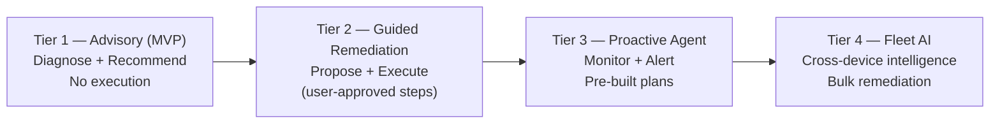
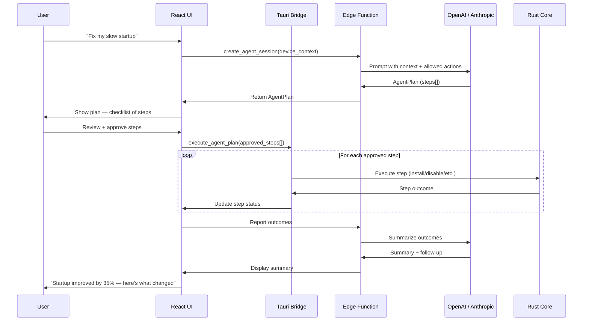

# 58. Future AI Agent Strategy

> Defines the post-MVP evolution of the AI Detective from an advisory system into an agentic assistant capable of proposing and executing fixes — with human-in-the-loop safeguards. Part of the DeviceLifeline documentation suite — see [Documentation Index](README.md).

**Status:** Draft v1 · **Authoring role:** Principal Architect · **Last updated:** 2026-06-07
**Related:** [22. AI Diagnostics Design](22-ai-diagnostics-design.md), [25. Restore Engine Design](25-restore-engine-design.md), [26. Software Installation Engine Design](26-software-installation-engine-design.md), [23. Performance Timeline Design](23-performance-timeline-design.md), [57. Business Edition Specification](57-business-edition-specification.md), [30. System Architecture](30-system-architecture.md), [60. Final Implementation Roadmap](60-final-implementation-roadmap.md)

---

## 1. Purpose & Scope

> **FUTURE / POST-MVP.** Nothing in this document describes MVP or near-term capabilities. All features described here are post-MVP research and product investments. They depend on the stability of the core platform and must clear safety reviews before implementation.

This document describes the long-term AI strategy for DeviceLifeline: evolving the **AI Detective** from a diagnostic advisor into an **AI Agent** that can:

- Propose multi-step remediation plans
- Execute approved actions on-device with user consent
- Monitor outcomes and adapt plans
- Operate proactively (not just on demand)
- Serve fleet-level intelligence for Business Edition
- Run lightweight on-device models for latency-sensitive tasks

---

## 2. Assumptions

| ID | Assumption |
|----|------------|
| A-AI-01 | All agentic capabilities require explicit user or admin consent before any action is taken; no autonomous action occurs without an approval gate. |
| A-AI-02 | The Rust core remains the execution engine for all on-device actions; the AI Agent can only propose tasks that the Rust core's existing InstallTask / RestoreJob / policy executor understands. |
| A-AI-03 | AI API keys are never shipped in the client; all LLM calls route through Supabase Edge Functions (see [30. System Architecture](30-system-architecture.md)). |
| A-AI-04 | On-device small models (e.g., quantized LLMs) are evaluated against privacy, performance, and size constraints; they are complementary to, not replacements for, cloud LLM calls. |
| A-AI-05 | Fleet-level AI (Business Edition) operates on aggregated, anonymized device data; no individual employee data is surfaced without appropriate RBAC. |
| A-AI-06 | The evolution from advisory to agentic is incremental: each capability tier must be validated and safe before proceeding to the next. |

---

## 3. Evolution Tiers

The AI Detective evolves through four capability tiers. Each tier is a distinct release phase.

### Tier 1 — Advisory (MVP, current design)

Already specified in [22. AI Diagnostics Design](22-ai-diagnostics-design.md).

- Natural-language diagnosis queries
- DiagnosisFindings with confidence scores
- Recommended actions in plain English
- **No execution capability**

### Tier 2 — Guided Remediation (Post-MVP, Phase 1)

The AI Agent can propose a specific, bounded RestorePlan or set of InstallTasks based on DiagnosisFindings. The user reviews and explicitly approves each action.

- Agent presents a numbered remediation plan: "Step 1: Remove X; Step 2: Update Y; Step 3: Disable Z startup item"
- Each step maps to a concrete Rust core action
- User sees an explicit consent checklist before execution
- Execution is sequential; agent monitors each step
- Outcome reported back to agent; plan adapts if a step fails

**Execution boundary:** Only actions supported by the existing Rust core action vocabulary (install, uninstall, update, disable startup item, disable service, restore config). No arbitrary shell execution.

### Tier 3 — Proactive Agent (Post-MVP, Phase 2)

The AI Agent monitors device health continuously and proactively surfaces "situations requiring attention" before the user asks.

- Watches HealthSamples, TimelineEvents, CrashEvents via Supabase Realtime or scheduled Edge Function
- Detects degradation patterns before they become failures
- Sends proactive Alert: "Your SSD health dropped 15% this month — here's what I recommend"
- Presents pre-built remediation plan for user approval
- Push notifications via companion mobile app (see [59. Future Mobile App Strategy](59-future-mobile-app-strategy.md))

**Guardrail:** Proactive suggestions are rate-limited (max 2/week) to prevent alert fatigue. Confidence threshold: ≥0.8 before surfacing a proactive suggestion.

### Tier 4 — Fleet AI Agent (Post-MVP, Phase 3 — Business Edition)

Fleet-level intelligence for Business Edition: the AI Agent analyses patterns across an entire device fleet.

- "Why are 40% of Engineering laptops showing degraded startup times this week?"
- Cross-device anomaly detection using aggregated TimelineEvent and HealthScore data
- Bulk remediation: Fleet Admin approves action that deploys across a FleetGroup
- Predictive fleet health: "Based on current trends, 8 devices will need SSD replacement within 90 days"

---

## 4. Architecture for Agentic Execution

### 4.1 Agent Execution Loop

```
User / Proactive trigger
  → AgentSession created (Supabase)
  → Context gathered:
      - Current DiagnosisFindings
      - Recent TimelineEvents
      - HealthSamples
      - Previous AgentSession outcomes
  → LLM (via Edge Function) generates AgentPlan
  → AgentPlan presented to user (React UI)
  → User reviews each AgentStep, toggles approval
  → User clicks "Execute Approved Steps"
  → Tauri bridge sends approved steps to Rust core
  → Rust core executes each step (InstallTask / RestoreJob action)
  → Outcomes reported back via Tauri event
  → UI updates with step results
  → Final outcome sent to Edge Function
  → LLM summarizes outcome; updates AgentSession
  → Follow-up recommendations surfaced if needed
```

### 4.2 Data Structures (Illustrative)

```
AgentSession {
  id: UUID
  user_id: UUID
  device_id: UUID
  trigger_type: ENUM(user_query, proactive, fleet_policy)
  initial_context: JSONB (DiagnosisFindings, HealthSamples)
  plan_id: UUID (FK → AgentPlan)
  status: ENUM(planning, awaiting_approval, executing, complete, failed, cancelled)
  created_at: TIMESTAMPTZ
  completed_at: TIMESTAMPTZ
}

AgentPlan {
  id: UUID
  session_id: UUID
  steps: AgentStep[]
  estimated_duration_minutes: INT
  risk_level: ENUM(low, medium, high)
  approved_by: UUID (user)
  approved_at: TIMESTAMPTZ
}

AgentStep {
  id: UUID
  plan_id: UUID
  sequence: INT
  action_type: ENUM(install, uninstall, update, disable_startup, disable_service, restore_config, restart)
  target: TEXT (app name, service name, config key)
  rationale: TEXT (plain English why)
  user_approved: BOOLEAN
  status: ENUM(pending, executing, success, failed, skipped)
  outcome_note: TEXT (nullable)
}
```

### 4.3 Execution Constraints

The Rust core maintains an **allowed action registry** — a static list of action types the AI Agent may request. This registry cannot be modified at runtime.

| Allowed Action | Notes |
|---------------|-------|
| `install_software(name, source)` | Via WinGet / Store only; no arbitrary download URLs |
| `uninstall_software(name)` | Via OS uninstaller; user notified |
| `update_software(name)` | Via WinGet / Store only |
| `disable_startup_item(name)` | Windows startup registry / Task Scheduler |
| `enable_startup_item(name)` | Reverse of above |
| `disable_service(name)` | Set service start type to Disabled |
| `enable_service(name)` | Set service start type to Automatic / Manual |
| `restore_config(snapshot_id, scope)` | Via existing RestorePlan mechanism |
| `restart_device` | Only after explicit user approval; 60-second countdown |

**Prohibited actions (agent may never request):**

- Arbitrary shell/PowerShell execution
- File deletion outside of standard uninstall paths
- Registry modification outside of defined startup/service keys
- Network configuration changes
- System32 or driver modifications

---

## 5. Human-in-the-Loop Model

Human oversight is the non-negotiable foundation of agentic capability in DeviceLifeline.

### 5.1 Consent Gates

| Action Type | Consent Requirement |
|-------------|-------------------|
| Single low-risk action (disable startup item) | One-click confirm |
| Multi-step plan (3+ steps) | Checklist review: user approves each step |
| Any uninstall action | Explicit named confirmation: type software name to confirm |
| Service disable | Warning about impact + confirm |
| Device restart | 60-second countdown with cancel option |
| Fleet-wide action (Business) | Fleet Admin approval + secondary confirmation |

### 5.2 Undo & Rollback

Every agentic execution that modifies system state must have a rollback path:

- Before any action, the Rust core captures a minimal before-state snapshot of affected components.
- Stored as `AgentStep.before_state: JSONB`.
- If a step fails or the user requests undo, the Rust core restores from `before_state`.
- Rollback available for up to 30 days via Recovery Center UI.

### 5.3 Audit Trail

All agentic actions are written to AuditLog:

```
AuditLog entry for agentic action:
{
  event_type: "agent_step_executed",
  actor_type: "ai_agent",
  actor_session_id: "<AgentSession.id>",
  approved_by: "<user_id>",
  action: "<AgentStep.action_type>",
  target: "<AgentStep.target>",
  outcome: "success | failed",
  timestamp: "ISO 8601"
}
```

---

## 6. On-Device Small Models

For latency-sensitive tasks and privacy-conscious users who want local inference:

### 6.1 Use Cases for On-Device Models

| Task | Model Size Target | Notes |
|------|------------------|-------|
| Quick health triage | <500 MB quantized (e.g., Phi-3 Mini Q4) | "Is this device in good health?" — instant answer without cloud call |
| Timeline event summarization | <1 GB | Summarize recent timeline events to plain text |
| Local FAQ / help chatbot | <500 MB | Answer common questions without network |

### 6.2 Constraints

- Model must fit within 1 GB RAM overhead during inference.
- Inference must complete in <3 seconds on a mid-range laptop (Intel Core i5, 8 GB RAM).
- On-device model is **opt-in only**; default is cloud inference via Edge Functions.
- Model weights are downloaded on demand, not bundled in the installer.
- Cloud inference is always available as fallback.

### 6.3 Architecture Integration

```
User query received
  → Check user preference: on_device_ai = true?
  → Yes: Tauri bridge invokes Rust core → local model inference (ONNX runtime or llama.cpp)
  → No / model not downloaded: Route to Supabase Edge Function → OpenAI / Anthropic
  → Results returned to React UI regardless of path
```

---

## 7. Fleet AI (Business Edition)

### 7.1 Cross-Device Intelligence

Fleet AI aggregates data across all enrolled devices in an Account to surface fleet-level insights:

- **Anomaly detection:** Detect devices that deviate significantly from fleet norms (startup time, health score, software versions).
- **Predictive alerts:** "5 devices show SSD health patterns consistent with failure within 60 days."
- **Common root-cause analysis:** "12 devices degraded startup time correlates with Windows Update KB5034441 installed 3 days ago."
- **Compliance trend:** Fleet compliance rate trending down — which Policy rules are driving violations?

### 7.2 Fleet AI Data Pipeline

```
Nightly Edge Function: fleet_ai_analysis
  → Loads last 30d of DeviceDNASnapshots, HealthSamples, PolicyComplianceResults
    for all devices in Account (anonymized at individual level)
  → Aggregates: median health scores, top violations, startup time distribution
  → Sends summary prompt to LLM (Anthropic Claude — preferred for long context)
  → LLM returns structured insights + anomaly flags
  → Stored in: fleet_ai_insights table (account_id, insight_type, detail, severity, generated_at)
  → Surfaced in Admin Console: Fleet Intelligence panel
```

---

## Diagrams

### AI Agent Capability Tiers



### Agentic Execution Flow (Tier 2+)



---

## Risks & Mitigations

| Risk | Likelihood | Impact | Mitigation |
|------|-----------|--------|------------|
| RISK-AI-01: AI proposes an action that breaks a device | Medium | High | Allowed action registry strictly limits scope; before-state capture + rollback; user can undo |
| RISK-AI-02: User approves a risky plan without understanding it | Medium | High | Risk level banner on AgentPlan; plain-English rationale per step; destructive actions require typed confirmation |
| RISK-AI-03: Proactive agent creates alert fatigue | High | Medium | Rate limit: max 2 proactive suggestions/week; confidence threshold ≥0.8; user-configurable sensitivity |
| RISK-AI-04: Fleet AI aggregation exposes individual employee data | Low | Critical | Aggregation at group level (≥5 devices minimum); no individual breakdown unless Fleet Admin with RBAC |
| RISK-AI-05: On-device model produces worse results than cloud model | High | Medium | Cloud inference always as fallback; on-device clearly labeled as "faster, local"; user can switch |
| RISK-AI-06: LLM prompt injection via malicious device data | Low | High | Sanitize all device data before including in prompts; structured schemas not raw text; output validation |

---

## Future Considerations

- **Natural-language fleet commands:** Fleet Admin types "Update Chrome on all Engineering devices" → Fleet AI translates to RestorePlan + deployment.
- **Predictive replacement scheduling:** AI recommends hardware replacement timelines based on HealthScore trends, integrated with IT asset management.
- **Multi-agent orchestration:** Separate specialized agents (Hardware Agent, Software Agent, Security Agent) orchestrated by a meta-agent.
- **AI model fine-tuning:** Fine-tune on DeviceLifeline-specific telemetry for more accurate device-specific diagnoses (requires opt-in data contribution program).
- **Voice interface:** Voice-activated AI Detective queries via companion mobile app.
- **Autonomous mode (advanced users only):** Opt-in fully autonomous remediation with comprehensive audit trail and easy undo.

---

## Acceptance Criteria

- [ ] AC-AI-01: No agentic execution occurs without at least one explicit user consent gate before any step is executed.
- [ ] AC-AI-02: Allowed action registry is enforced in Rust core; a request for a prohibited action type is rejected with an error and logged.
- [ ] AC-AI-03: Before-state capture completes before each step; rollback restores before-state correctly in integration tests.
- [ ] AC-AI-04: All agentic actions are written to AuditLog with actor_type, action, target, outcome, and approved_by fields.
- [ ] AC-AI-05: AgentPlan risk level is displayed prominently before user approval; high-risk plans display a warning banner.
- [ ] AC-AI-06: Fleet AI aggregation query returns no individual-level breakdown for groups with fewer than 5 devices (privacy floor).
- [ ] AC-AI-07: On-device model inference completes in <3 seconds on reference hardware (i5-10th gen, 8 GB RAM) for health triage task.
- [ ] AC-AI-08: Proactive suggestions are rate-limited to max 2 per device per week; excess suggestions are queued, not dropped.
- [ ] AC-AI-09: LLM prompt construction passes through sanitization layer before any device data is included; sanitization is covered by unit tests.
