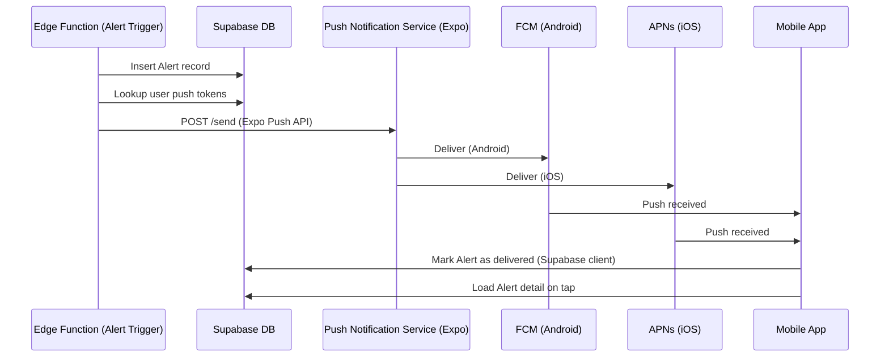
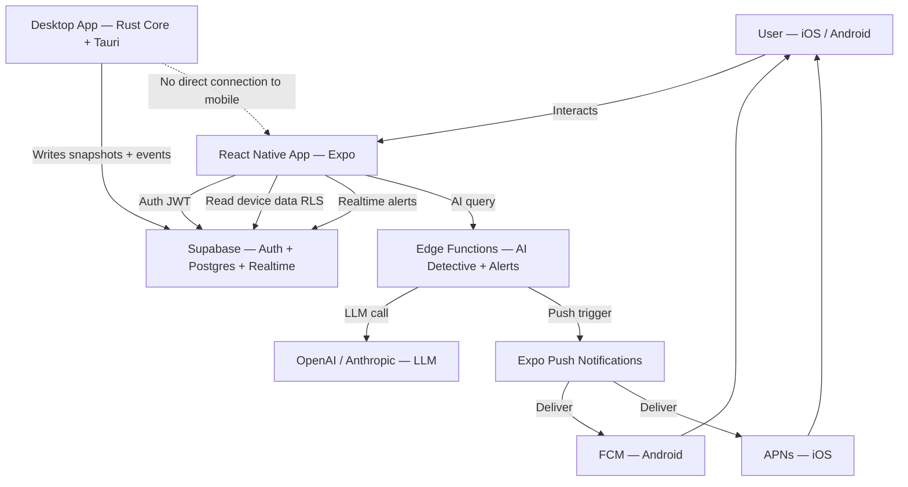
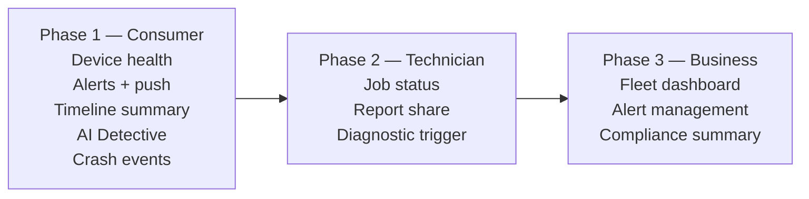

# 59. Future Mobile App Strategy

> Defines the post-MVP companion mobile app for DeviceLifeline (iOS & Android): use cases, architecture, mobile-OS constraints, and scope boundaries. Part of the DeviceLifeline documentation suite — see [Documentation Index](README.md).

**Status:** Draft v1 · **Authoring role:** Principal Architect · **Last updated:** 2026-06-07
**Related:** [30. System Architecture](30-system-architecture.md), [34. API Specification](34-api-specification.md), [22. AI Diagnostics Design](22-ai-diagnostics-design.md), [58. Future AI Agent Strategy](58-future-ai-agent-strategy.md), [57. Business Edition Specification](57-business-edition-specification.md), [54. Support Operations Plan](54-support-operations-plan.md)

---

## 1. Purpose & Scope

> **FUTURE / POST-MVP.** The mobile companion app is a post-MVP product investment. It requires a stable, well-adopted desktop platform before it delivers meaningful value. The earliest realistic timeline for a public mobile beta is after Pro edition has reached product-market fit.

This document defines the strategy and architecture for a **DeviceLifeline companion mobile app** for iOS and Android. The app is a **companion**, not a replacement for the desktop platform. It provides:

- Remote monitoring and status of registered devices
- Push notifications for Alerts (health, compliance, crash events)
- Quick access to device health and performance summaries
- AI Detective query interface (cloud-backed, read-only results)
- Technician and Business on-the-go views

**What the mobile app does NOT do:**

- Direct deep device access (mobile OSes do not permit this)
- Trigger device scans or run the Rust core (desktop-only)
- Replace the full desktop experience for any workflow

---

## 2. Assumptions

| ID | Assumption |
|----|------------|
| A-MOB-01 | The mobile app is a native-capable cross-platform app built with React Native (see §4 for rationale). |
| A-MOB-02 | All device data displayed in the mobile app is read from Supabase; the app has no direct connection to the device itself. |
| A-MOB-03 | The mobile app uses the same Supabase Auth (JWT) as the desktop app; users log in once and see their existing data. |
| A-MOB-04 | Push notifications are delivered via FCM (Android) and APNs (iOS), orchestrated through Supabase Edge Functions. |
| A-MOB-05 | The mobile app is a consumer-first release; Technician and Business on-the-go views are added in a second mobile release. |
| A-MOB-06 | Mobile app is iOS 16+ and Android 13+ at launch. |
| A-MOB-07 | Privacy-sensitive data (device snapshots) is not cached on the mobile device beyond session; all reads are live from Supabase. |

---

## 3. Mobile OS Constraints

Mobile OSes (iOS and Android) impose fundamental limitations that must be understood to set correct expectations.

| Constraint | iOS | Android | Implication for DeviceLifeline Mobile |
|-----------|-----|---------|--------------------------------------|
| No access to other apps' data | Yes | Yes | Cannot read installed software list from phone; reads synced data from Supabase only |
| No background system agent | Yes | Partial | Cannot run continuous monitoring on mobile; monitoring runs on the desktop agent |
| No file system access (beyond sandbox) | Yes | Partial | Cannot read Windows/macOS system data; all device data comes from Supabase |
| Push notification delivery not guaranteed | Yes | Yes | Alerts may be delayed; not suitable for P0 incident response alone |
| App Store / Play Store review delays | Yes | Yes | Feature releases take 2–7 days for review; plan release cycles accordingly |
| Battery and CPU restrictions for background tasks | Yes | Yes | No polling loops; use push + websocket sparingly |
| Network API calls must be user-initiated or push-triggered | Partial | Partial | Supabase Realtime via websocket for live updates; no polling |

**Key principle:** The mobile app is a **display layer over Supabase**. All intelligence and data collection happens on the desktop.

---

## 4. Candidate Architecture

### 4.1 Technology Selection

**Recommended: React Native (with Expo)**

Rationale:

| Factor | React Native (Expo) | Native Swift/Kotlin | Flutter |
|--------|---------------------|---------------------|---------|
| Code reuse with desktop React UI | High (shared logic, hooks, types) | None | Low |
| Team familiarity (React/TS) | High | Low (new languages) | Medium |
| Expo managed workflow | Excellent DX; OTA updates | N/A | Similar |
| Performance for this use case | Sufficient (display + notifications) | Overkill | Sufficient |
| Supabase JS SDK support | Full | Partial (unofficial) | Full (Dart) |
| Time to MVP | 2–3 months | 4–6 months per platform | 2–4 months |

**Decision:** React Native with Expo Managed Workflow. TypeScript throughout. Shared type definitions with desktop codebase via a `@devicelifeline/shared` package.

### 4.2 High-Level Architecture

```
Mobile App (React Native + Expo)
  ↓ Supabase JS SDK (Auth + Database + Realtime)
  ↓ Supabase Auth — JWT (same account as desktop)
  ↓ Supabase Postgres — reads device data (RLS enforced)
  ↓ Supabase Realtime — live Alert updates via websocket
  ↓ Supabase Edge Functions — AI Detective queries
  ↓ FCM / APNs — push notifications (via Expo Push Notifications)
```

### 4.3 State Management

- **TanStack Query (React Query):** Server state management for device data fetching, caching, and background refresh.
- **Zustand:** Lightweight local UI state (notification preferences, selected device, theme).
- **Expo SecureStore:** Store JWT and session tokens securely on device.
- **No SQLite on mobile:** All data reads from Supabase directly; no local device data cache beyond session TTL.

---

## 5. Feature Scope

### 5.1 Phase 1 — Consumer Companion (Launch)

| Feature | Description | Data Source |
|---------|-------------|-------------|
| **Device List** | View all registered devices with health scores | Supabase: Device + HealthScore |
| **Device Health Overview** | Current health score, component breakdown, trend chart | Supabase: HealthSample |
| **Performance Timeline** | Recent TimelineEvents summarized (last 30 days) | Supabase: TimelineEvent |
| **Alerts** | View and acknowledge Alerts; push notifications | Supabase: Alert + Push |
| **AI Detective** | Type a question; view DiagnosisSession results | Supabase Edge Function → LLM |
| **Crash Events** | Recent CrashEvents with plain-English descriptions | Supabase: CrashEvent |
| **Account Settings** | Notification preferences, account info, plan | Supabase: User + Subscription |

### 5.2 Phase 2 — Technician On-the-Go (Post-Phase 1)

| Feature | Description |
|---------|-------------|
| **Job Summary** | View active JobSessions and their status |
| **Client Reports** | View generated TechnicianReports; share PDF link |
| **Quick Diagnostic Trigger** | Request a new diagnostic session on a connected device (desktop must be running) |
| **Notification for Job Completion** | Push when a diagnostic session completes |

### 5.3 Phase 3 — Business Fleet Overview (Post-Phase 2)

| Feature | Description |
|---------|-------------|
| **Fleet Dashboard (mobile)** | Total devices, health score distribution, compliance rate |
| **Alert Management** | Acknowledge and escalate fleet Alerts from mobile |
| **Device Drill-Down** | View individual device health + compliance status |
| **Compliance Summary** | Violations by severity; exportable summary |

---

## 6. Push Notification Architecture

### 6.1 Notification Types

| Type | Trigger | Priority | User Control |
|------|---------|----------|-------------|
| **Critical Health Alert** | HealthScore drops to <30 | High | On by default; cannot disable |
| **Hardware Failure Risk** | Predictive failure finding | High | On by default |
| **New CrashEvent** | Critical crash (BSOD, kernel panic) | High | On by default |
| **Policy Violation** | Critical/High severity (Business) | High | On by default (Admin) |
| **Diagnostic Complete** | DiagnosisSession finishes | Medium | On by default |
| **Weekly Health Digest** | Nightly Edge Function — Friday | Low | Opt-in |
| **AI Agent Suggestion** | Proactive AI suggestion (Tier 3) | Medium | Opt-in |

### 6.2 Delivery Flow



### 6.3 Push Token Management

```
Mobile app on first launch:
  1. Request push notification permission (user prompt)
  2. Expo Notifications.getExpoPushTokenAsync()
  3. POST to Supabase Edge Function: register_push_token
  4. Store: user_push_tokens table (user_id, token, platform, created_at, last_seen)
  5. Token refreshed on app launch if >7 days old
  6. Tokens purged after 90 days without activity
```

---

## 7. Screen Map

```
Mobile App/
├── Home                     # Selected device health overview
├── My Devices               # Device list with health scores
│   └── Device Detail [id]/
│       ├── Health Overview  # Component scores + trend
│       ├── Timeline         # Recent events (summarized)
│       ├── Crash Events     # Recent crashes
│       └── AI Detective     # Query interface
├── Alerts                   # All alerts; filter + acknowledge
├── [Technician] Jobs        # Phase 2 — active JobSessions
│   └── Job Detail [id]/
│       ├── Status           # Job summary
│       └── Reports          # TechnicianReport list + share
├── [Business] Fleet         # Phase 3 — fleet overview
│   ├── Dashboard            # Key metrics
│   ├── Devices              # Device table (read-only)
│   └── Alerts               # Fleet alerts
└── Settings/
    ├── Notifications        # Push notification preferences
    ├── Account              # Plan, email, password
    └── Privacy              # Data preferences
```

---

## 8. Scope Boundaries

The following are explicit non-goals for the mobile app:

| Non-Goal | Reason | Alternative |
|----------|--------|-------------|
| Running Device DNA scans from mobile | iOS/Android do not grant system-level device access | Scans run on desktop; results read from Supabase |
| Triggering RestorePlan execution from mobile | Restore requires desktop Rust core running | Future: send "execute when desktop next active" queue |
| Real-time device telemetry (sub-second) | Battery + bandwidth constraints; mobile is not a monitoring console | Desktop agent handles real-time; mobile shows summaries |
| Full Technician Edition workflow from mobile | Report generation and PDF creation require desktop | Mobile shows job status + report share links only |
| Admin Console full capabilities on mobile | Complex fleet management requires desktop screen real estate | Mobile provides read-only fleet overview + alert management |
| Offline mode | Mobile data is read from Supabase; without connectivity, data is stale | Show last-fetched timestamp; explicit refresh button |

---

## Diagrams

### Mobile App Architecture



### Feature Phasing



---

## Risks & Mitigations

| Risk | Likelihood | Impact | Mitigation |
|------|-----------|--------|------------|
| RISK-MOB-01: App Store / Play Store rejection due to device access claims | Low | High | Clearly document mobile as "companion" with no system access; review App Store guidelines before submission |
| RISK-MOB-02: Push notifications unreliable on iOS due to APNs delivery failure | Medium | Medium | Alerts also visible in-app on next open; critical alerts also trigger email |
| RISK-MOB-03: Stale data displayed because mobile is read-only from Supabase | Medium | Low | Show "last updated" timestamp; pull-to-refresh; Supabase Realtime for live updates where feasible |
| RISK-MOB-04: JWT token management insecure on mobile | Low | Critical | Expo SecureStore for token storage; short-lived tokens; refresh token rotation via Supabase Auth |
| RISK-MOB-05: React Native performance insufficient for timeline charts | Medium | Medium | Use lightweight charting library (e.g., Victory Native); fallback to summarized view for long timelines |
| RISK-MOB-06: OTA updates via Expo break existing sessions | Low | Medium | Expo EAS Update with staged rollouts; monitor error rates post-update via Sentry |

---

## Future Considerations

- **"Wake and scan" remote command:** Mobile sends a queued command; when desktop app next opens, it triggers a Device DNA scan. Requires Supabase-mediated command queue.
- **Biometric auth:** Face ID / Touch ID for quick app unlock on return visits.
- **Widget (iOS/Android):** Home screen widget showing device health score at a glance.
- **Apple Watch / Wear OS companion:** Ultra-minimal notification relay for Alerts on wearables.
- **Voice AI Detective:** Voice input for AI queries via device microphone + speech-to-text.
- **Localization:** Multi-language support for top markets (Spanish, French, Portuguese, German, Japanese).
- **Apple Silicon Mac compatibility:** If macOS support is added to the desktop platform (see [28. Future macOS Architecture Plan](28-macos-architecture-plan.md)), the mobile app's Supabase data layer is already compatible.

---

## Acceptance Criteria

- [ ] AC-MOB-01: Mobile app authenticates with the same Supabase account as the desktop app and displays the user's registered devices on first launch.
- [ ] AC-MOB-02: Push notification for a Critical health Alert is delivered to a test device within 60 seconds of Alert insertion in Supabase.
- [ ] AC-MOB-03: All device data reads are gated by Supabase RLS; a user cannot read another user's device data via the mobile API.
- [ ] AC-MOB-04: Push tokens are stored in Expo SecureStore; they are NOT stored in plaintext in AsyncStorage or Redux.
- [ ] AC-MOB-05: App loads device health overview within 2 seconds on a standard 4G connection (90th percentile).
- [ ] AC-MOB-06: AI Detective query returns DiagnosisSession results within 15 seconds for 90% of queries.
- [ ] AC-MOB-07: Notification preferences settings correctly suppress push notification types the user has opted out of.
- [ ] AC-MOB-08: App correctly handles offline state — displays last-fetched data with staleness indicator; does not crash.
- [ ] AC-MOB-09: iOS app passes App Store review without requesting device-level system access entitlements.
- [ ] AC-MOB-10: Pull-to-refresh fetches latest device data and updates the UI within 3 seconds on a standard connection.
