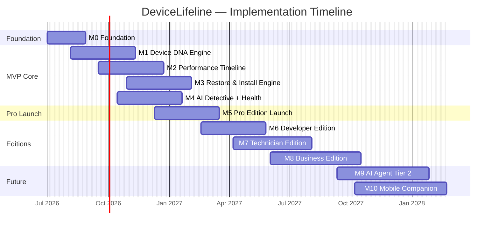
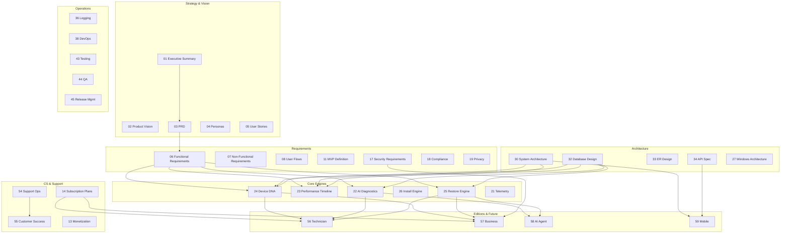

# 60. Final Implementation Roadmap

> The capstone document synthesizing the DeviceLifeline documentation suite into a phased execution plan: build sequence, workstreams, critical-path dependencies, team/roles, timeline, per-phase exit criteria, and dependency graph. Part of the DeviceLifeline documentation suite — see [Documentation Index](README.md).

**Status:** Draft v1 · **Authoring role:** Customer Success/Support Lead + Product Manager + Principal Architect · **Last updated:** 2026-06-07
**Related:** All documents in the DeviceLifeline documentation suite. Primary dependencies: [11. MVP Definition](11-mvp-definition.md), [12. Product Roadmap](12-product-roadmap.md), [30. System Architecture](30-system-architecture.md), [22. AI Diagnostics Design](22-ai-diagnostics-design.md), [24. Device DNA Design](24-device-dna-design.md), [25. Restore Engine Design](25-restore-engine-design.md), [56. Technician Edition Specification](56-technician-edition-specification.md), [57. Business Edition Specification](57-business-edition-specification.md), [58. Future AI Agent Strategy](58-future-ai-agent-strategy.md), [59. Future Mobile App Strategy](59-future-mobile-app-strategy.md)

---

## 1. Purpose & Scope

This document is the **definitive execution plan** for building DeviceLifeline from scratch to a full multi-edition platform. It synthesizes the 59 preceding documents into an actionable, prioritized, dependency-aware build sequence.

It answers:

1. What order do we build things in?
2. What does each phase deliver and require to be true before it starts?
3. Which critical dependencies must not be violated?
4. What team structure supports each phase?
5. What does "done" look like at each phase exit?

This document does not repeat design decisions made in sibling documents — it references them. Every phase section links to the documents that govern it.

---

## 2. Assumptions

| ID | Assumption |
|----|------------|
| A-ROAD-01 | The team starts with a founding team of 3–5 (1–2 Rust engineers, 1 fullstack/React engineer, 1 PM/lead); scales in later phases. |
| A-ROAD-02 | Development begins on Windows-first; macOS and Linux remain future (see [28. Future macOS Architecture Plan](28-macos-architecture-plan.md), [29. Future Linux Architecture Plan](29-linux-architecture-plan.md)). |
| A-ROAD-03 | Supabase hosted (not self-hosted) is used throughout; no infrastructure management overhead at MVP. |
| A-ROAD-04 | The locked tech stack defined in the [Authoring Brief](../AUTHORING_BRIEF.md) is fixed: Tauri, Rust core, React/TypeScript/Tailwind, SQLite, Supabase, OpenAI/Anthropic, WinGet, Stripe/Paystack, PostHog, Sentry. |
| A-ROAD-05 | Phase exit criteria must all be met before the next phase begins; partial exits are acceptable only for non-blocking items explicitly marked as deferred. |
| A-ROAD-06 | Timelines expressed as month offsets from kickoff (M0 = project start). Sample calendar anchoring: M0 = Q3 2026. Adjust at project start. |
| A-ROAD-07 | "MVP" = the V1 feature set defined in [11. MVP Definition](11-mvp-definition.md): Device DNA Engine, software inventory, setup export, setup restore, Performance Timeline, basic health monitoring, basic AI diagnosis. |

---

## 3. Phase Overview

| Phase | Name | Duration | Key Deliverable |
|-------|------|----------|----------------|
| **M0** | Foundation | Weeks 1–6 | Rust core skeleton, Tauri shell, Supabase project, SQLite schema, CI/CD |
| **M1** | Device DNA MVP | Weeks 5–14 | Device DNA Engine, SoftwareInventoryItems, DeviceDNASnapshot, local SQLite, cloud sync |
| **M2** | Performance Timeline MVP | Weeks 11–20 | TimelineEvent capture, correlation engine, Timeline UI |
| **M3** | Restore & Install MVP | Weeks 17–26 | RestorePlan, RestoreJob, InstallTask, WinGet integration, Recovery Center UI |
| **M4** | AI & Health MVP | Weeks 21–30 | AI Detective (DiagnosisSession/Findings), Health Intelligence, CrashEvents, basic Alerts |
| **M5** | Pro Edition Launch | Weeks 27–36 | Subscription/plan enforcement, Stripe/Paystack, Pro feature gates, public launch |
| **M6** | Developer Edition | Weeks 33–42 | EnvironmentTemplates, developer tool capture, workspace restore, Developer plan |
| **M7** | Technician Edition | Weeks 39–50 | JobSession, TechnicianReport, white-label, multi-device management |
| **M8** | Business Edition | Weeks 47–60 | FleetGroup, Policy, compliance, admin console, per-device licensing |
| **M9** | AI Agent (Tier 2) | Weeks 56–68 | Guided remediation, AgentPlan, human-in-the-loop execution |
| **M10** | Mobile Companion | Weeks 60–72 | React Native app, push notifications, device health view |
| **M11+** | Future Capabilities | Ongoing | Proactive AI, Fleet AI, on-device models, SSO/MDM, macOS |

> Note: Phase overlaps are intentional — foundational work in one phase enables parallel streams in the next. Dependencies are enumerated in §6.

---

## 4. Detailed Phase Specifications

### Phase M0 — Foundation (Weeks 1–6)

**Goal:** Every engineer can run a working skeleton; CI/CD is green; Supabase project exists with base schema.

**Key docs:** [30. System Architecture](30-system-architecture.md), [27. Windows Architecture Plan](27-windows-architecture-plan.md), [32. Database Design](32-database-design.md), [38. DevOps Architecture](38-devops-architecture.md), [48. Folder Structure Specification](48-folder-structure-specification.md), [47. Coding Standards](47-coding-standards.md)

**Deliverables:**

| ID | Deliverable |
|----|-------------|
| M0-01 | Tauri project scaffolded: Rust core + React UI + Tauri bridge IPC boilerplate |
| M0-02 | SQLite schema v0 applied; migrations framework in place (SQLx) |
| M0-03 | Supabase project created: Postgres schema v0, Auth configured, Storage buckets, RLS policies template |
| M0-04 | CI/CD pipeline live: GitHub Actions; Rust tests, React tests, Tauri build; passes on every PR |
| M0-05 | Sentry integrated (desktop + React); first test error captured |
| M0-06 | PostHog integrated; first `app_launched` event visible in PostHog dashboard |
| M0-07 | Design system tokens + Tailwind config initialized (see [49. Design System Specification](49-design-system-specification.md)) |
| M0-08 | Internal dev documentation: README, local setup guide, contribution guide |

**Exit Criteria:**
- [ ] Tauri app launches on Windows 11; shows placeholder React UI
- [ ] CI/CD builds and tests pass in <10 minutes
- [ ] SQLite schema applies cleanly from migration; Supabase schema matches ERD
- [ ] `app_launched` event appears in PostHog within 30s of app launch

---

### Phase M1 — Device DNA MVP (Weeks 5–14)

**Goal:** The Rust core can scan a Windows device, produce a DeviceDNASnapshot, persist to SQLite, and sync to Supabase.

**Key docs:** [24. Device DNA Design](24-device-dna-design.md), [21. Device Telemetry Strategy](21-device-telemetry-strategy.md), [32. Database Design](32-database-design.md), [33. Entity Relationship Design](33-entity-relationship-design.md), [19. Privacy Requirements](19-privacy-requirements.md), [20. Data Retention Policies](20-data-retention-policies.md)

**Workstreams:**

| Stream | Work |
|--------|------|
| **Rust Core** | Windows registry collectors; WMI/PowerShell collectors; application inventory collector; startup item collector; service collector; scheduled scan daemon |
| **SQLite** | `device_dna_snapshots`, `software_inventory_items` tables; migration M0→M1 |
| **Supabase** | `devices`, `dna_snapshots`, `software_inventory_items` tables; RLS policies; sync Edge Function |
| **Tauri Bridge** | IPC commands: `trigger_scan`, `get_latest_snapshot`, `get_snapshot_history` |
| **React UI** | Device Dashboard: snapshot summary cards, software inventory list, hardware profile |
| **Auth** | Supabase Auth integration: sign up, sign in, JWT management in React |

**Deliverables:**

| ID | Deliverable |
|----|-------------|
| M1-01 | Rust core scans installed applications via WMI + registry; returns SoftwareInventoryItem list |
| M1-02 | Rust core scans startup items, services, scheduled tasks |
| M1-03 | DeviceDNASnapshot written to SQLite on scan completion |
| M1-04 | Snapshot synced to Supabase on network availability |
| M1-05 | React UI: Device Dashboard shows current snapshot summary |
| M1-06 | React UI: Software inventory list with search and filter |
| M1-07 | User account creation + sign-in via Supabase Auth works end-to-end |
| M1-08 | Privacy: no PII collected outside defined schema; telemetry opt-in dialog |

**Exit Criteria:**
- [ ] Full Device DNA scan completes in <90 seconds on a machine with ≤500 installed apps
- [ ] DeviceDNASnapshot stored in SQLite and verifiably synced to Supabase
- [ ] Software inventory list renders in React UI with correct data
- [ ] RLS test: authenticated user cannot read another user's snapshot
- [ ] Privacy audit: no email, file content, or credentials in snapshot JSONB

---

### Phase M2 — Performance Timeline MVP (Weeks 11–20)

**Goal:** Capture system events as TimelineEvents, store them, and render a navigable Performance Timeline with basic AI correlations.

**Key docs:** [23. Performance Timeline Design](23-performance-timeline-design.md), [22. AI Diagnostics Design](22-ai-diagnostics-design.md), [35. Event Tracking Specification](35-event-tracking-specification.md), [36. Logging Strategy](36-logging-strategy.md)

**Workstreams:**

| Stream | Work |
|--------|------|
| **Rust Core** | Windows Event Log watcher; WinGet / Windows Update event collectors; startup change detector; performance baseline sampler; TimelineEvent schema |
| **SQLite** | `timeline_events` table; migration M1→M2 |
| **Supabase** | `timeline_events` cloud table; sync strategy |
| **AI (Edge Functions)** | Basic correlation: "software installed around same time as performance change" prompt; returns correlation hypothesis |
| **React UI** | Performance Timeline screen: chronological event list; filter by category; event detail panel; correlation callouts |

**Deliverables:**

| ID | Deliverable |
|----|-------------|
| M2-01 | Rust core watches Windows Event Log for key event categories; emits TimelineEvents |
| M2-02 | Rust core detects software install/remove/update events; links to SoftwareInventoryItem |
| M2-03 | TimelineEvents persisted to SQLite; synced to Supabase |
| M2-04 | Performance Timeline UI: scrollable timeline, event cards with timestamps |
| M2-05 | Basic AI correlation: Edge Function identifies top 3 correlations for a given time window |
| M2-06 | Correlation hypotheses surfaced as callout cards on Timeline |

**Exit Criteria:**
- [ ] ≥10 distinct TimelineEvent categories captured by Rust core on a test machine
- [ ] Timeline renders correctly for a device with >500 events
- [ ] At least one AI correlation surfaced correctly in test scenario (e.g., Docker install → startup time increase)
- [ ] Timeline events sync to Supabase within 5 minutes of collection

---

### Phase M3 — Restore & Install MVP (Weeks 17–26)

**Goal:** Users can export a RestorePlan from a DeviceDNASnapshot, import it on a new machine, and execute a restore that installs applications via WinGet.

**Key docs:** [25. Restore Engine Design](25-restore-engine-design.md), [26. Software Installation Engine Design](26-software-installation-engine-design.md), [08. User Flows](08-user-flows.md)

**Workstreams:**

| Stream | Work |
|--------|------|
| **Rust Core** | RestorePlan export from snapshot; RestoreJob executor; InstallTask: WinGet lookup, fallback to Store, fallback to vendor URL; progress events to Tauri |
| **SQLite** | `restore_plans`, `restore_jobs`, `install_tasks` tables; migration M2→M3 |
| **Supabase** | RestorePlan cloud storage; share token for cross-device restore |
| **React UI** | Recovery Center: RestorePlan list; new plan from snapshot; import plan; restore job progress view; per-task status |

**Deliverables:**

| ID | Deliverable |
|----|-------------|
| M3-01 | Rust core exports RestorePlan JSON from a DeviceDNASnapshot |
| M3-02 | Rust core executes RestoreJob: InstallTasks via WinGet primary, Store fallback |
| M3-03 | Progress events streamed to React UI via Tauri events in real time |
| M3-04 | Recovery Center UI: plan list, plan detail, restore progress screen |
| M3-05 | RestorePlan stored in Supabase Storage; shareable via signed URL |
| M3-06 | Import plan on a different device; restore executes correctly |

**Exit Criteria:**
- [ ] RestorePlan created from a snapshot containing ≥20 WinGet-available apps
- [ ] Restore successfully installs ≥80% of apps on a clean Windows 11 install
- [ ] Failed InstallTasks are reported with error reason; user can retry individually
- [ ] Restore job completes in <30 minutes for a 20-app plan (network permitting)

---

### Phase M4 — AI & Health MVP (Weeks 21–30)

**Goal:** AI Detective answers natural-language device questions; Health Intelligence monitors components and produces HealthScores; CrashEvents are captured and explained.

**Key docs:** [22. AI Diagnostics Design](22-ai-diagnostics-design.md), [21. Device Telemetry Strategy](21-device-telemetry-strategy.md), [17. Security Requirements](17-security-requirements.md)

**Workstreams:**

| Stream | Work |
|--------|------|
| **Rust Core** | CPU/RAM/SSD/GPU/Battery health samplers; SMART data reader; HealthScore computation; Windows Event Viewer crash event parser; CrashEvent schema |
| **SQLite** | `health_samples`, `health_scores`, `crash_events` tables; migration M3→M4 |
| **AI Edge Functions** | `run_diagnosis_session`: context assembly → OpenAI/Anthropic prompt → DiagnosisFindings; `generate_health_summary` |
| **Supabase** | `diagnosis_sessions`, `diagnosis_findings`, `health_samples`, `alerts` tables; Alert triggers |
| **React UI** | Health Intelligence dashboard; HealthScore gauges; CrashEvents list; AI Detective chat interface; DiagnosisFindings cards |

**Deliverables:**

| ID | Deliverable |
|----|-------------|
| M4-01 | Rust core samples CPU/RAM/SSD/Battery health every 15 minutes; HealthScore computed |
| M4-02 | CrashEvent collector: Windows Event Viewer BSOD / app crash entries parsed |
| M4-03 | AI Detective: user types question; DiagnosisSession created; DiagnosisFindings returned |
| M4-04 | Health Intelligence UI: component scores, trend charts, health history |
| M4-05 | CrashEvents UI: plain-English crash descriptions |
| M4-06 | Basic Alert: critical health drop triggers in-app notification |

**Exit Criteria:**
- [ ] HealthScore produced within 60 seconds of app launch on test machine
- [ ] AI Detective returns DiagnosisFindings within 120 seconds for a natural-language query
- [ ] CrashEvents correctly parsed for ≥3 distinct Windows crash event categories
- [ ] AI API keys confirmed not present in client bundle (verified by build artifact scan)

---

### Phase M5 — Pro Edition Launch (Weeks 27–36)

**Goal:** Public launch with Free and Pro tiers; subscription billing live; feature gates enforced.

**Key docs:** [14. Subscription Plans](14-subscription-plans.md), [13. Monetization Strategy](13-monetization-strategy.md), [17. Security Requirements](17-security-requirements.md), [18. Compliance Requirements](18-compliance-requirements.md), [43. Testing Strategy](43-testing-strategy.md), [44. QA Plan](44-qa-plan.md), [54. Support Operations Plan](54-support-operations-plan.md), [55. Customer Success Plan](55-customer-success-plan.md)

**Workstreams:**

| Stream | Work |
|--------|------|
| **Billing** | Stripe + Paystack integration; Subscription model in Supabase; plan enforcement in RLS + Edge Functions |
| **Feature Gates** | Entitlement checks on Pro features (Timeline, AI, Restore); Free plan limits |
| **Auth & Security** | Security hardening pass: auth flows, token expiry, RLS audit |
| **Compliance** | Privacy policy, ToS, GDPR consent flow (see [18. Compliance Requirements](18-compliance-requirements.md), [19. Privacy Requirements](19-privacy-requirements.md)) |
| **Support** | Knowledge base live; in-app help panel; debug bundle workflow live |
| **CS** | Onboarding email sequences configured; PostHog funnels set up; NPS survey ready |
| **QA** | Full regression test pass; performance testing; security audit |
| **Launch** | App signed and submitted to distribution channel; marketing site live |

**Exit Criteria:**
- [ ] Free and Pro plans enforce correct feature gates end-to-end
- [ ] Stripe checkout completes; subscription activates; plan reflected in app within 60 seconds
- [ ] Privacy policy, ToS, and GDPR consent flow live and legally reviewed
- [ ] Knowledge base covers all MVP features; in-app help panel functional
- [ ] Sentry error rate <1% of sessions
- [ ] P95 app startup time <3 seconds on reference hardware
- [ ] Security review passed: no hardcoded secrets; RLS audit clean; OWASP Top 10 checked

---

### Phase M6 — Developer Edition (Weeks 33–42)

**Goal:** Developer-specific features: IDE/SDK/language inventory, EnvironmentTemplates, workspace restore, Developer plan.

**Key docs:** [24. Device DNA Design](24-device-dna-design.md), [25. Restore Engine Design](25-restore-engine-design.md), [04. User Personas](04-user-personas.md) (Developer persona), [14. Subscription Plans](14-subscription-plans.md)

**Deliverables:**

| ID | Deliverable |
|----|-------------|
| M6-01 | Rust core: IDE detection (VS Code, JetBrains, Visual Studio); SDK/runtime detection (Node, Python, .NET, Java, Go); package manager detection (npm, pip, cargo, winget) |
| M6-02 | EnvironmentTemplate: create from snapshot; store in Supabase; version history |
| M6-03 | Developer-focused RestorePlan: restores dev tools, IDE extensions (via marketplace APIs where available) |
| M6-04 | Developer Edition UI: developer environment dashboard; template management; workspace restore |
| M6-05 | Developer plan billing + feature gates |

**Exit Criteria:**
- [ ] Developer environment section of DeviceDNASnapshot populates correctly for a machine with ≥3 dev tools
- [ ] EnvironmentTemplate created from snapshot; restored on a clean machine installs ≥80% of dev tools
- [ ] Developer plan enforces correct feature gates separate from Pro

---

### Phase M7 — Technician Edition (Weeks 39–50)

**Goal:** Technician Edition live: multi-device JobSession management, AI diagnostic assessment, before/after comparison, customer report generation, white-label.

**Key docs:** [56. Technician Edition Specification](56-technician-edition-specification.md), [22. AI Diagnostics Design](22-ai-diagnostics-design.md), [24. Device DNA Design](24-device-dna-design.md)

**Deliverables:**

| ID | Deliverable |
|----|-------------|
| M7-01 | JobSession model + Supabase schema + RLS |
| M7-02 | Device pairing: local network pairing code flow |
| M7-03 | Technician diagnostic assessment: full DiagnosisSession with technician context |
| M7-04 | Before/after snapshot comparison UI |
| M7-05 | PDF report generation Edge Function with BrandingConfig |
| M7-06 | White-label configuration screen |
| M7-07 | Technician Edition feature gates + billing |

**Exit Criteria:**
- [ ] All AC-TE-01 through AC-TE-10 from [56. Technician Edition Specification](56-technician-edition-specification.md) pass
- [ ] RLS: technician A cannot access technician B's JobSessions or reports
- [ ] PDF generated within 30 seconds with correct branding

---

### Phase M8 — Business Edition (Weeks 47–60)

**Goal:** Business Edition live: Account/org model, FleetGroup, Policy, admin console, per-device licensing, employee enrollment.

**Key docs:** [57. Business Edition Specification](57-business-edition-specification.md), [17. Security Requirements](17-security-requirements.md), [32. Database Design](32-database-design.md)

**Deliverables:**

| ID | Deliverable |
|----|-------------|
| M8-01 | Account org model + AccountMember + RBAC |
| M8-02 | FleetGroup + DeviceGroupMembership + Policy models in Supabase |
| M8-03 | Employee invite + enrollment flow |
| M8-04 | Policy Builder UI + compliance evaluation in Rust core |
| M8-05 | Admin Console: fleet dashboard, device table, compliance panel, alert management |
| M8-06 | EnvironmentTemplate deployment flow (fleet-level RestorePlan) |
| M8-07 | Per-device LicenseSeat billing via Stripe |

**Exit Criteria:**
- [ ] All AC-BE-01 through AC-BE-10 from [57. Business Edition Specification](57-business-edition-specification.md) pass
- [ ] Fleet dashboard loads in <3 seconds for 200 enrolled devices
- [ ] RBAC: employee cannot view other employees' devices; Fleet Manager scoped to own groups

---

### Phase M9 — AI Agent Tier 2 (Weeks 56–68)

**Goal:** Guided remediation: AI Agent proposes and executes approved multi-step repair plans.

**Key docs:** [58. Future AI Agent Strategy](58-future-ai-agent-strategy.md), [25. Restore Engine Design](25-restore-engine-design.md)

**Exit Criteria:**
- [ ] All AC-AI-01 through AC-AI-09 from [58. Future AI Agent Strategy](58-future-ai-agent-strategy.md) pass
- [ ] Allowed action registry enforced; arbitrary shell execution rejected
- [ ] Before-state capture and rollback functional for all action types

---

### Phase M10 — Mobile Companion (Weeks 60–72)

**Goal:** React Native app on iOS and Android: device health overview, push alerts, AI Detective, fleet overview (read-only).

**Key docs:** [59. Future Mobile App Strategy](59-future-mobile-app-strategy.md), [34. API Specification](34-api-specification.md)

**Exit Criteria:**
- [ ] All AC-MOB-01 through AC-MOB-10 from [59. Future Mobile App Strategy](59-future-mobile-app-strategy.md) pass
- [ ] App approved in App Store and Play Store without system access rejections
- [ ] Push notification delivered in <60 seconds of Alert creation

---

## 5. Workstreams

All phases draw on these parallel workstreams, managed by area ownership:

| Workstream | Owner Role | Description |
|------------|-----------|-------------|
| **Rust Core** | Rust Engineer | Windows system APIs, collectors, schedulers, action executors |
| **Tauri Bridge** | Rust / Fullstack | IPC commands/events between Rust core and React UI |
| **React UI** | Frontend Engineer | All screens, components, design system, accessibility |
| **Supabase Backend** | Fullstack / Backend | Schema, RLS, Edge Functions, Auth, Storage, Realtime |
| **AI / LLM** | Fullstack / AI | Edge Function prompt engineering, DiagnosisSession, AI correlations, agent plans |
| **Billing & Licensing** | Fullstack / PM | Stripe/Paystack integration, Subscription model, LicenseSeat management |
| **Security & Compliance** | Lead Engineer + PM | RLS audits, security reviews, GDPR, Sentry |
| **DevOps / CI** | Lead Engineer | GitHub Actions, build pipeline, release management, Tauri code signing |
| **Design & UX** | Designer / PM | Design system, wireframes, user flows, accessibility |
| **Support & CS** | CS Lead | Knowledge base, onboarding sequences, support tooling, NPS |
| **QA** | QA Engineer (or shared) | Test plans, regression, performance, RLS tests |

---

## 6. Critical-Path Dependencies

The following dependency chain governs the build sequence. Violating these dependencies results in rework.

```
Rust Core Foundation
  → Device DNA Engine [M1]
      → Performance Timeline [M2]           ← depends on timeline events from DNA scan cycle
      → Restore Engine [M3]                 ← depends on DeviceDNASnapshot as source
      → Health Sampler [M4]                 ← depends on Rust core infrastructure
          → AI Detective [M4]               ← depends on Health + Timeline + DNA data available
              → Pro Launch [M5]             ← depends on all MVP features working
                  → Developer Edition [M6]  ← depends on Pro + DNA extension for dev tools
                  → Technician Edition [M7] ← depends on DNA + AI Detective + Restore
                  → Business Edition [M8]   ← depends on multi-user model + Policy + Restore
                      → AI Agent Tier 2 [M9]   ← depends on stable action execution + Business Edition
                      → Mobile App [M10]        ← depends on stable Supabase data model + Alerts

Auth + Supabase Schema [M0]
  → RLS policies [M1–M8]   ← each phase adds tables; must be RLS-reviewed at each phase
  → Billing / Stripe [M5]  ← must be before public launch

DevOps / CI [M0]
  → Code signing [M5]      ← required before distribution
```

### 6.1 Strict Dependencies Table

| Dependency | Upstream | Downstream | Risk if Violated |
|-----------|---------|----------|-----------------|
| SQLite schema stable before cloud sync | M1 SQLite | M1 Supabase sync | Migration conflicts; data loss |
| DeviceDNASnapshot complete before Timeline | M1 | M2 | No event source; timeline empty |
| Timeline events before AI correlation | M2 | M4 AI Detective | AI has no context; findings poor quality |
| Health data before AI diagnosis | M4 Health | M4 AI | Incomplete diagnosis context |
| Subscription model before Pro launch | M5 billing | M5 launch | Free users access paid features |
| RLS audit before each new edition | M5/M6/M7/M8 | Phase launch | Data leak between accounts |
| JobSession model stable before report generation | M7 schema | M7 PDF gen | Report contains wrong data |
| AccountMember + RBAC before fleet features | M8 auth | M8 compliance/fleet | Authorization bypass |

---

## 7. Team & Roles

| Phase | Minimum Team | Notes |
|-------|-------------|-------|
| M0–M1 | 2 Rust engineers, 1 fullstack/React, 1 PM | Founding team |
| M2–M4 | +1 Fullstack/AI engineer | AI Edge Functions and correlation complexity |
| M5 (Launch) | +1 Designer, +1 QA, +1 CS lead | Design polish, QA rigor, support readiness |
| M6–M7 | +1 Rust engineer (installer complexity) | WinGet edge cases; Technician device pairing |
| M8 | +1 Backend engineer (fleet scale), +1 CSM | Admin console complexity; fleet scale |
| M9–M10 | +1 AI engineer, +1 mobile engineer (React Native) | Agent execution safety; mobile platform |

---

## 8. Sample Timeline (Gantt)



---

## 9. Per-Phase Exit Criteria Summary

| Phase | Exit Criteria (Summary) | Linked Spec |
|-------|------------------------|-------------|
| M0 | Tauri app launches; CI green; Supabase schema deployed | [30](30-system-architecture.md), [32](32-database-design.md) |
| M1 | DNA scan complete in <90s; synced to Supabase; RLS clean | [24](24-device-dna-design.md) |
| M2 | ≥10 event types captured; AI correlation works in test | [23](23-performance-timeline-design.md) |
| M3 | 80%+ apps restored on clean machine; progress UI working | [25](25-restore-engine-design.md), [26](26-software-installation-engine-design.md) |
| M4 | HealthScore computed; AI Detective returns findings; crash events captured | [22](22-ai-diagnostics-design.md) |
| M5 | Billing live; feature gates enforced; security review passed; public launch | [14](14-subscription-plans.md), [17](17-security-requirements.md) |
| M6 | Dev tools captured; EnvironmentTemplate restore works | [24](24-device-dna-design.md) (dev section) |
| M7 | All AC-TE-01–AC-TE-10 pass; PDF generated; RLS clean | [56](56-technician-edition-specification.md) |
| M8 | All AC-BE-01–AC-BE-10 pass; fleet dashboard <3s; RBAC clean | [57](57-business-edition-specification.md) |
| M9 | All AC-AI-01–AC-AI-09 pass; no arbitrary execution; rollback works | [58](58-future-ai-agent-strategy.md) |
| M10 | App Store approved; push <60s; AC-MOB-01–AC-MOB-10 pass | [59](59-future-mobile-app-strategy.md) |

---

## 10. Risk Register Summary

| Risk | Phase | Likelihood | Impact | Mitigation |
|------|-------|-----------|--------|------------|
| RISK-ROAD-01: Windows API instability slows Rust core development | M1–M4 | Medium | High | Invest in integration test suite against multiple Windows versions early |
| RISK-ROAD-02: WinGet availability gaps prevent restore completion | M3 | High | High | Three-tier fallback (WinGet → Store → vendor URL); user notified of manual installs |
| RISK-ROAD-03: OpenAI / Anthropic API latency or cost overrun | M4+ | Medium | Medium | Multi-provider routing; fallback between OpenAI and Anthropic; caching of repeated queries |
| RISK-ROAD-04: Supabase RLS misconfiguration leaks cross-user data | All | Low | Critical | RLS automated test suite runs on every PR; manual audit at each edition launch |
| RISK-ROAD-05: Founding team bandwidth bottleneck delays Pro launch | M5 | High | High | Scope MVP strictly per [11. MVP Definition](11-mvp-definition.md); defer non-critical features |
| RISK-ROAD-06: App Store rejection for Mobile app | M10 | Low | High | Pre-review compliance check; no system-access entitlements; test with Apple review guidelines |
| RISK-ROAD-07: Business Edition fleet scale underperforms | M8 | Medium | High | Load test at M8: 200-device fleet scenario; read replicas if needed; pre-computed aggregates |
| RISK-ROAD-08: AI agent executes unintended action | M9 | Low | Critical | Strict allowed action registry; mandatory consent gates; automated safety tests |

---

## 11. Documentation Dependency Map

Each document in the 60-document suite feeds into one or more build phases:



---

## Future Considerations

- **macOS platform:** See [28. Future macOS Architecture Plan](28-macos-architecture-plan.md). Earliest realistic phase: M12 (post-Business Edition stable).
- **Linux platform:** See [29. Future Linux Architecture Plan](29-linux-architecture-plan.md). Phase M13+.
- **AI Agent Tiers 3 & 4:** Proactive agent and Fleet AI (see [58. Future AI Agent Strategy](58-future-ai-agent-strategy.md)); planned for M11+.
- **SSO / MDM integration for Business Edition:** Phase M8.5 (6-month post-Business launch).
- **Hardware asset lifecycle:** Business Edition v2 — warranty tracking, replacement scheduling.
- **Marketplace / Partner ecosystem:** DeviceLifeline API for third-party integrations; post-Series A.
- **International expansion:** Localization, regional CS, additional payment methods.

---

## Acceptance Criteria

- [ ] AC-ROAD-01: Every build phase has a defined, testable exit criteria checklist that must be fully satisfied before the next phase begins.
- [ ] AC-ROAD-02: Critical-path dependency table is reviewed and signed off by the lead engineer at the start of each phase.
- [ ] AC-ROAD-03: Gantt timeline is maintained and updated at each phase kickoff to reflect actual vs. planned progress.
- [ ] AC-ROAD-04: Every new Supabase table introduced in any phase has corresponding RLS policies before the phase is declared complete.
- [ ] AC-ROAD-05: AI API keys are confirmed absent from the client-side bundle at M4 and re-verified at every phase exit (automated build check).
- [ ] AC-ROAD-06: Each edition launch (M5/M6/M7/M8) includes a completed security review checklist before public release.
- [ ] AC-ROAD-07: The documentation suite (docs 01–60) is reviewed for consistency with the final implementation choices at M5 launch; discrepancies are logged and updated.
- [ ] AC-ROAD-08: PostHog activation funnels for each edition are live before that edition's public launch, enabling measurement of activation rates per [55. Customer Success Plan](55-customer-success-plan.md).
